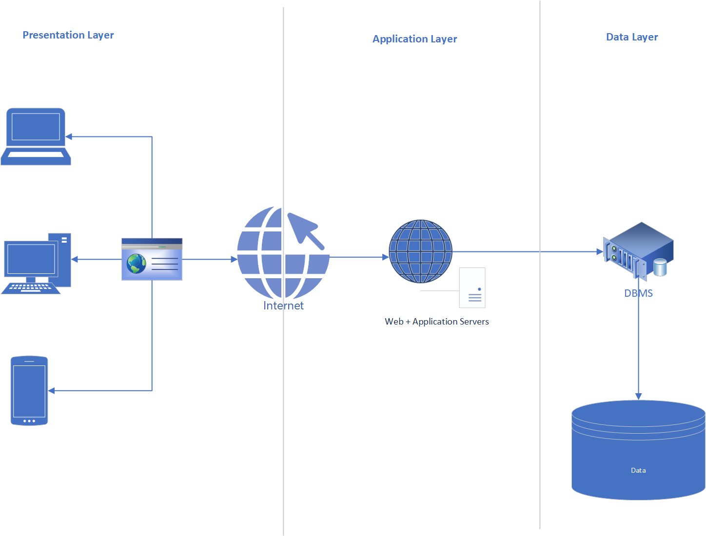
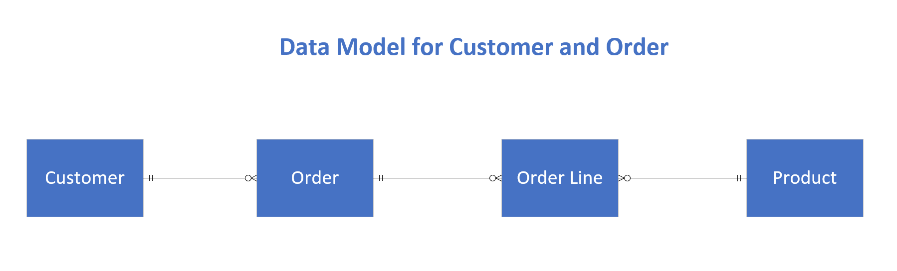
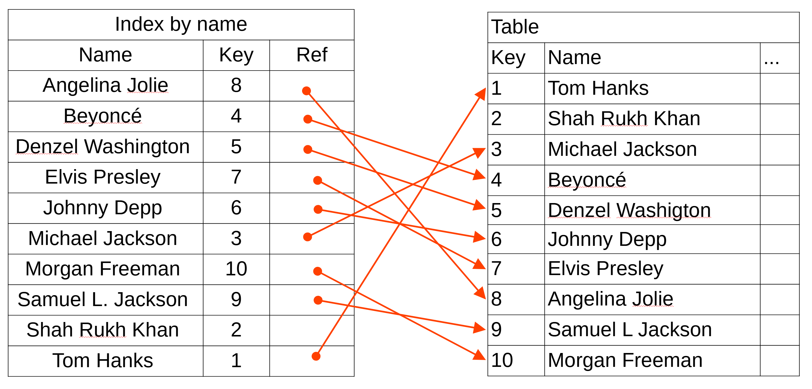
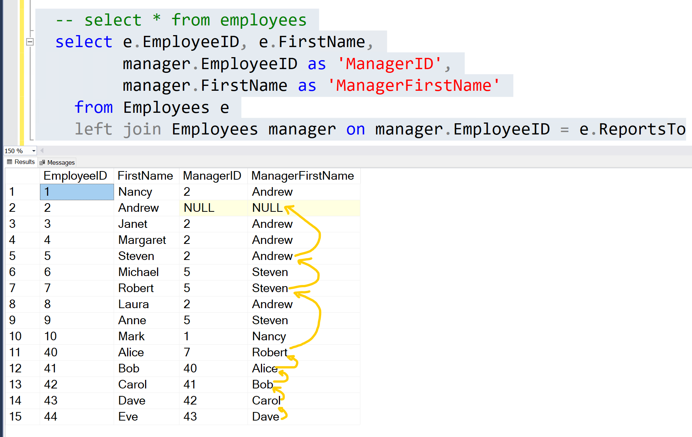

# SQL - Structured Query Language

## **Database Servers and Database Management Systems (DBMS)**

A **Database Server** is a dedicated computer system that provides database services to other computers (clients) over a network. It manages data storage, retrieval and manipulation. A **Database Management System (DBMS)** is the software running on the database server that interacts with the database to perform these operations.

* Popular examples of DBMS include:
  * SQL Server
  * Postgre
  * Oracle Database
  * MySQL

### **Key Concepts of Database Servers**

1. **Centralized Data Storage:**  
   Database servers act as central hubs for storing structured or unstructured data, ensuring all users or applications interact with the same source of truth.
2. **Concurrency and Transactions:**  
   They support multiple users accessing the same data simultaneously while maintaining consistency through mechanisms like transactions, locking, and isolation levels.
3. **Scalability:**  
   Database servers handle growing data and user demand efficiently, offering horizontal (adding more servers) or vertical (increasing hardware resources) scalability.
4. **Security:**  
   A DBMS ensures data integrity, prevents unauthorized access, and provides role-based access controls.
5. **Backup and Recovery:**  
   Database servers often include automated tools to back up data regularly and recover it in case of failures.

### **Importance of Database Servers in Software**

1. **Data-Driven Applications:**  
   Modern software, like web or mobile applications, depends heavily on managing and processing large amounts of data efficiently. Database servers power these functionalities.
2. **Improved Performance:**  
   By optimizing data queries, indexing, and caching, database servers enhance application performance significantly.
3. **Integration with Software Systems:**  
   Many frameworks and libraries (like .NET, Django, or Spring Boot) provide seamless integration with databases, enabling developers to build data-centric applications rapidly.
4. **Scalability in Modern Architectures:**  
   In systems like microservices, a database server can scale to support individual services or applications, ensuring uninterrupted operations as demand grows.
5. **Business Intelligence:**  
   Databases store and organize business-critical data, enabling analysis through tools like SQL queries, reports, and dashboards for decision-making.

---

### **How They Work Together in Software**

When building software, developers use **SQL (Structured Query Language)** to interact with the database server via the DBMS. For example, when a customer places an order in an e-commerce application, the software sends SQL commands to store the order details in a database, ensuring the data is available for future processing, like generating invoices or tracking orders.

Usually, a System/Application is devided in 3 tiers:

* Front-end (User Interface): The tier that interacts with the user
* Back-End (Middleware): The tier that executes the main logic of the System
* Database (Persistence): The tier that manages the data
  * Store
  * Protect
  * Manager
  * Retrieve
  * Create
  * Delete
  * etc



## Introduction to SQL

SQL stands for Structured Query Language. It is a language to interact with a Database Server.
A database server is a software to store and manage data.

## Some Context

SQL is usually related to Relational Databases. There are many different types of databases and in general, the database types that are NOT relational are called NO SQL DATABASE.
A quick search and you will find a long list of SQL and NoSQL databases servers. Each database technology is specialized in something. So there is no such thing as the best database technology for all situations.

## SQL Servers

There are several free SQL Server that you can use to practice and each one has different options for clients or IDE:

* Microsoft SQL Server
  * <https://www.microsoft.com/en-us/sql-server/sql-server-downloads>
    * There are two free version: Developer and Express
  * Client: SQL Server Managment Studio (SSMS)
    * <https://learn.microsoft.com/en-us/ssms/sql-server-management-studio-ssms>
* Postgre SQL
  * <https://www.postgresql.org>
  * Client: PGAdmin
    * <https://www.pgadmin.org/>
* SQL Lite
  * <https://www.sqlite.org>
* MYSQL
  * <https://www.mysql.com>

> **ATTENTION**:

* Each SQL Server has some variation of the SQL syntax.
* This material will use SQL Syntax for Microsoft SQL Server.
* This material focuses only on the basic concepts and tries to give a good intro to SQL.

> **RECOMMENDATION**: I recommend an online SQL IDE called SQL Fiddler.
You just need a browser and don't need to install anything.
It supports the SQL Syntax for each one of the listed SQL Servers

* SQL Fiddle: <http://sqlfiddle.com/>

## Database Organization

* A relational database organizes the information in tables and fields.
* A table is an entity to store data.
  * Examples:
    * Customer
    * Product
    * Employee
    * Order
    * Project

* A field is a unit of data that compose a Table.
  * Examples:
    * ID
    * first_name
    * last_name
    * email
    * salary

* A record is a row (instance) of data in a table:
  * Example of of Rows:

| ID | first_name | last_name  | email                    | salary  |
|----|------------|------------|--------------------------|---------|
| 1  | John       | Doe        | <john.doe@example.com>   | $50,000 |
| 2  | Jane       | Smith      | <jane.smith@example.com> | $55,000 |
| 3  | Alice      | Johnson    | <alice.j@example.com>    | $60,000 |
| 4  | Bob        | Williams   | <bob.will@example.com>   | $45,000 |
| 5  | Charlie    | Brown      | <charlie.b@example.com>  | $48,000 |

## Operations

SQL defines a sitaxe to execute commands to:

* Create, update and delete tables
* Insert, Update, Delete and Select rows

## Data Modeling

Data Modeling is the process of creating an abstract representation of the information required for a system.
Data models are built around business needs and contain the data entities (Tables and Field) and their relationships.
The first step to build the Data Layer is the Data Model.



> ⚠️ **Warning**: SQL Server commands are not case sensitive. This material will use Upper case just to help with visualization

## CREATE TABLE

A table is defined by a list of fields and before we create a table it is important to understand the field types (DataType).

## Fields Data Types

Full list: <https://learn.microsoft.com/en-us/sql/t-sql/data-types/data-types-transact-sql?view=sql-server-ver16>

* [Numerics](https://learn.microsoft.com/en-us/sql/t-sql/data-types/data-types-transact-sql?view=sql-server-ver16#exact-numerics):
  * [tinyint](https://learn.microsoft.com/en-us/sql/t-sql/data-types/int-bigint-smallint-and-tinyint-transact-sql?view=sql-server-ver16)
  * [smallint](https://learn.microsoft.com/en-us/sql/t-sql/data-types/int-bigint-smallint-and-tinyint-transact-sql?view=sql-server-ver16)
  * [int](https://learn.microsoft.com/en-us/sql/t-sql/data-types/int-bigint-smallint-and-tinyint-transact-sql?view=sql-server-ver16)
  * [bigint](https://learn.microsoft.com/en-us/sql/t-sql/data-types/int-bigint-smallint-and-tinyint-transact-sql?view=sql-server-ver16)
  * [bit](https://learn.microsoft.com/en-us/sql/t-sql/data-types/bit-transact-sql?view=sql-server-ver16)
  * [decimal](https://learn.microsoft.com/en-us/sql/t-sql/data-types/decimal-and-numeric-transact-sql?view=sql-server-ver16)
  * [numeric](https://learn.microsoft.com/en-us/sql/t-sql/data-types/decimal-and-numeric-transact-sql?view=sql-server-ver16)
  * [money](https://learn.microsoft.com/en-us/sql/t-sql/data-types/money-and-smallmoney-transact-sql?view=sql-server-ver16)
  * [smallmoney](https://learn.microsoft.com/en-us/sql/t-sql/data-types/money-and-smallmoney-transact-sql?view=sql-server-ver16)
  * [float](https://learn.microsoft.com/en-us/sql/t-sql/data-types/float-and-real-transact-sql?view=sql-server-ver16)
  * [real](https://learn.microsoft.com/en-us/sql/t-sql/data-types/float-and-real-transact-sql?view=sql-server-ver16)
* [Date and Time](https://dev.mysql.com/doc/refman/8.0/en/date-and-time-types.html)
  * [date](https://learn.microsoft.com/en-us/sql/t-sql/data-types/date-transact-sql?view=sql-server-ver16)
  * [time](https://learn.microsoft.com/en-us/sql/t-sql/data-types/time-transact-sql?view=sql-server-ver16)
  * [datetime](https://learn.microsoft.com/en-us/sql/t-sql/data-types/datetime-transact-sql?view=sql-server-ver16)
  * [datetime2](https://learn.microsoft.com/en-us/sql/t-sql/data-types/datetime2-transact-sql?view=sql-server-ver16)
  * [smalldatetime](https://learn.microsoft.com/en-us/sql/t-sql/data-types/smalldatetime-transact-sql?view=sql-server-ver16)
  * [datetimeoffset](https://learn.microsoft.com/en-us/sql/t-sql/data-types/datetimeoffset-transact-sql?view=sql-server-ver16)
* String (<https://dev.mysql.com/doc/refman/8.0/en/string-types.html>)
  * [char](https://learn.microsoft.com/en-us/sql/t-sql/data-types/char-and-varchar-transact-sql?view=sql-server-ver16)
  * [varchar](https://learn.microsoft.com/en-us/sql/t-sql/data-types/char-and-varchar-transact-sql?view=sql-server-ver16)
  * [text](https://learn.microsoft.com/en-us/sql/t-sql/data-types/ntext-text-and-image-transact-sql?view=sql-server-ver16)
  * [nchar](https://learn.microsoft.com/en-us/sql/t-sql/data-types/nchar-and-nvarchar-transact-sql?view=sql-server-ver16)
  * [nvarchar](https://learn.microsoft.com/en-us/sql/t-sql/data-types/nchar-and-nvarchar-transact-sql?view=sql-server-ver16)
  * [ntext](https://learn.microsoft.com/en-us/sql/t-sql/data-types/ntext-text-and-image-transact-sql?view=sql-server-ver16)
* Others
  * [Unique Identifier (GUID)](https://learn.microsoft.com/en-us/sql/t-sql/data-types/uniqueidentifier-transact-sql?view=sql-server-ver16)
  * [JSON](https://learn.microsoft.com/en-us/sql/t-sql/data-types/json-data-type?view=sql-server-ver16)
  * [XML](https://learn.microsoft.com/en-us/sql/t-sql/xml/xml-transact-sql?view=sql-server-ver16)
  * [Vector](https://learn.microsoft.com/en-us/sql/t-sql/data-types/vector-data-type?view=sql-server-ver16)

### Primary Key

A primary key is a field that uniquely identifies each record in a table.
Primary keys must contain UNIQUE values, and cannot contain NULL values.
A table can have only ONE primary key; and in the table, this primary key can consist of single or multiple columns (fields).
> **ATTENTION**: Most of the time the Primary Key field is called ID and its value is auto generated

* Example of Primary Keys:
  * ID
  * Email
  * SSN
  * EmployeeId
  * StudentId
  * DepartmentId

### Foreign Key

A foreign key is a field designated to store values from a field (usually a Primary Key) from another table.
The foreign key is the mechanism used in relational databases to define relationships between records.

#### Example of Foreign Key

Department Table

| Department ID | Department Name |
| --- | --- |
| 1 | Human Resources |
| 2 | Information Technology |
| 3 | Sales |
| 4 | Finances |

Employee Table

| Employee ID | Department ID | Name | Email |
| --- | --- | --- | --- |
| 1 | 2 | Jose Santos | <jose.santos@noemail.com> |
| 2 | 1 | Leila Rodrigues | <leila.rodrigues@nomail.com> |
| 3 | 2 | Artur Rodrigues | <artur.rodrigues@nomail.com> |
| ... |

> **ATTENTION**: Department ID is a primary key on the Department table and a foreign key on the Employee table.

* The department of an Employee is defined by the value stored at his "Department ID" field.
* Jose Santos and Artur Rodrigues are assigned to the Information Technology Department (Department ID = 2)
* Leila Rodrigues is assigned to the Human Resource Department (Department ID = 1)

### CREATE TABLE sintaxe

```sql
CREATE TABLE table_name (
    column1 datatype,
    column2 datatype,
    column3 datatype,
   ....
);
```

### CREATE TABLE example

```sql
CREATE TABLE Department (
    ID INT NOT NULL IDENTITY(1,1),
    Name NVARCHAR(100),
    Abbreviation NVARCHAR(5),
    PRIMARY KEY (ID)
);

CREATE TABLE Employee (
    ID INT NOT NULL IDENTITY(1,1),
    Name NVARCHAR(200),
    Email NVARCHAR(200),
    Salary DECIMAL(13,2),
    DepartmentID INT,
    PRIMARY KEY (ID),
    FOREIGN KEY (DepartmentID) REFERENCES Department(ID)
);
```

> **WARNING**: When executing multiple SQL statements, it is necessary to finish each one ';'.

## INSERT command

The insert command is used to add records to a table

### Insert Sintaxe

```sql
INSERT INTO table_name (column1, column2, column3, ...)
  VALUES (value1, value2, value3, ...);
```

```sql
INSERT INTO Department (Name, Abbreviation) VALUES ('Human Resources', 'HR');
INSERT INTO Department (Name, Abbreviation) VALUES ('Information Technology', 'IT');
INSERT INTO Department (Name, Abbreviation) VALUES ('Sales', 'SAL');
INSERT INTO Department (Name, Abbreviation) VALUES ('Finances', 'FIN');
INSERT INTO Department (Name, Abbreviation) VALUES ('Marketing', 'MARK');
INSERT INTO Department (Name, Abbreviation) VALUES ('Public Relations', 'PL');
```

> **ATTENTION**: No need to insert the ID field because it is auto-gerenated (AUTO_INCREMENT)

```sql
INSERT INTO Employee (Name, Email, Salary, DepartmentID) VALUES
('Jose Santos', 'jose.santos@noemail.com', 15000.15, 2),
('Leila Rodrigues', 'leila.rodrigues@noemail.com', 200000.20, 1),
('Artur Rodrigues', 'artur.rodrigues@noemail.com', 100000.45, 2),
('Bob Marley', 'bob@noemail.com', 900000.37, 5),
('Mickael Jackson', 'theking@noemail.com', 2000000.00, 5),
('Frank Sinatra', 'sinatra@noemail.com', 700000.67, 5),
('Elon Musk', 'musk@noemail.com', 450000.15, 3),
('Steve Jobs', 'jobs@noemail.com', 1000000.67, 3),
('Lady Gaga', 'ladygaga@noemail.com', 650000.90, 5),
('Britney Spears', 'bspears@noemail.com', 75000.56, 5),
('Oprah Winfrey', 'oprah@noemail.com', 5000000.01,5);
```

> **TIP**: It is possible to insert multiple rows with just one INSERT command. Check the INSERT command on Employee table

## UPDATE command

The UPDATE command is used to modify existing record(s) in a table.

### Update Sintaxe

```sql
UPDATE table_name
  SET column1 = value1, column2 = value2, ...
  [WHERE condition]
```

>⚠️**DANGER**⚠️: If you forget to use the ```WHERE``` clause all the records will be updated.

```sql
UPDATE Department
  SET Abbreviation = 'SA'
  WHERE ID = 3
```

* Update the Department table, setting the Abbreviation to 'SA' for the record with ID equals 3

## DELETE command

The DELETE statement is used to delete records from a table.

### Delete Sitaxe

```sql
DELETE FROM table_name 
  WHERE condition
```

>⚠️**DANGER**⚠️: If you forget to use the ```WHERE``` clause all the records will be deleted.

```sql
DELETE
  FROM Department 
  WHERE ID = 4
```

* The row with ID equals 4 will be deleted from the Department table

## Preparation for the SELECT command examples

* These are the SQL commands to prepare the database for the select examples
* Execute the commands below into your sandbox database to create the tables and insert records necessary for the following examples

```sql
CREATE TABLE Department (
    ID INT NOT NULL IDENTITY(1,1),
    Name NVARCHAR(100),
    Abbreviation NVARCHAR(5),
    PRIMARY KEY (ID)
);

CREATE TABLE Employee (
    ID INT NOT NULL IDENTITY(1,1),
    Name NVARCHAR(200),
    Email NVARCHAR(200),
    Salary DECIMAL(13,2),
    DepartmentID INT,
    PRIMARY KEY (ID),
    FOREIGN KEY (DepartmentID) REFERENCES Department(ID)
);

INSERT INTO Department (Name, Abbreviation) VALUES ('Human Resources', 'HR');
INSERT INTO Department (Name, Abbreviation) VALUES ('Information Technology', 'IT');
INSERT INTO Department (Name, Abbreviation) VALUES ('Sales', 'SAL');
INSERT INTO Department (Name, Abbreviation) VALUES ('Finances', 'FIN');
INSERT INTO Department (Name, Abbreviation) VALUES ('Marketing', 'MARK');
INSERT INTO Department (Name, Abbreviation) VALUES ('Public Relations', 'PL');

INSERT INTO Employee (Name, Email, Salary, DepartmentID) VALUES
('Jose Santos', 'jose.santos@noemail.com', 15000.15, 2),
('Leila Rodrigues', 'leila.rodrigues@noemail.com', 200000.20, 1),
('Artur Rodrigues', 'artur.rodrigues@noemail.com', 100000.45, 2),
('Bob Marley', 'bob@noemail.com', 900000.37, 5),
('Mickael Jackson', 'theking@noemail.com', 2000000.00, 5),
('Frank Sinatra', 'sinatra@noemail.com', 700000.67, 5),
('Elon Musk', 'musk@noemail.com', 450000.15, 3),
('Steve Jobs', 'jobs@noemail.com', 1000000.67, 3),
('Lady Gaga', 'ladygaga@noemail.com', 650000.90, 5),
('Britney Spears', 'bspears@noemail.com', 75000.56, 5),
('Oprah Winfrey', 'oprah@noemail.com', 5000000.01,5);
```

## SELECT command

The SELECT command is used to select/retrieve data.

### Select Sintaxe

```sql
SELECT * 
  FROM table_name;

SELECT column1, column2, ...
  FROM table_name;
  WHERE condition
```

> **TIP**: Using ```SELECT *``` is not recommended as we rarely need all fields. It is better to use a list with only the necessary fields.

## Select all columns and all rows from Employee table

```sql
SELECT *
  FROM Employee
```

| ID |            Name |                         Email |   Salary   | DepartmentID |
|----|-----------------|-------------------------------|------------|--------------|
|  1 |     Jose Santos |     <jose.santos@noemail.com> |   15000.15 |            2 |
|  2 | Leila Rodrigues | <leila.rodrigues@noemail.com> |   200000.2 |            1 |
|  3 | Artur Rodrigues | <artur.rodrigues@noemail.com> |  100000.45 |            2 |
|  4 |      Bob Marley |             <bob@noemail.com> |  900000.37 |            5 |
|  5 | Mickael Jackson |         <theking@noemail.com> |    2000000 |            5 |
|  6 |   Frank Sinatra |         <sinatra@noemail.com> |  700000.67 |            5 |
|  7 |       Elon Musk |            <musk@noemail.com> |  450000.15 |            3 |
|  8 |      Steve Jobs |            <jobs@noemail.com> | 1000000.67 |            3 |
|  9 |       Lady Gaga |        <ladygaga@noemail.com> |   650000.9 |            5 |
| 10 |  Britney Spears |         <bspears@noemail.com> |   75000.56 |            5 |
| 11 |   Oprah Winfrey |           <oprah@noemail.com> | 5000000.01 |            5 |

### Select only ID Name and salary fields from the Employee table

```sql
SELECT ID, Name, Salary 
  FROM Employee
```

| ID |            Name |     Salary |
|----|-----------------|------------|
|  1 |     Jose Santos |   15000.15 |
|  2 | Leila Rodrigues |   200000.2 |
|  3 | Artur Rodrigues |  100000.45 |
|  4 |      Bob Marley |  900000.37 |
|  5 | Mickael Jackson |    2000000 |
|  6 |   Frank Sinatra |  700000.67 |
|  7 |       Elon Musk |  450000.15 |
|  8 |      Steve Jobs | 1000000.67 |
|  9 |       Lady Gaga |   650000.9 |
| 10 |  Britney Spears |   75000.56 |
| 11 |   Oprah Winfrey | 5000000.01 |

### Select all fields from employee where the Department ID equals to 5

```sql
SELECT * 
  FROM Employee
  WHERE DepartmentID = 5
```

| ID |            Name |                Email   |     Salary | DepartmentID |
|----|-----------------|------------------------|------------|--------------|
|  4 |      Bob Marley |      <bob@noemail.com> |  900000.37 |            5 |
|  5 | Mickael Jackson |  <theking@noemail.com> |    2000000 |            5 |
|  6 |   Frank Sinatra |  <sinatra@noemail.com> |  700000.67 |            5 |
|  9 |       Lady Gaga | <ladygaga@noemail.com> |   650000.9 |            5 |
| 10 |  Britney Spears |  <bspears@noemail.com> |   75000.56 |            5 |
| 11 |   Oprah Winfrey |    <oprah@noemail.com> | 5000000.01 |            5 |

### Select the Email field of all Employees of the IT and HR departments

```sql
SELECT Email 
  FROM Employee
  WHERE DepartmentID = 1 OR DepartmentID = 2
```

|                          Email |
|--------------------------------|
|    <jose.santos@noemail.com>   |
| <leila.rodrigues@noemail.com>  |
| <artur.rodrigues@noemail.com>  |

### INNER JOIN

* To select fields from two or more tables it is necessary to make a relational operation called JOIN
* A join operation uses foreign keys to relate the records
* As the Employee table has a foreign key (Department ID) from Department (ID), the select command can join the related records from both tables
* The rows on the result dataset will be mapped (linked) based on the combination of Department ID on Employee table and ID on Department table.
* In a join operation is necessary to use alias, identifiers right after the table name, to distinguish fields from different tables.

### Select all columns from Employee and Department tables

```sql
SELECT * 
  FROM Employee e
  JOIN Department d on d.ID = e.DepartmentID
```

| ID |            Name |                         Email |       Salary | DepartmentID | ID |                   Name | Abbreviation |
|----|-----------------|-------------------------------|--------------|--------------|----|------------------------|--------------|
|  2 | Leila Rodrigues | <leila.rodrigues@noemail.com> |     200000.2 |            1 |  1 |        Human Resources |           HR |
|  1 |     Jose Santos |     <jose.santos@noemail.com> |     15000.15 |            2 |  2 | Information Technology |           IT |
|  3 | Artur Rodrigues | <artur.rodrigues@noemail.com> |    100000.45 |            2 |  2 | Information Technology |           IT |
|  7 |       Elon Musk |            <musk@noemail.com> |    450000.15 |            3 |  3 |                  Sales |          SAL |
|  8 |      Steve Jobs |            <jobs@noemail.com> |   1000000.67 |            3 |  3 |                  Sales |          SAL |
|  4 |      Bob Marley |             <bob@noemail.com> |    900000.37 |            5 |  5 |              Marketing |         MARK |
|  5 | Mickael Jackson |         <theking@noemail.com> |      2000000 |            5 |  5 |              Marketing |         MARK |
|  6 |   Frank Sinatra |         <sinatra@noemail.com> |    700000.67 |            5 |  5 |              Marketing |         MARK |
|  9 |       Lady Gaga |        <ladygaga@noemail.com> |     650000.9 |            5 |  5 |              Marketing |         MARK |
| 10 |  Britney Spears |         <bspears@noemail.com> |     75000.56 |            5 |  5 |              Marketing |         MARK |
| 11 |   Oprah Winfrey |           <oprah@noemail.com> |   5000000.01 |            5 |  5 |              Marketing |         MARK |

### Select 'Employee Name' and 'Department Name' fields from Employee and Department tables

```sql
SELECT e.Name, d.Name
  FROM Employee e
  JOIN Department d on d.ID = e.DepartmentID
```

|            Name |                   Name |
|-----------------|------------------------|
| Leila Rodrigues |        Human Resources |
|     Jose Santos | Information Technology |
| Artur Rodrigues | Information Technology |
|       Elon Musk |                  Sales |
|      Steve Jobs |                  Sales |
|      Bob Marley |              Marketing |
| Mickael Jackson |              Marketing |
|   Frank Sinatra |              Marketing |
|       Lady Gaga |              Marketing |
|  Britney Spears |              Marketing |
|   Oprah Winfrey |              Marketing |

### Renaming Columns

### Select 'Employee Name' and 'Department Name' fields but renaming them to 'Employee Name' and 'Department Name' respectively

```sql
SELECT e.Name as 'Employee Name', 
       d.Name as 'Department Name'
  FROM Employee e
  JOIN Department d on d.ID = e.DepartmentID
```

|   Employee Name |        Department Name |
|-----------------|------------------------|
| Leila Rodrigues |        Human Resources |
|     Jose Santos | Information Technology |
| Artur Rodrigues | Information Technology |
|       Elon Musk |                  Sales |
|      Steve Jobs |                  Sales |
|      Bob Marley |              Marketing |
| Mickael Jackson |              Marketing |
|   Frank Sinatra |              Marketing |
|       Lady Gaga |              Marketing |
|  Britney Spears |              Marketing |
|   Oprah Winfrey |              Marketing |

### Sorting

* The ```order by``` clause sort the result set.
* The default order is ascendent, use ```DESC``` for descending order

#### Sorting Employee by Salary

```sql
SELECT FORMAT(Salary, 'N2') AS Salary, Name
  FROM Employee e
  ORDER BY e.Salary;
```

> **TIP**: Use the [FORMAT function](https://learn.microsoft.com/en-us/sql/t-sql/functions/format-transact-sql?view=sql-server-ver16) to formats a decimal value. Every SQL Server offers a lot functions

|       Salary |            Name |
|--------------|-----------------|
|    15,000.15 |     Jose Santos |
|    75,000.56 |  Britney Spears |
|   100,000.45 | Artur Rodrigues |
|   200,000.20 | Leila Rodrigues |
|   450,000.15 |       Elon Musk |
|   650,000.90 |       Lady Gaga |
|   700,000.67 |   Frank Sinatra |
|   900,000.37 |      Bob Marley |
| 1,000,000.67 |      Steve Jobs |
| 2,000,000.00 | Mickael Jackson |
| 5,000,000.01 |   Oprah Winfrey |

#### Sorting Employee by Salary in descending order

```sql
SELECT FORMAT(Salary, 'N2') as 'Salary', Name
  FROM Employee e
  ORDER BY e.Salary DESC
```

|       Salary |            Name |
|--------------|-----------------|
| 5,000,000.01 |   Oprah Winfrey |
| 2,000,000.00 | Mickael Jackson |
| 1,000,000.67 |      Steve Jobs |
|   900,000.37 |      Bob Marley |
|   700,000.67 |   Frank Sinatra |
|   650,000.90 |       Lady Gaga |
|   450,000.15 |       Elon Musk |
|   200,000.20 | Leila Rodrigues |
|   100,000.45 | Artur Rodrigues |
|    75,000.56 |  Britney Spears |
|    15,000.15 |     Jose Santos |

#### Sorting 'Employee Name' and 'Department Name' fields from Employee and Department tables

```sql
SELECT d.Name as 'Department Name',
       e.Name as 'Employee Name'
  FROM Employee e
  JOIN Department d on d.ID = e.DepartmentID
  ORDER BY d.Name, e.Name
```

* Sorting by Department and Employee Names

|        Department Name |   Employee Name |
|------------------------|-----------------|
|        Human Resources | Leila Rodrigues |
| Information Technology | Artur Rodrigues |
| Information Technology |     Jose Santos |
|              Marketing |      Bob Marley |
|              Marketing |  Britney Spears |
|              Marketing |   Frank Sinatra |
|              Marketing |       Lady Gaga |
|              Marketing | Mickael Jackson |
|              Marketing |   Oprah Winfrey |
|                  Sales |       Elon Musk |
|                  Sales |      Steve Jobs |

### LEFT, RIGHT and FULL JOIN

The default behavior of a join command (INNER JOIN) is to return only rows with data from both tables.
If it is necessary to return data from one of the tables even if there is no foreign key mapping, it is necessary to use LEFT or RIGHT join. The table in the ```FROM``` clause is the LEFT one and the table in the ```JOIN``` clause is the RIGHT one. The FULL JOIN will return records from both tables including the ones without a relation

```sql
SELECT e.Name as 'Employee Name', 
       d.Name as 'Department Name'
  FROM Employee e
  RIGHT JOIN Department d on d.ID = e.DepartmentID
```

|   Employee Name |        Department Name |
|-----------------|------------------------|
| Leila Rodrigues |        Human Resources |
|     Jose Santos | Information Technology |
| Artur Rodrigues | Information Technology |
|       Elon Musk |                  Sales |
|      Steve Jobs |                  Sales |
|          (null) |               Finances |
|      Bob Marley |              Marketing |
| Mickael Jackson |              Marketing |
|   Frank Sinatra |              Marketing |
|       Lady Gaga |              Marketing |
|  Britney Spears |              Marketing |
|   Oprah Winfrey |              Marketing |
|          (null) |       Public Relations |

* ```Employee``` is LEFT and ```Department`` is RIGHT
* Compare this result to the one from the previous example and observe that this one has two extra rows with no Employee Name for Finance Department and Public Relations.
* As there is no Employee with a Department ID equal to 4 or 5, it is necessary a RIGHT JOIN to retrieve a row for each one of those departments.

> **TIP**: Try each one of the queries below and pay good attention to the results:

```sql
SELECT e.Name as 'Employee Name', 
       d.Name as 'Department Name'
  FROM Employee e
  LEFT JOIN Department d on d.ID = e.DepartmentID

SELECT e.Name as 'Employee Name', 
       d.Name as 'Department Name'
  FROM Employee e
  RIGHT JOIN Department d on d.ID = e.DepartmentID

SELECT e.Name as 'Employee Name', 
       d.Name as 'Department Name'
  FROM Employee e
  FULL JOIN Department d on d.ID = e.DepartmentID
```

### Aggregate Functions: MAX, MIN, SUM and AVG

* MAX returns the maximum value of a field
* MIN returns the minimum value of a field
* SUM returns the sum of all values of a field
* AVG returns the average value of a field

```sql
SELECT MIN(Salary) as 'Minimum',
       MAX(Salary) as 'Maximum',
       SUM(Salary) as 'Sum',
       AVG(Salary) as 'Average'
FROM Employee
```

|  Minimum |    Maximum |         Sum |        Average |
|----------|------------|-------------|----------------|
| 15000.15 | 5000000.01 | 11090004.13 | 1008182.193636 |

### COUNT

* The COUNT clause returns the number of the records in the dataset (result of the SELECT command)

```sql
SELECT COUNT(ID) as 'Employee COUNT'
  FROM Employee
  WHERE DepartmentID = 5
```

| Employee COUNT |
|----------------|
|              6 |

### GROUP BY and COUNT

* It is possible to group the information based on a field and use a COUNT command
* The command below return a list with the Department name and the number of Employees associated with the Department

```sql
SELECT d.Name, COUNT(e.ID) as 'Employee Count'
  FROM Department d
  JOIN Employee e on e.DepartmentID = d.ID
  GROUP BY d.Name
  ORDER BY d.Name
```

|                   Name | Employee Count |
|------------------------|----------------|
|        Human Resources |              1 |
| Information Technology |              2 |
|              Marketing |              6 |
|                  Sales |              2 |

### GROUP BY and COUNT with LEFT JOIN

* It is possible to group the information based on a field and use a COUNT command
* The command below return a list with the Department name and the number of Employees associated with the Department

```sql
SELECT d.Name, COUNT(e.ID) as 'Employee Count'
  FROM Department d
  LEFT JOIN Employee e on e.DepartmentID = d.ID
  GROUP BY d.Name
  ORDER BY d.Name
```

|                   Name | Employee Count |
|------------------------|----------------|
|               Finances |              0 |
|        Human Resources |              1 |
| Information Technology |              2 |
|              Marketing |              6 |
|       Public Relations |              0 |
|                  Sales |              2 |

> **ATTENTION**: Using the left join makes sure the departments without Employees are returned.

### Group BY with Aggregate Functions

```sql
SELECT d.Name as 'Department',
       Min(e.Salary) as 'Min Salary',
       Max(e.Salary) as 'Max Salary',
       AVG(e.Salary) as 'Salary Average',
       SUM(e.Salary) as 'Salary Sum'
  FROM Department d
  LEFT JOIN Employee e on e.DepartmentID = d.ID
  GROUP BY d.Name
  ORDER BY d.Name
```

| Name                     | Min Salary   | Max Salary   | Salary Average   | Salary Sum   |
|--------------------------|--------------|--------------|------------------|--------------|
| Finances                 | NULL         | NULL         | NULL             | NULL         |
| Human Resources          | 200000.20    | 200000.20    | 200000.200000    | 200000.20    |
| Information Technology   | 15000.15     | 100000.45    | 57500.300000     | 115000.60    |
| Marketing                | 15000.15     | 5000000.01   | 1334286.094285   | 9340002.66   |
| Public Relations         | NULL         | NULL         | NULL             | NULL         |
| Sales                    | 450000.15    | 1000000.67   | 725000.410000    | 1450000.82   |

## SQL Server Functions

* [SQL Functions](https://learn.microsoft.com/en-us/sql/t-sql/functions/functions?view=sql-server-ver16)
  * [String Functions](https://learn.microsoft.com/en-us/sql/t-sql/functions/string-functions-transact-sql?view=sql-server-ver16)
  * [Mathematical Function](https://learn.microsoft.com/en-us/sql/t-sql/functions/mathematical-functions-transact-sql?view=sql-server-ver16)
  * [Date & Time Functions](https://learn.microsoft.com/en-us/sql/t-sql/functions/date-and-time-data-types-and-functions-transact-sql?view=sql-server-ver16)

### String Functions

```sql
-- Length
SELECT LEN('Hello SQL Server') AS StringLength

select name, len(name) as 'Name Length'
  from Employee

-- Upper and Lower Case
SELECT UPPER('hello') AS Uppercase,
       LOWER('SQL') AS Lowercase

select upper(name), lower(name)
  from Employee

-- Substring
SELECT SUBSTRING('Microsoft SQL Server', 11, 3) AS SubString

select substring(name, 1, 5) 
  from Employee

-- Left
SELECT LEFT('Microsoft SQL Server', 9) AS 'LeftString'

select left(name, 5)
  from Employee

-- Right
SELECT RIGHT('Microsoft SQL Server', 10) AS 'LeftString'

select right(name, 5)
  from Employee

-- Replace
SELECT REPLACE('SQL is fun', 'fun', 'awesome') AS 'ReplacedString'

select name, replace(name, 'a', 'A') as 'New Name'
  from Employee

-- Concatenation
SELECT CONCAT('SQL', ' ', 'Server') AS 'ConcatenatedString'

select concat('[', name, ':', email, ';', salary, ']') As 'NameEmail'
  from Employee

select concat(name, ' length is ', len(name))
  from Employee

select name as 'FullName',
       left(name, CHARINDEX (' ', name)) as 'First Name'
  from Employee

-- Reverse
SELECT REVERSE('ABCDEFGHIJKLM') AS 'ReversedString'

select name as 'FullName',
       REVERSE(name) as 'Reversed Name'
  from Employee

-- First Name
select name as 'FullName',
       left(name, CHARINDEX (' ', name) - 1) as 'First Name'
  from Employee

-- Last Name
select name as 'FullName',
       reverse(left(reverse(name), CHARINDEX (' ', reverse(name)) - 1)) as 'Last Name'
  from Employee
```

### Math Functions

```sql
SELECT 
  ABS(-15) AS AbsoluteValue,
  POWER(2, 3) AS PowerResult,
  ROUND(123.456, 2) AS RoundedNumber,
  SQRT(16) AS SquareRoot,
  CEILING(4.2) AS CeilingResult,
  FLOOR(4.7) AS FloorResult
```

### Date/Time Functions

```sql
SELECT GETDATE() AS CurrentDateTime

SELECT FORMAT(GETDATE(), 'yyyy-MM-dd'),
       FORMAT(GETDATE(), 'yyyy/MM/dd'),
       FORMAT(GETDATE(), 'MM/dd/yyyy'),
       FORMAT(GETDATE(), 'dd/MM/yyyy'),
       FORMAT(GETDATE(), 'yyyy-MM-dd hh:mm:ss')

SELECT GETDATE(), DATEADD(DAY, 15, GETDATE()),
       GETDATE(), DATEADD(MONTH, 6, GETDATE()),
       GETDATE(), DATEADD(YEAR, 2, GETDATE())

SELECT DATEDIFF(DAY, '1972-03-25', GETDATE()),
       DATEDIFF(MONTH, '1972-03-25', GETDATE()),
       DATEDIFF(YEAR, '1972-03-25', GETDATE())

SELECT YEAR(GETDATE()), 
       MONTH(GETDATE()), 
       DAY(GETDATE());

SELECT DATEPART(YEAR, GETDATE()),
       DATEPART(MONTH, GETDATE()),
       DATEPART(DAY, GETDATE())

SELECT EOMONTH(GETDATE()),
       EOMONTH('2025-02-01'),
       EOMONTH('2028-02-01')
```

## Sample Databases

Microsoft provides several excellent sample databases for practicing SQL commands.

### 1. AdventureWorks

This database simulates a multinational manufacturing company and includes a comprehensive schema with tables for:

* Products
* Sales
* Purchasing
* Production
* Human Resources

It's ideal for learning advanced SQL concepts like:

* Stored procedures
* Triggers
* Indexing

### 2. Wide World Importers

Designed for SQL Server 2016 and later, this database includes both OLTP (Online Transaction Processing) and OLAP (Online Analytical Processing) versions. It showcases modern database design techniques and is great for exploring features like:

* JSON support
* Temporal tables

### 3. Northwind

A classic database that represents a small business selling food and beverages. It's simpler than AdventureWorks and is perfect for beginners.

### Documentation

* You can find these databases on Microsoft's [SQL Server samples GitHub repository](https://learn.microsoft.com/en-us/sql/samples/sql-samples-where-are?view=sql-server-ver16) or other trusted sources.
* <https://github.com/Microsoft/sql-server-samples/tree/master/samples/databases/northwind-pubs>

### NorthWind Sample Database

#### Data Model Diagram


#### Queries

```sql
select ProductName, UnitPrice, UnitsInStock,
       CategoryName,
      CompanyName, ContactName, Phone
  from Products p
  inner join Categories c on c.CategoryID = p.CategoryID
  inner join Suppliers s on s.SupplierID = p.SupplierID
  where UnitsInStock <= 5

select c.CategoryName, count(ProductID)
  from Categories c
  left join Products p on p.CategoryID = c.CategoryID
  group by c.CategoryName

select CONCAT(FirstName, ' ', LastName) as FullName,
  t.TerritoryDescription,
  r.RegionDescription
  from Employees e
  inner join EmployeeTerritories et on et.EmployeeID = e.EmployeeID
  inner join Territories t on t.TerritoryID = et.TerritoryID
  inner join Region r on r.RegionID = t.RegionID

-- Orders for a specific customer
select o.OrderID, FORMAT(o.OrderDate,'MM-dd-yyyy') as 'Order Date',
       p.ProductName,
       od.Quantity, od.UnitPrice, od.Quantity * od.UnitPrice as 'Total Price'
  from Orders o
  inner join [Order Details] od on od.OrderID = o.OrderID
  inner join Products p on p.ProductID = od.ProductID
  where o.CustomerID = 'ANTON'
  order by o.OrderID

-- Homework: Craete a query to list employees per region
```

## More on Data Modeling

Data modeling is the process of defining and organizing data elements and their relationships for a specific purpose, usually within a database. It helps to:

* Structure data efficiently.
* Ensure data integrity.
* Simplify database management.

### Types of Data Models

#### 1. **Conceptual Data Model**

* High-level representation of the data.
* Focuses on **what** data is required and its relationships.
* Example: Entity-Relationship Diagram (ERD).

#### 2. **Logical Data Model**

* Detailed blueprint of data structure.
* Focuses on **how** data should be organized.
* Example: Defining attributes, data types, and primary/foreign keys.

#### 3. **Physical Data Model**

* Actual implementation of the database.
* Focuses on **how and where** data is stored.
* Example: Tables, columns, indexes, and storage settings.

### Components of a Data Model

* **Entities**:  Objects or concepts that store data (e.g., "Student", "Course").

* **Attributes**: Properties or characteristics of an entity (e.g., "Name", "Age").

* **Relationships**: Connections between entities (e.g., "Student enrolls in Course").

### Example: Entity-Relationship Diagram (ERD)

#### Entities

* **Student** (attributes: StudentID, Name, Age).

* **Course** (attributes: CourseID, Title, Credits).

#### Relationship

* A *Student* can enroll in multiple *Courses*.

### Benefits of Data Modeling

* Improves data quality and consistency.
* Enhances communication between stakeholders.
* Provides a clear blueprint for database developers.

### Tools for Data Modeling

* [Lucidchart](https://www.lucidchart.com)
* [Draw.io](https://app.diagrams.net)
* [Microsoft Visio](https://www.microsoft.com/en-us/microsoft-365/visio/flowchart-software)
* [MySQL Workbench](https://www.mysql.com/products/workbench/)
* [MS SQL Server Management Studio](https://learn.microsoft.com/en-us/ssms/download-sql-server-management-studio-ssms)

### Summary

Data modeling is a fundamental step in designing effective databases. It provides a clear structure to manage and retrieve data efficiently, laying the groundwork for successful database implementation.

## Indexes

Indexes in SQL Server are database objects that improve the speed of data retrieval operations on a table by providing quick access to rows.
They function like the index of a book, allowing the database engine to find information without scanning the entire table.

### **How Index Works**



### **Types of Indexes**

1. **Clustered Index**
   * Sorts and stores data rows in the table based on the index key.
   * A table can have only one clustered index.
   * SQL Server doesn’t create a separate structure a clustered index.
     Instead, the table itself becomes the index.
   * Example:

     ```sql
     CREATE CLUSTERED INDEX INDEX_NAME
     ON TABLE_NAME(FIELDS_LIST);
     ```

2. **Non-Clustered Index**
   * Creates a separate structure from the table data, with a pointer to the actual data rows.
   * A table can have multiple non-clustered indexes.
   * Example:

     ```sql
     CREATE NONCLUSTERED INDEX INDEX_NAME
     ON TABLE_NAME(FIELDS_LIST);
     ```

3. **Unique Index**
   * Ensures all values in the index key are unique.
   * Can be clustered or non-clustered.
   * Example:

     ```sql
     CREATE UNIQUE NONCLUSTERED INDEX INDEX_NAME
     ON TABLE_NAME(FIELDS_LIST);
     ```

### **Advantages of Indexes**

* Speeds up SELECT queries and improves search performance.
* Helps enforce constraints like UNIQUE and PRIMARY KEY.
* Reduces disk I/O operations during data retrieval.
* We don't need o specify indexes for queries, the DBMS automatically decide which indexes to use

### **Considerations When Using Indexes**

* **Performance Cost**: Indexes slow down INSERT, UPDATE, and DELETE operations as the index needs to be updated.
* **Storage Requirement**: Indexes consume additional storage space.
* **Maintenance**: Indexes should be rebuilt or reorganized periodically to ensure optimal performance.

### Index Management

* View Existing Indexes

   ```sql
   SELECT * 
   FROM sys.indexes 
   WHERE object_id = OBJECT_ID('TABLE_NAME');

* Rebuild Indexes

  ```sql
  ALTER INDEX INDEX_NAME ON TABLE_NAME REBUILD;
  ```

* Delete Index

  ```sql
  DROP INDEX INDEX_NAME ON TABLE_NAME;
  ```

* Monitor Index Usage

  ```sql
    SELECT * 
      FROM sys.dm_db_index_usage_stats 
      WHERE database_id = DB_ID('DATABASE_NAME');
  ```

## Advanced Queries

* Create table only if does NOT exist

  ```sql
  IF NOT EXISTS (
      SELECT * 
      FROM INFORMATION_SCHEMA.TABLES 
      WHERE TABLE_NAME = 'Region'
  )
  BEGIN
      CREATE TABLE Region (
          RegionID INT PRIMARY KEY,
          RegionDescription NVARCHAR(50)
      );
  END;
  ```

* Return only the Top N rows

  ```sql
  SELECT TOP 5 p.ProductID, p.ProductName
  FROM Products p

  SELECT TOP 5 ProductID, ProductName, UnitPrice
  FROM Products
  ORDER BY UnitPrice
  ```

* Filtering using LIKE

  ```sql
  SELECT * FROM products
  WHERE ProductName like 'Louis%'

  SELECT * FROM products
  WHERE ProductName like '%ing'

  SELECT * FROM products
  WHERE ProductName like '%org%'
  ```

* Filtering using BETWEEN

  ```sql
  SELECT * FROM products
  WHERE UnitPrice BETWEEN 20 AND 30
  ```

* Filtering by date

  ```sql
  SELECT *
  FROM Orders
  WHERE OrderDate > '1998-03-01'
  ORDER BY OrderDate

  SELECT *
  FROM Orders
  WHERE OrderDate >= '1998-03-01' AND OrderDate <= '1998-03-31'
  ORDER BY OrderDate

  SELECT *
  FROM Orders
  WHERE OrderDate BETWEEN '1998-03-01' AND '1998-03-31'
  ORDER BY OrderDate
  ```

* Filtering using IN

  ```sql
  SELECT * FROM products
  WHERE CategoryID in (2, 4, 7)

  SELECT * FROM Orders
  WHERE CustomerID IN (SELECT CustomerID FROM Customers WHERE City = 'Sao Paulo')

  SELECT CustomerID, CompanyName
  FROM Customers
  WHERE CustomerID IN (
      SELECT CustomerID
      FROM Orders
      WHERE ShipVia = 1
  )

  SELECT c.CustomerID, c.CompanyName
  FROM Customers c
  WHERE c.CustomerID NOT IN (
      SELECT DISTINCT o.CustomerID
      FROM Orders o
  )
  ```

* Comparing to NULL
  > ⚠️ **Warning**: Direct Comparison (= or !=) with NULL does NOT work, the expressions **IS NULL** or **IS NOT NULL** must be used

  ```sql
  SELECT EmployeeID, FirstName, LastName, ReportsTo
  FROM Employees
  WHERE ReportsTo IS NULL

  SELECT EmployeeID, FirstName, LastName, ReportsTo
  FROM Employees
  WHERE ReportsTo IS NOT NULL

  -- NEVER use = OR != when testing for NULL
  SELECT EmployeeID, FirstName, LastName, ReportsTo
  FROM Employees
  WHERE ReportsTo = NULL

  SELECT EmployeeID, FirstName, LastName, ReportsTo
  FROM Employees
  WHERE ReportsTo != NULL

  ```

* Queries with multiple joins

  ```sql
  SELECT 
      o.OrderID,
      o.OrderDate,
      c.CustomerID,
      c.CompanyName AS CustomerName,
      e.EmployeeID,
      e.FirstName + ' ' + e.LastName AS EmployeeName,
      s.ShipperID,
      s.CompanyName AS ShipperName,
      od.ProductID,
      p.ProductName,
      od.Quantity,
      od.UnitPrice,
      od.Discount,
      sup.SupplierID,
      sup.CompanyName AS SupplierName,
      cat.CategoryID,
      cat.CategoryName
  FROM Orders o
  JOIN Customers c ON o.CustomerID = c.CustomerID
  JOIN Employees e ON o.EmployeeID = e.EmployeeID
  JOIN [Order Details] od ON o.OrderID = od.OrderID
  JOIN Products p ON od.ProductID = p.ProductID
  JOIN Suppliers sup ON p.SupplierID = sup.SupplierID
  JOIN Categories cat ON p.CategoryID = cat.CategoryID
  JOIN Shippers s ON o.ShipVia = s.ShipperID;
  ```

* Using left/right join to return rows without relationship

  ```sql
  SELECT c.CustomerID, c.CompanyName
  FROM Customers c
  LEFT JOIN Orders o ON c.CustomerID = o.CustomerID
  WHERE o.CustomerID IS NULL
  ```

* Rank Employees by Sales Using Window Functions

  ```sql
  SELECT e.EmployeeID, e.FirstName, e.LastName,
        FORMAT(SUM(od.Quantity * od.UnitPrice),'N2') AS TotalSales,
        RANK() OVER (ORDER BY SUM(od.Quantity * od.UnitPrice) DESC) AS SalesRank
  FROM Employees e
  JOIN Orders o ON e.EmployeeID = o.EmployeeID
  JOIN [Order Details] od ON o.OrderID = od.OrderID
  GROUP BY e.EmployeeID, e.FirstName, e.LastName;
  ```

* Identify Customers with Orders Above a Certain Amount

  ```sql
  SELECT c.CustomerID, c.CompanyName,
        SUM(od.Quantity * od.UnitPrice) AS TotalOrderAmount
  FROM Customers c
  JOIN Orders o ON c.CustomerID = o.CustomerID
  JOIN [Order Details] od ON o.OrderID = od.OrderID
  GROUP BY c.CustomerID, c.CompanyName
  HAVING SUM(od.Quantity * od.UnitPrice) > 15000;
  ```

* Find Top 5 Products by Revenue

  ```sql
  SELECT TOP 5 p.ProductID, p.ProductName,
        SUM(od.Quantity * od.UnitPrice) AS TotalRevenue
  FROM Products p
  JOIN [Order Details] od ON p.ProductID = od.ProductID
  GROUP BY p.ProductID, p.ProductName
  ORDER BY TotalRevenue DESC;

  ```

* List Orders with Details in JSON Format

  ```sql
  SELECT o.OrderID, o.CustomerID, o.EmployeeID, o.OrderDate
  FROM Orders o
  FOR JSON PATH;

  SELECT o.OrderID,
        (SELECT od.ProductID, od.Quantity, od.UnitPrice
          FROM [Order Details] od
          WHERE o.OrderID = od.OrderID
          FOR JSON PATH) AS OrderDetailsJSON
  FROM Orders o;
  ```

## Database Transactions

A **transaction** in a database is a sequence of operations performed as a single unit of work.
The key idea is that either **all operations** within a transaction succeed or **none** do,
ensuring consistency.

### Transactions follow the **ACID properties**

1. **Atomicity**: All operations in a transaction complete successfully, or none of them do.
2. **Consistency**: The database moves from one valid state to another.
3. **Isolation**: Transactions do not interfere with each other.
4. **Durability**: Once a transaction is committed, it is permanently recorded.

### SQL Server Transaction implementation

In SQL server the commands below are used to manage transactions

* BEGIN TRAN  : initialize a transaction
* COMMIT      : finalize the transaction confirming all commands
* ROLL BACK   : cancel the transaction undoing all executed commands

```sql
BEGIN TRAN

-- SQL COMMANDS

COMMIT -- If everything is good

ROLLBACK -- If the transaction failed
```

### Links

* [SQL Server Transaction](https://learn.microsoft.com/en-us/sql/t-sql/language-elements/transactions-transact-sql?view=sql-server-ver16)
* [SQL Server, Locks object](https://learn.microsoft.com/en-us/sql/relational-databases/performance-monitor/sql-server-locks-object?view=sql-server-ver16)
* [Server configuration: locks](https://learn.microsoft.com/en-us/sql/database-engine/configure-windows/configure-the-locks-server-configuration-option?view=sql-server-ver16)

### Example: Bank Transactions

The most typical example of database transaction: Bank account transfer operation.

### Account table

  ```sql
  CREATE TABLE Account (
      id INT PRIMARY KEY,
      account_number INT NOT NULL,
      balance DECIMAL(10, 2) NOT NULL
  );

  INSERT INTO Account (id, account_number, balance)
  VALUES (1, 123456, 1000.00),
         (2, 654321, 2000.00);
  ```

### Transfer Transaction

  ```sql
  DECLARE @SourceAccount INT = 123456;  -- Source Account
  DECLARE @TargetAccount INT = 654321;  -- Target Account
  DECLARE @TransferAmount DECIMAL(10, 2) = 200.00; -- Amount to transfer
    
  BEGIN TRANSACTION

  -- Withdraw from souce account
  UPDATE Account
    SET balance = balance - @TransferAmount
    WHERE account_number = @SourceAccount;
  -- Deposit into target account
  UPDATE Account
    SET balance = balance + @TransferAmount
    WHERE account_number = @TargetAccount
  -- Commit the transaction

  COMMIT
  -- ROLLBACK

  PRINT 'Transaction Successful!'
  ```

## How SQL Server Implements Transactions

SQL Server ensures reliable and consistent transaction management by adhering to the ACID properties through several mechanisms:

### 1. Transaction Log

* SQL Server maintains a **transaction log** that records every modification made during a transaction.
* This log ensures **Durability**, as committed transactions can be recovered even in case of a crash.

### 2. Locks

* **Locks** are used to enforce **Isolation**, preventing conflicts between simultaneous transactions.
* SQL Server applies different types of locks (shared, exclusive, etc.) based on the operation being performed.

### 3. Write-Ahead Logging (WAL)

* Changes are written to the transaction log **before** being applied to the database.
* This principle ensures **Atomicity**, allowing rollback if a failure occurs mid-transaction.

### 4. TempDB Usage

* SQL Server uses the `tempdb` system database for temporary storage during operations such as sorting or versioning.
* This is especially relevant in **Snapshot Isolation**, where versioned data is stored temporarily.

### 5. Savepoints

* Users can define **savepoints** within a transaction, which act as checkpoints.
* Savepoints allow partial rollbacks without undoing the entire transaction.

### 6. Isolation Levels

* SQL Server provides multiple **isolation levels** (e.g., Read Committed, Serializable, Snapshot) to control how transactions interact.
* Each level balances **Isolation** and performance differently.

### 7. Automatic Rollback on Failure

* If an error occurs, SQL Server automatically rolls back the transaction to maintain **Consistency**.
* This prevents partial updates from corrupting the database state.

### 8. Concurrency Control

* SQL Server uses **locking** and **versioning** strategies to manage concurrent transactions.
* These mechanisms ensure efficiency while upholding the ACID properties.

### Query WITH(NOLOCK)

If rows are participating in transactions, the database lock access to it until the transaction is completed.
the WITH(NOLOCK) option allow the access of lines particating in trasactions

```sql
SELECT *
  FROM ACCOUNT WITH(NOLOCK) -- Ignoring the transaction locking
```

## Set Operations: Union, Intersect and Except

Set operations allow the combination of results from multiple queries.
The combined queries must have the same columns (number, order and types)

### Union

The [UNION](https://learn.microsoft.com/en-us/sql/t-sql/language-elements/set-operators-union-transact-sql?view=sql-server-ver16) operator combines the results of two or more SELECT statements. It eliminates duplicate rows by default,
if duplicates are desired **UNION ALL** must be used.

* Sintaxe

  ```sql
  QUERY 1
  UNION [ALL] -- ALL returns duplicates
  QUERY 2
  ```

* Example: Cities from Customers and Employees

  ```sql
  SELECT Country, City FROM Customers
  UNION
  SELECT Country, City FROM Employees
  ORDER BY CITY

  SELECT Country, City FROM Customers
  UNION ALL
  SELECT Country, City FROM Employees
  ORDER BY CITY
  ```

### Intersect

The [INTERSECT](https://learn.microsoft.com/en-us/sql/t-sql/language-elements/set-operators-except-and-intersect-transact-sql?view=sql-server-ver16) operator returns rows that are common to both SELECT statements.

* Sintaxe

  ```sql
  QUERY 1
  INTERSECT
  QUERY 2
  ```

* Example: Cities with Customers and Employees

  ```sql
  SELECT Country, City FROM Customers
  INTERSECT
  SELECT Country, City FROM Employees
  ```

### Except

The [EXCEPT](https://learn.microsoft.com/en-us/sql/t-sql/language-elements/set-operators-except-and-intersect-transact-sql?view=sql-server-ver16) operator returns rows from the first query that are not present in the second query.

* Sintaxe

  ```sql
  QUERY 1
  EXCEPT
  QUERY 2
  ```

* Example: Cities from Customers without Employees and Cites from Employee without Custmers

  ```sql
  SELECT Country, City FROM Customers
  EXCEPT
  SELECT Country, City FROM Employees

  SELECT Country, City FROM Employees
  EXCEPT
  SELECT Country, City FROM Customers
  ```

## CTE - Common Table Expression

A [Common Table Expression](https://learn.microsoft.com/en-us/sql/t-sql/queries/with-common-table-expression-transact-sql?view=sql-server-ver16) (CTE) is a temporary named result set that can be referenced within a SELECT, INSERT, UPDATE, DELETE, or MERGE statement and it is used to break down big queries in small parts.

### Benefits

* Simplifies complex queries.
* Improves readability and maintainability.
* Enables recursive queries.

### Sintaxe

  ```sql
    -- Single CTE
    WITH CTE_Name (Column1, Column2, ...)
    AS (
        SELECT Column1, Column2, ...
        FROM TableName
        WHERE Conditions
    )
    SELECT * FROM CTE_Name;

    -- Chain of CTEs
    WITH CTE1 AS (
      SELECT Column1, Column2
      FROM Table1
      WHERE Conditions1
    ),
    CTE2 AS (
        SELECT Column1, Column3
        FROM CTE1
        WHERE Conditions2
    ),
    CTE3 AS (
        SELECT Column3, Column4
        FROM CTE1
        INNER JOIN CTE3 ...
        WHERE Conditions3
    )
    SELECT *
    FROM CTE3;
  ```

  > ⚠️ **Attention**: There is no comma after the last CTE

### CTE Examples

* Customers and orders data

  ```sql
  WITH CustomerOrders AS (
      SELECT Customers.CustomerID, Customers.CompanyName, Orders.OrderID, Orders.OrderDate
      FROM Customers
      JOIN Orders ON Customers.CustomerID = Orders.CustomerID
  )
  SELECT * FROM CustomerOrders;

  -- with columns renaming
  WITH CustomerOrders (customer_id, company_name, order_id, order_date) AS (
      SELECT Customers.CustomerID, Customers.CompanyName, Orders.OrderID, Orders.OrderDate
      FROM Customers
      JOIN Orders ON Customers.CustomerID = Orders.CustomerID
  )
  SELECT * FROM CustomerOrders;
  ```

* Customers with more than 15 orders

  ```sql
  -- without CTE
  select c.CompanyName, count(o.CustomerId)
    from Customers c
    join Orders o on o.CustomerID = c.CustomerID
    group by c.CompanyName
    having count(o.CustomerId) > 15
    order by count(o.CustomerId) desc
  ```

  ```sql
  -- With CTE
  with CustomerOrderCounts as (
      select c.CompanyName, count(o.CustomerID) as OrderCount
        from Customers c
        join Orders o on o.CustomerID = c.CustomerID
        group by c.CompanyName
  )
  select CompanyName, OrderCount
    from CustomerOrderCounts
    where OrderCount > 15
    order by OrderCount desc;
  ```

* Products with top 5 frequency in orders
  * It is necessary to find the top 5 frequency first

  ```sql
  with topFiveFrequency as (
  select distinct top 5 od.Quantity
    from [Order Details] od
    inner join Products p on  p.ProductID = od.ProductID
    order by od.Quantity desc
  )
  select p.ProductID, p.ProductName, od.Quantity
    from [Order Details] od
    inner join Products p on p.ProductID = od.ProductID
    where od.Quantity in (select Quantity from topFiveFrequency)
    order by od.Quantity desc
  ```
  
* Using [CTE recursion](https://learn.microsoft.com/en-us/sql/t-sql/queries/with-common-table-expression-transact-sql?view=sql-server-ver16#guidelines-for-defining-and-using-recursive-common-table-expressions)
 to get a hierarchical report to list

  * Preparing the data for a better example

    ```sql
    INSERT INTO Employees (LastName, FirstName, Title, ReportsTo)
      VALUES ('Smith', 'Alice', 'CEO', 7);
    INSERT INTO Employees (LastName, FirstName, Title, ReportsTo)
      VALUES ('Johnson', 'Bob', 'VP', SCOPE_IDENTITY());
    INSERT INTO Employees (LastName, FirstName, Title, ReportsTo)
      VALUES ('Davis', 'Carol', 'Manager', SCOPE_IDENTITY());
    INSERT INTO Employees (LastName, FirstName, Title, ReportsTo)
      VALUES ('Brown', 'Dave', 'Supervisor', SCOPE_IDENTITY());
    INSERT INTO Employees (LastName, FirstName, Title, ReportsTo)
      VALUES ('Williams', 'Eve', 'Team Lead', SCOPE_IDENTITY());
    ```

    >**TIP:** The SCOPE_IDENTITY() returns the auto generated ID from the previous insert

    

    ```sql
      select e.EmployeeID, e.FirstName, 
        m.EmployeeID as 'ManagerID', m.FirstName as 'ManagerFirstName'
        from Employees e
        join Employees m on m.EmployeeID = e.ReportsTo
    ```

  * Query 1: returning the result as a table

    ```sql
      declare @eveId int = (select EmployeeId from Employees where FirstName = 'Eve');
      with ReportingChain as (
        
        -- Base case
          select EmployeeID, FirstName, ReportsTo
          from Employees
          where EmployeeID = @eveId

          union all

        -- Recursion using the CTE
          select e.EmployeeID, e.FirstName, e.ReportsTo
          from Employees e
          inner join ReportingChain rc ON e.EmployeeID = rc.ReportsTo
      )
      select FirstName
        from ReportingChain;
    ```

  * Query 2: returning the result as a string using STRING_AGG function

    ```sql
      DECLARE @eveId INT = (SELECT EmployeeId FROM Employees WHERE FirstName = 'Eve');
      WITH ReportingChain AS (
          -- Base case
          SELECT EmployeeID, FirstName, ReportsTo
          FROM Employees
          WHERE EmployeeID = @eveId

          UNION ALL

          -- Recursive case
          SELECT e.EmployeeID, e.FirstName, e.ReportsTo
          FROM Employees e
          INNER JOIN ReportingChain rc ON e.EmployeeID = rc.ReportsTo
      )
      -- Use STRING_AGG to concatenate names
      SELECT STRING_AGG(FirstName, ', ') AS NamesInChain
      FROM ReportingChain;
    ```

* Customers from Sao Paulo that ordered sea food

  ```sql
  with productsSeafood as (
    select ProductID, ProductName
      from Products
    where CategoryID = 8 -- sea food
  ),
  customersFromSaoPaulo as (
    select CustomerID, CompanyName
      from Customers
    where City = 'Sao Paulo'
  )
  select cfsp.CompanyName, pss.ProductName
    from [Order Details] od
    inner join Orders o on o.OrderID = od.OrderID
    inner join productsSeafood pss on pss.ProductID = od.ProductID
    inner join customersFromSaoPaulo cfsp on cfsp.CustomerID = o.CustomerID
    where od.ProductID in (select ProductID from productsSeafood)
      and o.CustomerID in (select CustomerID from customersFromSaoPaulo)
  ```

## Views

A [**view**](https://learn.microsoft.com/en-us/sql/relational-databases/views/views?view=sql-server-ver16)
is a virtual table in a relational database. It is created by a query and does not store data itself.
Instead, it dynamically displays data from one or more tables.

### Key Characteristics of Views

1. **Virtual Table:** Acts as a table but does not physically store data.
2. **Dynamic Content:** Updates automatically when the underlying table data changes.
3. **Simplified Queries:** Simplifies complex queries by encapsulating them into reusable views.
4. **Security:** Can limit access to specific data by selecting only the required columns or rows.
5. **Reusability:** Queries used to define views can be reused by simply querying the view.

### View Sintaxe

  ```sql
  CREATE VIEW [SchemaName].[ViewName] AS
    SELECT Column1, Column2, ...
    FROM TableName
    WHERE Condition;
  ```

* View Example: Customer Order details

  ```sql
  CREATE VIEW CustomerOrderDetails AS
  SELECT c.CustomerID, c.CompanyName AS CustomerName,
        o.OrderID, o.OrderDate,
        p.ProductID, p.ProductName,
        od.Quantity, od.UnitPrice, (od.Quantity * od.UnitPrice) AS TotalPrice,
      cat.CategoryID, cat.CategoryName
  FROM Customers c
  INNER JOIN Orders o ON c.CustomerID = o.CustomerID
  INNER JOIN [Order Details] od ON o.OrderID = od.OrderID
  INNER JOIN Products p ON od.ProductID = p.ProductID
  INNER JOIN Categories cat on cat.CategoryID = p.CategoryID
  ```

  ```sql
  -- Using the view 
  SELECT * FROM CustomerOrderDetails;
  ```

## Transact SQL ([T-SQL](https://learn.microsoft.com/en-us/sql/t-sql/language-reference?view=sql-server-ver16))

T-SQL (Transact-SQL) is Microsoft's proprietary extension to SQL, specifically designed for SQL Server. It empowers developers to perform more than just basic data retrieval and manipulation. T-SQL introduces procedural programming capabilities, allowing for complex logic, variable handling, control-of-flow, and advanced database scripting.

### Key Concepts

* **Procedural Programming**: T-SQL enables you to write scripts that execute step-by-step, similar to traditional programming languages.
* **Variables**: Temporary storage for data within a script's execution.
* **Control-of-Flow Statements**: IF...ELSE, WHILE, and CASE statements for conditional execution and looping.
* **Error Handling**: TRY...CATCH blocks for robust error management.
* **Stored Procedures and Functions**: Reusable blocks of T-SQL code.
* **Transactions**: Grouping multiple operations into a single unit of work for data integrity.

### [Variables](https://learn.microsoft.com/en-us/sql/t-sql/language-elements/variables-transact-sql?view=sql-server-ver16)

A Transact-SQL variable is an object that can hold a single data value of a specific type.

#### [Data Types](https://learn.microsoft.com/en-us/sql/t-sql/data-types/data-types-transact-sql?view=sql-server-ver16)

T-SQL supports a variety of data types for different kinds of data.

##### Common of Data Types

  | **Category**     | **Data Types**                | **Examples**   |
  |------------------|-------------------------------|----------------|
  | Integer          | `INT`, `BIGINT`, `SMALLINT`   | Whole numbers  |
  | Decimal          | `DECIMAL`, `FLOAT`            | Decimal values |
  | String           | `CHAR`, `VARCHAR`, `NVARCHAR` | Text values    |
  | Date/Time        | `DATETIME`, `DATE` , `TIME`   | Date or time   |
  | UNIQUEIDENTIFIER | `GUID`                        | 6AB11177-E636-47C4-9E62-395649208D18 |

* Example:

  ```sql
  DECLARE @fullName NVARCHAR(50)
  DECLARE @salary NUMERIC(10, 2)
  DECLARE @age INT
  DECLARE @birthday DATETIME

  -- Assign values to the variables
  SET @fullName = 'Emerson Ceara'
  SET @salary = 275000.50
  SET @age = 35
  SET @birthday = '1990-04-08'

  -- Print the variable values
  PRINT 'Full Name: ' + @fullName
  PRINT 'Salary: ' + CAST(@salary AS NVARCHAR)
  PRINT 'Age: ' + CAST(@age AS NVARCHAR)
  PRINT 'Birthday: ' + CAST(@birthday AS NVARCHAR)

  DECLARE @NewId UNIQUEIDENTIFIER = NEWID()
  PRINT(@NewId)
  ```

### [CASE](https://learn.microsoft.com/en-us/sql/t-sql/language-elements/case-transact-sql?view=sql-server-ver16)

* Sintaxe

  ```sql
  -- Using expression
  CASE expression
      WHEN value1 THEN result1
      WHEN value2 THEN result2
      ...
      ELSE resultN
  END

  -- Using condition
  CASE
    WHEN condition1 THEN result1
    WHEN condition2 THEN result2
    ...
    ELSE resultN
  END
  ```

* Example 1: Translating the ShipVia

  ```sql
  SELECT 
    OrderID, CustomerID,
    ShipVia,
    CASE ShipVia
      WHEN 1 THEN 'FEDEX'
    WHEN 2 THEN 'UPS'
    WHEN 3 THEN 'USPS'
    ELSE 'Other'
    END
    FROM Orders
  ```

* Example 2: Classifying Products by Price Range

  ```sql
  SELECT
    ProductID,
    ProductName,
    UnitPrice,
    CASE
      WHEN UnitPrice < 20 THEN 'Budget-Friendly'
      WHEN UnitPrice < 50 THEN 'Mid-Range'
      ELSE 'Premium'
    END AS PriceCategory
  FROM Products
  ```

* Example 3: Classifying Orders

  ```sql
  WITH OrderTotals AS (
      SELECT
          OrderID,
          SUM(UnitPrice * Quantity) AS TotalOrderValue
      FROM [Order Details]
      GROUP BY OrderID
  )
  SELECT
      O.OrderID,
      O.CustomerID,
      OT.TotalOrderValue,
      CASE
          WHEN OT.TotalOrderValue < 100 THEN 'Small'
          WHEN OT.TotalOrderValue < 500 THEN 'Medium'
          WHEN OT.TotalOrderValue < 1000 THEN 'Large'
          ELSE 'Very Large'
      END AS OrderCategory
  FROM Orders O
  JOIN OrderTotals OT ON O.OrderID = OT.OrderID
  ```

### [IF...ELSE](https://learn.microsoft.com/en-us/sql/t-sql/language-elements/if-else-transact-sql?view=sql-server-ver16)

* Sintaxe

  ```sql
  IF Condition
      BEGIN
          -- Statements to execute if the condition is true
      END
  ELSE
      BEGIN
          -- Statements to execute if the condition is false
      END  
  ```

* Example:

  ```sql
  DECLARE @Score INT = FLOOR(RAND() * 101)
  PRINT('Score = ' + CAST(@Score AS VARCHAR(3)))

  IF @Score >= 90
    BEGIN
        PRINT('A')
    END
  ELSE IF @Score >= 75
    BEGIN
        PRINT('B')
    END
  ELSE IF @Score >= 60
    BEGIN
      PRINT('C')
    END
  ELSE
    BEGIN
        PRINT 'F'
    END
  ```

### [WHILE](https://learn.microsoft.com/en-us/sql/t-sql/language-elements/while-transact-sql?view=sql-server-ver16)

* Sintaxe

```sql
  WHILE Condition
  BEGIN
          -- Statements
  END
```

> Warning: BREAK and CONTINUE can be used like in C#

* Example

```sql
DECLARE @Counter INT = 0

WHILE @Counter <= 1000
BEGIN
    SET @Counter = @Counter + 1
    IF (@Counter > 15)
    BEGIN
        BREAK
    END
    IF (@Counter % 2 = 0)
    BEGIN
        CONTINUE
    END
    PRINT 'Iteration: ' + CAST(@Counter AS NVARCHAR)
END;
```

* Example 1: Calculates the total sales amount for each employee and categorizes their performance based on the total sales.

  ```sql
  DECLARE @EmployeeID INT
  DECLARE @TotalSales MONEY
  DECLARE @PerformanceCategory NVARCHAR(50)

  -- Initialize the EmployeeID with the first employee's ID
  SET @EmployeeID = (SELECT MIN(EmployeeID) FROM Employees)

  -- Loop through all employees
  WHILE @EmployeeID IS NOT NULL
  BEGIN
      -- Calculate the total sales for the current employee
      SELECT @TotalSales = SUM(OD.UnitPrice * OD.Quantity)
        FROM [Order Details] OD
        INNER JOIN Orders O ON OD.OrderID = O.OrderID
        WHERE O.EmployeeID = @EmployeeID
      -- Categorize the employee based on their total sales
      IF @TotalSales >= 100000
          SET @PerformanceCategory = 'Top Performer'
      ELSE IF @TotalSales >= 50000
          SET @PerformanceCategory = 'Average Performer'
      ELSE
          SET @PerformanceCategory = 'Needs Improvement'
      -- Print the employee's performance
      PRINT 'EmployeeID: ' + CAST(@EmployeeID AS NVARCHAR) + 
            ', Total Sales: ' + CAST(ISNULL(@TotalSales, 0) AS NVARCHAR) + 
            ', Category: ' + @PerformanceCategory
      -- Move to the next employee
      SET @EmployeeID = (
        SELECT MIN(EmployeeID)
          FROM Employees 
          WHERE EmployeeID > @EmployeeID
      )
  END
  ```sql

* Example 2: Get the list of `report to` from an Employee

  ```sql
  DECLARE @CurrentEmployeeID INT = (select EmployeeId from Employees where FirstName = 'Eve')
  DECLARE @ManagerID INT
  DECLARE @Hierarchy NVARCHAR(MAX) = ''

  WHILE @CurrentEmployeeID IS NOT NULL
  BEGIN
      -- Get the manager (ReportsTo) for the current employee
      SELECT @ManagerID = ReportsTo
        FROM Employees
        WHERE EmployeeID = @CurrentEmployeeID
      -- Check if the manager exists
      IF @ManagerID IS NULL
      BEGIN
          BREAK
      END
      ELSE
      BEGIN
          -- Add the manager's name to the hierarchy
          SELECT @Hierarchy = @Hierarchy + FirstName + ' ' + LastName + ' -> '
          FROM Employees
          WHERE EmployeeID = @ManagerID

          -- Update the current employee to the manager for the next iteration
          SET @CurrentEmployeeID = @ManagerID
      END
  END

  PRINT 'Eve managers: ' + LEFT(@Hierarchy, LEN(@Hierarchy) - 3)
  ```

### [TRY-CATCH](https://learn.microsoft.com/en-us/sql/t-sql/language-elements/try-catch-transact-sql?view=sql-server-ver16)

Implements error handling for Transact-SQL that is similar to the exception handling in the C# and Visual C++ languages.

* Sintaxe

  ```sql
  BEGIN TRY
      -- SQL statements that might cause an error
  END TRY
  BEGIN CATCH
      -- SQL statements to handle the error
  END CATCH
  ```

* Example 1: Update an invalid table

  ```sql
  BEGIN TRY
      -- Attempt to update a non-existent table
      UPDATE NonExistentTable
        SET Column1 = 'Value';
  END TRY
  BEGIN CATCH
      -- Retrieve error details
      SELECT 
          ERROR_MESSAGE() AS ErrorMessage,
          ERROR_NUMBER() AS ErrorNumber,
          ERROR_SEVERITY() AS Severity,
          ERROR_STATE() AS State,
          ERROR_LINE() AS ErrorLine
  END CATCH
  ```

* Example 2: Calculate and update the Order Category

  ```sql
  -- Error Log Table
  IF OBJECT_ID('ErrorLog', 'U') IS NULL
  BEGIN
  CREATE TABLE ErrorLog (
    ErrorID INT IDENTITY(1,1) PRIMARY KEY,
    ErrorMessage NVARCHAR(4000),
    ErrorNumber INT,
    Severity INT,
    State INT,
    ErrorLine INT,
    OrderID INT,
    ErrorDateTime DATETIME DEFAULT GETDATE()
  )
  END

  -- Add a new column to the Orders table (if not exists)
  IF COL_LENGTH('Orders', 'OrderCategory') IS NULL
  BEGIN
    ALTER TABLE Orders ADD OrderCategory NVARCHAR(20)
  END
  ELSE
  BEGIN
    -- In case the column alread exist, update all categories to null
    UPDATE Orders SET OrderCategory = NULL
  END

  DECLARE @OrderID INT -- Current order id
  DECLARE @TotalOrderValue DECIMAL(18, 2) -- Total amount of the order
  DECLARE @OrderCategory NVARCHAR(20)

  WHILE 1 = 1 -- Infinite loop
  BEGIN
    BEGIN TRY
        -- Get the next OrderID with NULL OrderCategory and haven't failed
        SET @OrderID = (
        SELECT TOP 1 OrderID 
        FROM Orders 
        WHERE OrderCategory IS NULL and 
              OrderID NOT IN (select OrderId from ErrorLog))
        -- Break the loop if no more NULL values are found
        IF @OrderID IS NULL
        BEGIN
            PRINT 'No more orders to process. Exiting loop.'
            BREAK
        END

        -- Introduce a random failure
        IF RAND() < 0.3  -- 30% chance to simulate a failure
        BEGIN
            RAISERROR ('Simulated random failure for OrderID: %d', 16, 1, @OrderID)
        END

        -- Calculate TotalOrderValue for the current OrderID
        SELECT @TotalOrderValue = SUM(UnitPrice * Quantity)
          FROM [Order Details]
          WHERE OrderID = @OrderID

        -- Determine the OrderCategory based on TotalOrderValue
        SET @OrderCategory = CASE
          WHEN @TotalOrderValue < 100 THEN 'Small'
          WHEN @TotalOrderValue < 500 THEN 'Medium'
          WHEN @TotalOrderValue < 1000 THEN 'Large'
          ELSE 'Very Large'
        END

        -- Update the Orders table with the calculated OrderCategory
        UPDATE Orders
          SET OrderCategory = @OrderCategory
            WHERE OrderID = @OrderID

        PRINT 'Successfully updated OrderID: ' + CAST(@OrderID AS NVARCHAR(10)) + 
              ' with category: ' + @OrderCategory
    END TRY
    BEGIN CATCH
        -- Log the error details in the ErrorLog table
        INSERT INTO ErrorLog (ErrorMessage, ErrorNumber, Severity, State, ErrorLine, OrderID)
        SELECT 
            ERROR_MESSAGE(),
            ERROR_NUMBER(),
            ERROR_SEVERITY(),
            ERROR_STATE(),
            ERROR_LINE(),
            @OrderID
        PRINT 'An error occurred while processing OrderID: ' + CAST(@OrderID AS NVARCHAR(10))
        PRINT 'Error details logged to ErrorLog table.'
    END CATCH
  END

  -- View the Error Log
  SELECT * FROM ErrorLog

  -- Verify updates in the Orders table
  SELECT OrderID, CustomerID, OrderCategory FROM Orders
  ```

## Functions

A [**function**](https://learn.microsoft.com/en-us/sql/relational-databases/user-defined-functions/user-defined-functions?view=sql-server-ver16)
in SQL is a reusable code block that performs operations and returns a single value or table.
Functions can be used for various tasks, such as calculations, string manipulation, or filtering data.

* Key Characteristics of Functions

  1. **Reusability:** Functions can be called multiple times, simplifying code and reducing redundancy.
  2. **Modularity:** Encapsulates specific logic into a single callable unit.
  3. **Parameterization:** Accepts input parameters for dynamic processing.
  4. **Return Values:** Provides a single scalar value or table result, depending on the function type.
  5. **Type:** Functions can be either scalar (returning a single value) or table-valued (returning a table).
  6. **Optimized Execution:** Functions streamline complex calculations and operations.

* Syntax

  ```sql
  CREATE FUNCTION [SchemaName].[FunctionName] (@ParameterName DataType, ...)
  RETURNS ReturnType
  AS
  BEGIN
      -- Function logic
      RETURN Expression;
  END;
  ```

* Examples

  * Function to calculate the total price of a product: Quantity x UnitPrice

    ```sql
    CREATE FUNCTION dbo.CalculateTotalPrice 
    (
        @Quantity INT, 
        @UnitPrice DECIMAL(10, 2)
    )
    RETURNS DECIMAL(10, 2)
    AS
    BEGIN
        -- Declare a variable to store the total price
        DECLARE @TotalPrice DECIMAL(10, 2);
        
        -- Calculate the total price
        SET @TotalPrice = @Quantity * @UnitPrice;
        
        -- Return the result
        RETURN @TotalPrice;
    END;
    ```

    ```sql
      -- Using the function
      SELECT dbo.CalculateTotalPrice(10, 15.50) AS TotalPrice;

      -- Using the function in a query 
      SELECT c.CustomerID, c.CompanyName AS CustomerName,
            o.OrderID, o.OrderDate,
            p.ProductID, p.ProductName,
            od.Quantity, od.UnitPrice,
            dbo.CalculateTotalPrice(od.Quantity, od.UnitPrice) AS TotalPrice,
            cat.CategoryID, cat.CategoryName
      FROM Customers c
      INNER JOIN Orders o ON c.CustomerID = o.CustomerID
      INNER JOIN [Order Details] od ON o.OrderID = od.OrderID
      INNER JOIN Products p ON od.ProductID = p.ProductID
      INNER JOIN Categories cat on cat.CategoryID = p.CategoryID
    ```

  * Customer Order details with parameter

    ```sql
    CREATE FUNCTION CustomerOrderDetailsByID (@CustomerID NVARCHAR(5))
    RETURNS TABLE
    AS
    RETURN
    (
      SELECT c.CustomerID, c.CompanyName AS CustomerName,
            o.OrderID, o.OrderDate,
            p.ProductID, p.ProductName,
            od.Quantity, od.UnitPrice, 
            dbo.CalculateTotalPrice(od.Quantity, od.UnitPrice) AS TotalPrice,
            cat.CategoryID, cat.CategoryName
      FROM Customers c
      INNER JOIN Orders o ON c.CustomerID = o.CustomerID
      INNER JOIN [Order Details] od ON o.OrderID = od.OrderID
      INNER JOIN Products p ON od.ProductID = p.ProductID
      INNER JOIN Categories cat on cat.CategoryID = p.CategoryID
      WHERE c.CustomerID = @CustomerID
    )
    ```

    ```sql
    -- Using the view with parameter
    SELECT * FROM CustomerOrderDetailsByID('ALFKI');
    ```

## Stored Procedures

A [**Stored Procedure**](https://learn.microsoft.com/en-us/sql/relational-databases/stored-procedures/stored-procedures-database-engine?view=sql-server-ver16)
in SQL Server is a precompiled set of SQL statements that can be executed as a single unit. Stored procedures are commonly used to encapsulate complex operations, improve performance, and simplify database management.

* Key Characteristics of Stored Procedures

  1. **Encapsulation:** Groups a series of SQL commands into a single callable unit, simplifying execution.
  2. **Parameterization:** Accepts input and output parameters for dynamic and flexible processing.
  3. **Precompilation:** Improves execution speed by precompiling SQL statements.
  4. **Error Handling:** Supports robust mechanisms like TRY...CATCH for managing exceptions.
  5. **Type:** Procedures can return data (result sets) or simply perform actions (such as updating data).

* Syntax

  ```sql
  CREATE PROCEDURE [SchemaName].[ProcedureName] 
    @ParameterName DataType, ...
  AS
  BEGIN
      -- Procedure logic
  END;

* Examples

  * Procedure to update product price based on category

  ```sql
  CREATE PROCEDURE dbo.UpdateProductPriceByCategory
  (
      @CategoryID INT,
      @PercentageChange DECIMAL(10, 2)
  )
  AS
  BEGIN
      -- Update product price
      UPDATE Products
      SET UnitPrice = UnitPrice + (UnitPrice * @PercentageChange / 100)
      WHERE CategoryID = @CategoryID;
  END;
  ```

  ```sql
  -- Listing the prices before updating the prices
  select ProductID, ProductName, CategoryID, UnitPrice from Products where CategoryID = 3

  -- Executing the procedure
  EXEC dbo.UpdateProductPriceByCategory @CategoryID = 3, @PercentageChange = 10.00;

  -- Listing the prices after updating the prices
  select ProductID, ProductName, CategoryID, UnitPrice from Products where CategoryID = 3
  ```

  * Procedure to fetch customer order details:

  ```sql
  CREATE PROCEDURE GetCustomerOrderDetailsByID
  (
      @CustomerID NVARCHAR(5)
  )
  AS
  BEGIN
      SELECT c.CustomerID, c.CompanyName AS CustomerName,
            o.OrderID, o.OrderDate,
            p.ProductID, p.ProductName,
            od.Quantity, od.UnitPrice,
            od.Quantity * od.UnitPrice AS TotalPrice,
            cat.CategoryID, cat.CategoryName
      FROM Customers c
      INNER JOIN Orders o ON c.CustomerID = o.CustomerID
      INNER JOIN [Order Details] od ON o.OrderID = od.OrderID
      INNER JOIN Products p ON od.ProductID = p.ProductID
      INNER JOIN Categories cat ON cat.CategoryID = p.CategoryID
      WHERE c.CustomerID = @CustomerID;
  END;
  ```

  ```sql
  -- Using the procedure
  EXEC GetCustomerOrderDetailsByID @CustomerID = 'ALFKI';
  ```

  * Procedure

  ```sql
  CREATE PROCEDURE dbo.UpdateOrderCategories
  AS
  BEGIN
      DELETE FROM ErrorLog -- Clear the logs before execution

      DECLARE @OrderID INT; -- Current order ID
      DECLARE @TotalOrderValue DECIMAL(18, 2); -- Total amount of the order
      DECLARE @OrderCategory NVARCHAR(20); -- Category of the order

      WHILE 1 = 1 -- Infinite loop
      BEGIN
          BEGIN TRY
              -- Get the next OrderID with NULL OrderCategory and not logged in ErrorLog
              SET @OrderID = (
                  SELECT TOP 1 OrderID
                  FROM Orders
                  WHERE OrderCategory IS NULL AND 
                        OrderID NOT IN (SELECT OrderID FROM ErrorLog)
              );
              -- Break the loop if no more NULL values are found
              IF @OrderID IS NULL
              BEGIN
                  BREAK;
              END;

              -- Simulate a random failure with 30% probability
              IF RAND() < 0.3
              BEGIN
                  RAISERROR('Simulated random failure for OrderID: %d', 16, 1, @OrderID);
              END;

              -- Calculate TotalOrderValue for the current OrderID
              SELECT @TotalOrderValue = SUM(UnitPrice * Quantity)
               FROM [Order Details]
               WHERE OrderID = @OrderID;
              -- Determine the OrderCategory based on TotalOrderValue
              SET @OrderCategory = CASE
                  WHEN @TotalOrderValue < 100 THEN 'Small'
                  WHEN @TotalOrderValue < 500 THEN 'Medium'
                  WHEN @TotalOrderValue < 1000 THEN 'Large'
                  ELSE 'Very Large'
              END;

              -- Update the Orders table with the calculated OrderCategory
              UPDATE Orders
               SET OrderCategory = @OrderCategory
               WHERE OrderID = @OrderID;
          END TRY
          BEGIN CATCH
              -- Log the error details in the ErrorLog table
              INSERT INTO ErrorLog (ErrorMessage, ErrorNumber, Severity, State, ErrorLine, OrderID)
              SELECT 
                  ERROR_MESSAGE(),
                  ERROR_NUMBER(),
                  ERROR_SEVERITY(),
                  ERROR_STATE(),
                  ERROR_LINE(),
                  @OrderID;
          END CATCH;
      END;
  END;
  ```

  ```sql
  UPDATE Orders SET OrderCategory = NULL
  SELECT * FROM ErrorLog;
  SELECT OrderID, CustomerID, OrderCategory FROM Orders;

  EXEC UpdateOrderCategories

  SELECT * FROM ErrorLog;
  SELECT OrderID, CustomerID, OrderCategory FROM Orders;
  ```

## Functions vs. Stored Procedures in SQL Server

| **Aspect**                 | **Functions**                                                                                     | **Stored Procedures**                                                                                      |
|----------------------------|---------------------------------------------------------------------------------------------------|------------------------------------------------------------------------------------------------------------|
| **Purpose**                | Perform calculations or return data (scalar or table).                                            | Encapsulate a series of SQL operations that may return data or simply perform actions.                     |
| **Return Value**           | Always returns a value (scalar or table).                                                         | Can return result sets or no output (actions-only).                                                        |
| **Input Parameters**       | Accepts input parameters only.                                                                    | Can accept input and output parameters.                                                                    |
| **Execution**              | Must be used within SQL statements like `SELECT`, `WHERE`, or `JOIN`.                             | Executed independently using `EXEC` or `EXECUTE`.                                                          |
| **Precompilation**         | Compiled as part of the query execution plan.                                                     | Precompiled with its own execution plan for better performance.                                            |
| **Error Handling**         | Limited error handling; cannot use `TRY...CATCH`.                                                 | Robust error handling with `TRY...CATCH`.                                                                  |
| **Side Effects**           | Cannot modify database objects (read-only operations); deterministic logic.                       | Can perform actions like inserting, updating, or deleting data; non-deterministic logic.                   |
| **Use in Queries**         | Must be embedded within queries (e.g., `SELECT`, `JOIN`, or `WHERE`).                             | Cannot be directly used in queries; must be invoked using `EXEC`.                                          |
| **Transaction Control**    | Cannot manage transactions.                                                                       | Can manage transactions, including nested transactions (e.g., `BEGIN TRANSACTION`, `COMMIT`, `ROLLBACK`).  |
| **Dependencies**           | Used as part of views, computed columns, or constraints.                                          | Used for complex operations that may span across multiple statements or procedures.                        |
| **Return Type Restriction**| Must return a single data type or table (deterministic logic).                                    | Can return multiple result sets or none (non-deterministic logic).                                         |

* Summary
  * **Use Functions**: When you need reusable, side-effect-free logic for calculations or returning specific data types.
  * **Use Stored Procedures**: When encapsulating complex operations, Batch processing, performing actions on the database, or managing transactions.

## Cursor

A [Cursor](https://learn.microsoft.com/en-us/sql/relational-databases/cursors?view=sql-server-ver16)
in SQL Server is a database object used to retrieve, manipulate, and process rows in a result set one at a time.
While generally not as efficient as set-based operations, cursors are useful for handling row-by-row logic.

* Key Characteristics of Cursors
  * Sequential Access: Allows processing of result set rows individually.
  * Flexibility: Enables complex operations not easily achievable with pure SQL statements.
  * Fetch Operations: Provides mechanisms like FETCH NEXT, FETCH PRIOR, etc., for controlled traversal.
  * Resource-Intensive: Requires careful usage due to potential performance overhead.
  * Scope: Operates within a specific connection and is tied to a defined result set.

* Sintaxe

  ```sql
  -- Declare variables
  DECLARE @Variable1, @Variable2

  -- Declare a Cursor
  DECLARE CursorName CURSOR FOR
  SELECT Column1, Column2
  FROM TableName
  WHERE Condition;

  -- Open and Use the Cursor
  OPEN CursorName;

  -- Fetch current row
  FETCH NEXT FROM CursorName INTO @Variable1, @Variable2;

  WHILE @@FETCH_STATUS = 0
  BEGIN
      -- Perform operations


      -- Fetch current row
      FETCH NEXT FROM CursorName INTO @Variable1, @Variable2;
  END;

  -- Close and Deallocate the Cursor
  CLOSE CursorName;
  DEALLOCATE CursorName;
  ```

* Examples
  * Example 1: Cursor to generate an string with details from all orders of a employee

  ```sql
  DECLARE @EmployeeID INT = 1

  DECLARE @OrderID INT;
  DECLARE @OrderTotal DECIMAL(18, 2);
  DECLARE @OrdersSummary NVARCHAR(MAX) = '';

  DECLARE OrdersCursor CURSOR FOR
  SELECT o.OrderID, SUM(UnitPrice * Quantity) AS TotalAmount
  FROM [Order Details] od
  INNER JOIN Orders o ON od.OrderID = o.OrderID
  WHERE o.EmployeeID = @EmployeeID
  GROUP BY o.OrderID;

  OPEN OrdersCursor;

  FETCH NEXT FROM OrdersCursor INTO @OrderID, @OrderTotal;

  WHILE @@FETCH_STATUS = 0
  BEGIN
      SET @OrdersSummary = @OrdersSummary +
          'OrderID: ' + CAST(@OrderID AS NVARCHAR) +
          ', TotalAmount: ' + CAST(@OrderTotal AS NVARCHAR) + '; ';

      FETCH NEXT FROM OrdersCursor INTO @OrderID, @OrderTotal;
  END;

  CLOSE OrdersCursor;
  DEALLOCATE OrdersCursor;

  PRINT 'Orders Summary: ' + @OrdersSummary;
  ```

  * Example 2: Store procedure to update the Orders Category

  ```sql
  CREATE PROCEDURE dbo.UpdateOrderCategoriesWithCursor
  AS
  BEGIN
      -- Clear the logs before execution
      DELETE FROM ErrorLog;

      -- Declare variables for processing
      DECLARE @OrderID INT;
      DECLARE @TotalOrderValue DECIMAL(18, 2);
      DECLARE @OrderCategory NVARCHAR(20);

      -- Declare a cursor for processing OrderIDs with NULL OrderCategory
      DECLARE OrderCursor CURSOR FOR
      SELECT OrderID
        FROM Orders
        WHERE OrderCategory IS NULL;

      -- Open the cursor
      OPEN OrderCursor;

      FETCH NEXT FROM OrderCursor INTO @OrderID;

      WHILE @@FETCH_STATUS = 0
      BEGIN
          BEGIN TRY
              -- Simulate a random failure with 30% probability
              IF RAND() < 0.3
              BEGIN
                  RAISERROR('Simulated random failure for OrderID: %d', 16, 1, @OrderID);
              END;

              -- Calculate TotalOrderValue for the current OrderID
              SELECT @TotalOrderValue = SUM(UnitPrice * Quantity)
                FROM [Order Details]
                WHERE OrderID = @OrderID;

              -- Determine the OrderCategory based on TotalOrderValue
              SET @OrderCategory = CASE
                  WHEN @TotalOrderValue < 100 THEN 'Small'
                  WHEN @TotalOrderValue < 500 THEN 'Medium'
                  WHEN @TotalOrderValue < 1000 THEN 'Large'
                  ELSE 'Very Large'
              END;

              -- Update the Orders table with the calculated OrderCategory
              UPDATE Orders
                SET OrderCategory = @OrderCategory
                WHERE OrderID = @OrderID;
          END TRY
          BEGIN CATCH
              -- Log the error details in the ErrorLog table
              INSERT INTO ErrorLog (ErrorMessage, ErrorNumber, Severity, State, ErrorLine, OrderID)
              SELECT 
                  ERROR_MESSAGE(),
                  ERROR_NUMBER(),
                  ERROR_SEVERITY(),
                  ERROR_STATE(),
                  ERROR_LINE(),
                  @OrderID;
          END CATCH;

          -- Fetch the next OrderID from the cursor
          FETCH NEXT FROM OrderCursor INTO @OrderID;
      END;

      -- Close and deallocate the cursor
      CLOSE OrderCursor;
      DEALLOCATE OrderCursor;
  END;
  ```

  ```sql
  UPDATE Orders SET OrderCategory = NULL
  SELECT * FROM ErrorLog;
  SELECT OrderID, CustomerID, OrderCategory FROM Orders;

  EXEC UpdateOrderCategoriesWithCursor

  SELECT * FROM ErrorLog;
  SELECT OrderID, CustomerID, OrderCategory FROM Orders;
  ```

* Advantages of Cursors
  * Ideal for row-by-row processing that is not easily done with standard SQL operations.
  * Offers fine-grained control over data manipulation.
* Disadvantages of Cursors
  * High resource consumption, making them less efficient than set-based processing.
  * Potential for slower performance, especially with large result sets.
* Summary

  Cursors should be used carefuly and only when necessary for row-by-row logic.
  Where possible, prefer set-based operations for better performance and scalability.

## Triggers

A [**SQL Trigger**]((https://learn.microsoft.com/en-us/sql/t-sql/statements/create-trigger-transact-sql?view=sql-server-ver16))
is a special type of stored procedure that automatically executes in response to certain events on a table or view. Triggers are primarily used for enforcing business rules, maintaining audit trails, and replicating data.

* Types of SQL Triggers in SQL Server

  * **AFTER Triggers**:
    * Executed after the triggering SQL statement (INSERT, UPDATE, DELETE) has completed.
    * Commonly used for enforcing data integrity.

  * **INSTEAD OF Triggers**:
    * Executed in place of the triggering SQL statement.
    * Useful for complex business rules and operations that override the default behavior.

* Key Features of Triggers
  * Automatic execution when specified events occur.
  * Can access the **Inserted** and **Deleted** pseudo-tables to inspect the data affected by the triggering operation.
  * Cannot be invoked directly; they are tied to specific table events.

* Syntax

  ```sql
  CREATE TRIGGER trigger_name
  ON table_name
  AFTER | INSTEAD OF [INSERT, UPDATE, DELETE]
  AS
  BEGIN
      -- Trigger logic here
  END
  ```

* Examples
  * Example 1: Trigger to save the DateTime, Previous and new Price of a product
  
  ```sql
  CREATE TABLE PriceChangeHistory (
    HistoryID INT IDENTITY(1,1) PRIMARY KEY,
    ProductID INT NOT NULL,
    ChangeDate DATETIME DEFAULT GETDATE(),
    OldPrice MONEY NOT NULL,
    NewPrice MONEY NOT NULL,
    FOREIGN KEY (ProductID) REFERENCES Products(ProductID)
  );
  ```

  ```sql
  CREATE TRIGGER trg_PriceChange
  ON Products
  AFTER UPDATE
  AS
  BEGIN
    IF UPDATE(UnitPrice)
    BEGIN
      INSERT INTO PriceChangeHistory (ProductID, OldPrice, NewPrice)
      SELECT
          d.ProductID,
          d.UnitPrice AS OldPrice,
          i.UnitPrice AS NewPrice
      FROM
          Deleted d
      INNER JOIN
          Inserted i
      ON
          d.ProductID = i.ProductID;
    END
  END;
  ```

  ```sql
  UPDATE Products
    SET UnitPrice = UnitPrice + 5
    WHERE ProductID = 1;

  SELECT * FROM PriceChangeHistory;
  ```

* Example 2: Trigger to make sure that the unit price of a product can't be less than 1.00

  ```sql
  CREATE TRIGGER trg_CustomInsert
  ON Products
  INSTEAD OF INSERT
  AS
  BEGIN
      DECLARE @MinPrice MONEY = 1.00;

      INSERT INTO Products (ProductName, SupplierID, CategoryID, QuantityPerUnit, UnitPrice, UnitsInStock, UnitsOnOrder, ReorderLevel, Discontinued)
      SELECT 
          ProductName,
          SupplierID,
          CategoryID,
          QuantityPerUnit,
          CASE WHEN UnitPrice >= @MinPrice 
            THEN UnitPrice 
            ELSE @MinPrice 
          END AS UnitPrice,
          UnitsInStock,
          UnitsOnOrder,
          ReorderLevel,
          Discontinued
      FROM Inserted;
  END;
  ```

  ```sql
  INSERT INTO Products (ProductName, SupplierID, CategoryID, QuantityPerUnit, UnitPrice, UnitsInStock, UnitsOnOrder, ReorderLevel, Discontinued)
  VALUES ('Premium Coffee', 1, 1, '10 packets', 5.00, 50, 10, 5, 0);

  INSERT INTO Products (ProductName, SupplierID, CategoryID, QuantityPerUnit, UnitPrice, UnitsInStock, UnitsOnOrder, ReorderLevel, Discontinued)
  VALUES ('Cheap Candy', 2, 2, '5 packs', 0.50, 100, 20, 10, 0);

  SELECT * FROM Products WHERE ProductName IN ('Premium Coffee', 'Cheap Candy');
  ```

## Calculated Fields
