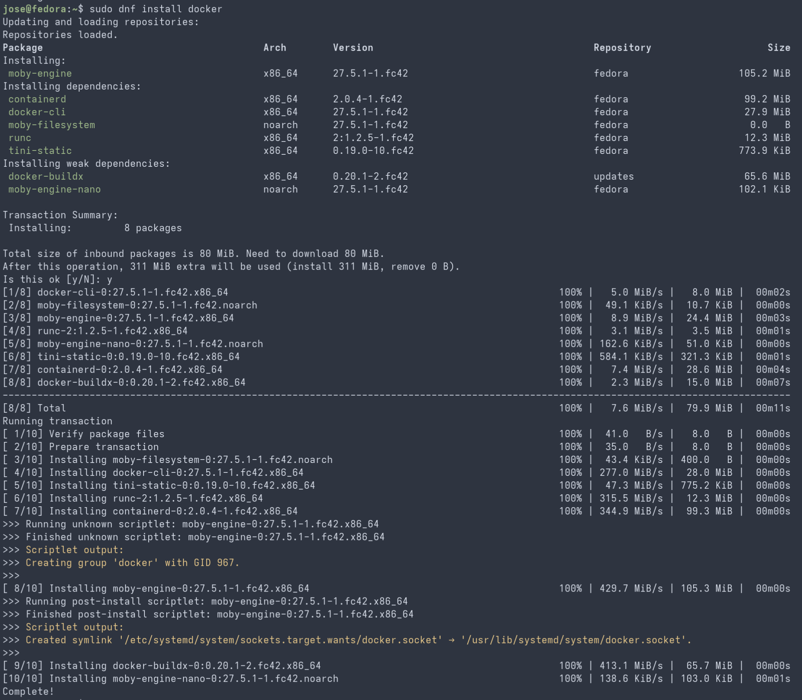
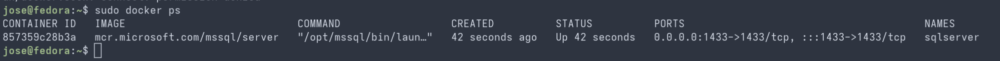
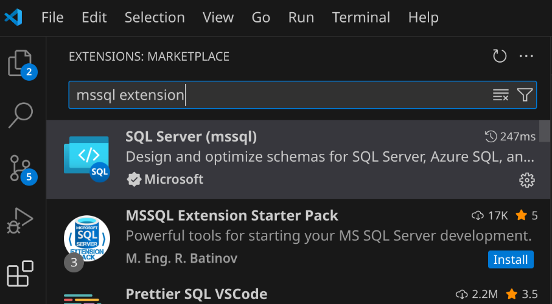
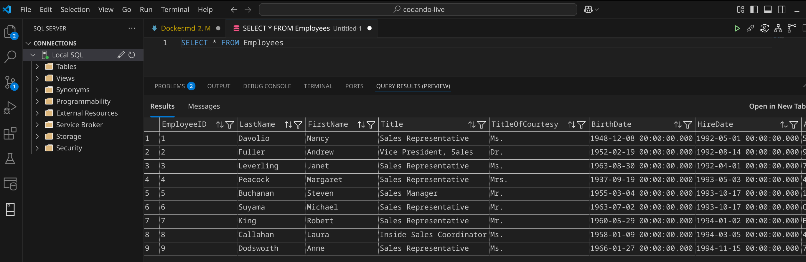

# Introduction to Docker Containers

## Container

A [container](https://www.docker.com/resources/what-container/) is a lightweight, portable, and efficient software package that encapsulates an application's code, dependencies, and runtime environment. It operates independently of the underlying infrastructure, ensuring consistent behavior across different systems and platforms. Containers are foundational to modern software development, enabling faster deployment, scalability, and flexibility.

## Docker

[Docker is](https://www.docker.com/) a platform for developing, shipping, and running applications in lightweight, portable containers. Containers bundle the application, along with all its dependencies and environment configurations, into a single package. This ensures consistency across development, testing, and production environments.

### Key Concepts

- **Containers**: Isolated environments for running applications, sharing the host OS kernel, but with dedicated resources.
- **Images**: Immutable templates for creating containers, containing the application and its dependencies.
- **Docker Engine**: The runtime that builds, runs, and manages containers.
- **Docker Hub**: A repository for sharing and downloading container images.

### Why Use Docker?

- **Consistency**: Applications run the same way across different environments.
- **Resource Efficiency**: Containers are lightweight compared to traditional virtual machines.
- **Scalability**: Easily replicate and deploy containers to meet demand.

## Virtual Machines vs Containers

### Virtual Machines (VMs)

- **Definition**: VMs emulate an entire physical machine, including its operating system, on top of a hypervisor.
- **Structure**: Each VM includes a full guest operating system, application, and required dependencies.
- **Resource Usage**: VMs are heavyweight due to the need for individual OS instances, consuming significant system resources.
- **Isolation**: Strong isolation between VMs since each runs its own OS.
- **Startup Time**: VMs typically have slower startup times as they boot the guest OS.

### Containers

- **Definition**: Containers virtualize the operating system, allowing multiple applications to run in isolated environments on the same OS kernel.
- **Structure**: Containers share the host OS kernel, bundling only applications and their dependencies.
- **Resource Usage**: Containers are lightweight and use fewer resources compared to VMs.
- **Isolation**: Process-level isolation; less isolated than VMs but sufficient for most use cases.
- **Startup Time**: Containers start almost instantly due to their lightweight structure.

## Using Docker on Linux

Most Linux distributions include all necessary tools to run Docker containers.
Make sure Docker is installed and configured before proceeding.

## Installing Docker and Creating a SQL Server Container

- **Install Docker**:
  - Check if docker is installed

      ```bash
      docker --version
      ```

  - Update the package repository

    ```bash
    sudo dnf update
    ```

  - Install Docker

    ```bash
    sudo dnf install docker
    ```

    

  - Start the Docker service

    ```bash
    sudo systemctl start docker
    sudo systemctl enable docker
    ```

- **Create SQL Server Container**

  - Advantages of Using SQL Server Containers
    - Rapid setup of SQL Server instances for development and testing.
    - Easy removal and recreation of containers for clean environments.
    - Simplified dependency management.
    - Platform independency (No windows machine required).

  - Search for the official SQL Server

    ```bash
    sudo docker search mssql-server
    ```

  - Pull the image (e.g., `mcr.microsoft.com/mssql/server`):

    ```bash
    sudo docker pull mcr.microsoft.com/mssql/server
    ```

- **Run the Container**
  - Create a SQL Server container

    ```bash
    sudo docker run -e 'ACCEPT_EULA=Y' -e 'SA_PASSWORD=YourPassword123' -p 1433:1433 --name sqlserver -d mcr.microsoft.com/mssql/server
    ```

  - Replace `YourPassword123` with a strong password for the SQL Server `sa` user.

- **Access SQL Server from VSCODE**
  - Verify it's running:

    ```bash
    sudo docker ps
    ```

    

  - Install SQL Server extension

    

  - Connect to the SQL Server local container
    - After the SQL Server Extension installation two new icons will appear on the left side menu.
      Use the one called "SQL Server".
  
    > Hokeys: CONTROL + ALT + D
  
    

- **Create the NorthWind database**
  -- Right click on the Connection and select "New Query" or Create a new .sql file

  ```sql
  -- Create the database
  CREATE DATABASE NorthWind;

  -- Verify it was created
  SELECT name 
    FROM sys.databases
    WHERE name = 'NorthWind';

  -- Set the database
  USE NorthWind

  ```

  - Copy and execute the NortWind scripts from [here](https://github.com/microsoft/sql-server-samples/blob/master/samples/databases/northwind-pubs/instnwnd.sql)

  - Test some SQL queries
    
  - Basic Commands:
    - List all installed containers: ```sudo docker ps -a```
    - List all RUNNING installed containers: ```sudo docker ps```
    - Start the container: ```sudo docker start sqlserver```
    - Stop the container: ```sudo docker stop sqlserver```
    - Remove the container: ```sudo docker rm sqlserver```

- **Basic Container Operations**:

  | **Command**                 | **Description**                                                                      |
  |-----------------------------|--------------------------------------------------------------------------------------|
  | `docker run <image>`        | Creates and runs a container from the specified Docker image.                        |
  | `docker ps`                 | Lists all running containers.                                                        |
  | `docker ps -a`              | Lists all containers.                                                                |
  | `docker images`             | Displays a list of all locally available Docker images.                              |
  | `docker build -t <name> .`  | Builds a Docker image from a Dockerfile in the current directory and tags it.        |
  | `docker stop <container>`   | Stops a running container.                                                           |
  | `docker rm <container>`     | Removes a stopped container.                                                         |
  | `docker rmi <image>`        | Deletes a Docker image from the local repository.                                    |
  | `docker exec -it <container> <command>` | Executes a command inside a running container (e.g., open a bash shell). |
  | `docker pull <image>`       | Downloads a Docker image from a registry like Docker Hub.                            |
  | `docker push <image>`       | Uploads a Docker image to a registry.                                                |
  | `docker logs <container>`   | Fetches logs from a container.                                                       |
  | `docker-compose up`         | Starts services defined in a `docker-compose.yml` file.                              |
  | `docker-compose down`       | Stops and removes services defined in `docker-compose.yml`.                          |
  | `docker network ls`         | Lists all Docker networks.                                                           |
  | `docker volume ls`          | Lists all Docker volumes.                                                            |
