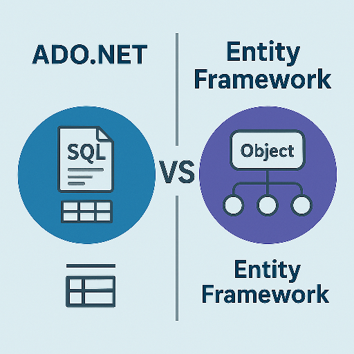

# ADO.NET vs Entity Framework



## Overview

ADO.NET and Entity Framework (EF) are two popular data access technologies in .NET Core. While ADO.NET provides low-level access to databases, EF offers an abstraction that simplifies data manipulation.

## Pros and Cons

### ADO.NET

**Pros:**

* High performance for direct database interactions.
* Fine-grained control over queries and transactions.
* Works with any type of database using raw SQL.

**Cons:**

* Requires manual management of connections and queries.
* More complex and time-consuming compared to ORM solutions.
* Increased risk of SQL injection if not handled properly.

```csharp
string connectionString = "Server=localhost,1433;Database=NorthWind;User Id=sa;Password=Password!;TrustServerCertificate=True;";
string query = "SELECT ProductID, ProductName, UnitPrice FROM Products";
using (SqlConnection connection = new SqlConnection(connectionString))
{
  connection.Open();
  using (SqlCommand command = new SqlCommand(query, connection))
  {
    using (SqlDataReader reader = command.ExecuteReader())
    {
      while (reader.Read())
      {
        Console.Write($"ID: {reader["ProductID"]}; ");
        Console.Write($"Name: {reader["ProductName"]}; ");
        Console.WriteLine($"Price: {reader["UnitPrice"]}");
      }
    }
  }
}
```

```csharp
public static DataTable GetProducts()
{
  string query = "SELECT ProductID, ProductName, UnitPrice FROM Products";
  using (var connection = new SqlConnection(ConnectionString.GetConnectionString()))
  {
    SqlDataAdapter adapter = new SqlDataAdapter(query, connection);
    DataTable products = new DataTable();
    adapter.Fill(products);
    return products;
  }
}

public static void PrintDataTable(DataTable products)
{
  foreach (DataRow product in products.Rows)
  {
    int id = (int)product["ProductID"];
    string name = (string)product["ProductName"];
    decimal price = (decimal)product["UnitPrice"];
    Console.WriteLine($"{id}; {name}; {price}");
  }
}
```

### Entity Framework

**Pros:**

* Simplifies database operations using LINQ.
* Supports automatic migrations and model updates.
* Manages connections and transactions internally.
* Reduces boilerplate code for CRUD operations.

**Cons:**

* Slower performance compared to ADO.NET in large-scale applications.
* Requires understanding of ORM concepts.
* May generate inefficient queries in certain cases.

```csharp
var optionsBuilder = new DbContextOptionsBuilder<NorthWindContext>();
optionsBuilder.UseSqlServer(ConnectionString.GetConnectionString());
using (var context = new NorthWindContext(optionsBuilder.Options))
{
  // Listing All
  List<Product> products = context.Products.ToList();
  products.ForEach(p => Console.WriteLine($"[{p.ProductId}; {p.ProductName}; {p.UnitPrice}]"));
}
```

```csharp
var customers = context
  .Customers
  .Where(c => c.Country == "Brazil" && c.City == "Sao Paulo")
  .ToList();
customers.ForEach(c => Console.WriteLine($"{c.CustomerId}; {c.CompanyName}; {c.Country}, {c.City}"));
```

## When to Use Each

| Feature           | ADO.NET                                     | Entity Framework                            |
|-------------------|---------------------------------------------|---------------------------------------------|
| Performance       | High                                        | Moderate                                    |
| Abstraction Level | Low (manual SQL operations)                 | High (object-relational mapping)            |
| Ease of Use       | Complex                                     | Easy                                        |
| Query Flexibility | Full SQL control                            | LINQ with ORM mappings                      |
| Recommended For   | High-performance scenarios, complex queries | Rapid development, standard CRUD operations |

### Recommendations

* Use **ADO.NET** when performance, flexibility and fine-grained control are essential, such as in complex transactions, tools, reporting or high-speed applications.

* Use **Entity Framework** when rapid development and maintainability are key, especially in applications with standard CRUD operations.

> TIP: Both technologies have their place in software development, and understanding their strengths and weaknesses helps in choosing the right tool for the job.
