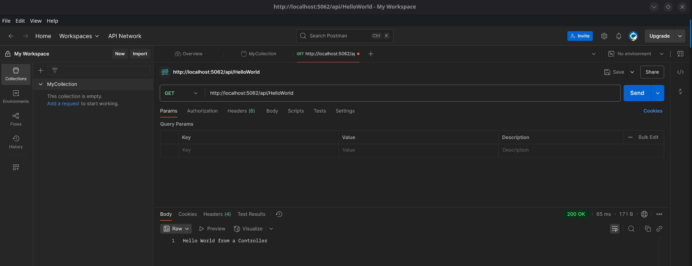

# WebAPI ASP.NET Core

A WebAPI in ASP.NET Core is a framework for building HTTP services that can be consumed by web applications, mobile apps, or other services.
It follows RESTful principles and is lightweight, making it ideal for microservices and backend communication.

* Interesting sources
  * [APIs with ASP.NET Core](https://dotnet.microsoft.com/en-us/apps/aspnet/apis)
  * [Build a web API with minimal API, ASP.NET Core, and .NET (FREE COURSE)](https://learn.microsoft.com/en-us/training/modules/build-web-api-minimal-api/?WT.mc_id=dotnet-35129-website)
  * [Minimal APIs overview](https://learn.microsoft.com/en-us/aspnet/core/fundamentals/minimal-apis/overview?view=aspnetcore-9.0&WT.mc_id=dotnet-35129-website)

## URL - Uniform Resource Locator

A [**Uniform Resource Locator (URL)**](https://en.wikipedia.org/wiki/URL) is a reference or address used to access resources on the web. It specifies the location of a resource and the protocol used to retrieve it. URLs are fundamental to web navigation, allowing users and applications to interact with websites, APIs, and other online services.

* Structure of a URL
  * A typical URL consists of several components, each serving a distinct purpose:
  * Example: `https://www.example.com:8080/path/to/resource?query=value#section`
  * Components:

    | **Value**         | **Component**    | **Description**                                          |
    |-------------------|------------------|----------------------------------------------------------|
    | `https://`        | **Protocol**     | Specifies the communication method (HTTP/HTTPS).         |
    | `www.example.com` | **Domain**       | The address of the website.                              |
    | `:8080`           | **Port**         | (Optional) Defines the communication port.               |
    | `/path/to/page`   | **Path**         | Specifies the resource location within the site.         |
    | `?query=value`    | **Query String** | (Optional) Sends data to the server via key-value pairs. |
    | `#section`        | **Fragment**     | (Optional) Refers to a specific section within the page. |

  * Additional Notes
    * **Protocols**: Common ones include `http`, `https`, `ftp`, and `file`.
    * [**Ports**](https://en.wikipedia.org/wiki/Port_(computer_networking)): Default ports are `80` for HTTP and `443` for HTTPS. When omitted, browsers assume these defaults.
    * **Query Parameters**: Used for passing dynamic data to a webpage, often seen in search queries.
    * **Fragments**: Allow navigation to specific sections within a page, improving usability.

> Note 🚀: Understanding URL structures is essential for web developers in **building, debugging, and optimizing web applications**.

## REST API

A [REST API](https://developer.mozilla.org/en-US/docs/Glossary/REST) (Representational State Transfer Application Programming Interface) is a web service that allows systems to communicate over HTTP using a set of predefined rules. REST APIs follow architectural principles that emphasize statelessness, uniform interfaces, and client-server separation.

REST APIs are widely used for building scalable and efficient web services. They rely on standard HTTP methods to perform CRUD (Create, Read, Update, Delete) operations on resources. These methods include:

* Properties
  * `Statelessness` – Each request from a client must contain all necessary information because the server does not store client session data. This improves scalability and reliability.
  * `Uniform Interface` – REST APIs follow a standard set of conventions, including resource-based URLs and HTTP methods (GET, POST, PUT, DELETE).
  * `Client-Server Architecture` – The client and server are independent; the client sends requests, and the server responds with data.
  * `Cacheability` – Responses can be cached to improve performance and reduce redundant requests.
  * `Layered System` – REST APIs support intermediate layers such as load balancers, security layers, and proxies without affecting communication.
  * `Resource-Based Design` – Everything is treated as a resource, accessible via a unique URL: ```/users/123, /products/456```.

## MVC

The [**Model-View-Controller (MVC)**](https://learn.microsoft.com/en-us/aspnet/core/mvc/overview?view=aspnetcore-9.0) pattern is a software design architecture that separates an application into three main components:

1. `Model`: Represents the data and business logic.
2. `View`: Handles UI presentation (not relevant in WebAPI).
3. `Controller`: Manages user requests and acts as an intermediary between the Model and View.

ASP.NET Core WebAPI primarily focuses on **Controllers**, where requests are processed and responses are sent in formats like JSON.

* Create a WebAPI project and add to the solution

  ```shell
  # Create the WebAPI project
  dotnet new webapi -n WEB_API_PROJECT_NAME # This one will have a WeatherForecast demo content

  # Creates an empty one
  dotnet new empty -n WEB_API_PROJECT_NAME

  # Add the WebAPI project to the solution
  dotnet sln add folder/WEB_API_PROJECT_NAME.csproj

  # List all projects
  dotnet sln list
  ```

* Create a Controller

  ```shell
  dotnet new apicontroller -n HelloWorldController -o Controllers
  ```

  ```csharp
  using Microsoft.AspNetCore.Mvc;

  namespace WebAPI.Controllers;

  [Route("api/[controller]")]
  [ApiController]
  public class HelloWorldController : ControllerBase
  {
    [HttpGet]
    public string Get()
    {
      return "Hello World from a Controller";
    }
  }
  ```

* Start the WebAPI Application

  ```shell
  dotnet run
  ```

* Acessing the Controller
  * Using the browser  

    ```shell
    http://localhost:<port>/api/HelloWorld
    ```

  * Using Postman
    * [Postman](https://www.postman.com/) is the single platform for designing, building, and scaling APIs—together. Join over 40 million users who have consolidated their workflows and leveled up their API game—all in one powerful platform.

    

  * Using cURL
    * [curl](https://curl.se/) is used in command lines or scripts to transfer data
    * curl is free and open source software and exists thanks to thousands of contributors and our awesome sponsors. The curl project follows well established open source best practices. You too can help us improve!

    ```shell
    curl -X GET http://localhost:5062/api/HelloWorld
    ```

## HTTP - Hyper Text Transfer Protocol

[**HTTP (HyperText Transfer Protocol)**](https://en.wikipedia.org/wiki/HTTP) is the foundation of communication on the web. It allows clients (such as browsers or APIs) to interact with servers by sending requests and receiving responses.

* [HTTP Documentation](https://httpwg.org/specs/)
* Every HTTP interaction follows this structure:
  1. **Client sends a request** (e.g., browser or API call).
  2. **Server processes the request** and generates a response.
  3. **Server responds** with data and a status code.

* [HTTP Methods](https://developer.mozilla.org/en-US/docs/Web/HTTP/Reference/Methods)

  | Method   | **Description**                |
  |----------|--------------------------------|
  | `GET`    | Retrieve data                  |
  | `POST`   | Send new data to the server    |
  | `PUT`    | Update existing data           |
  | `DELETE` | Remove a resource              |
  | `PATCH`  | Partially update a resource    |
  | `OPTIONS`| Retrieve supported methods for the resource |
  | `HEAD`   | Retrieve only headers, without the response body |
  | `TRACE`  | Debugging tool that shows the request journey |

## What Happens on a HTTP Request


When a client (such as a web browser) sends an [HTTP request](https://developer.mozilla.org/en-US/docs/Web/HTTP/Guides/Overview),
a series of steps occur to ensure communication between the client and the server. Here's a breakdown of the process:

1. **Client Initiates Request**  
   * A user interacts with a webpage by clicking a link or entering a URL.
   * The browser constructs an HTTP request with headers, method (GET, POST, etc.), and optional body content.

2. **DNS Resolution**  
   * The browser checks its cache or asks a DNS server to resolve the domain name into an IP address.

3. **Establishing a TCP Connection**  
   * Using the resolved IP address, the browser establishes a TCP connection with the server through a handshake.

4. **Sending the HTTP Request**  
   * The client sends the HTTP request to the server, specifying details such as the requested resource and additional headers.

5. **Server Processes Request**  
   * The server parses the request and determines how to respond.
   * If the resource is found, it processes the request and generates an appropriate response.
   * If the resource is not found or there's an error, the server returns an HTTP status code.

6. **Sending the HTTP Response**  
   * The server sends back an HTTP response containing headers, a status code (such as `200 OK` or `404 Not Found`), and the requested data (body).

7. **Client Receives and Renders Response**  
   * The browser receives the response and processes the content.
   * If the response contains HTML, CSS, or JavaScript, it renders the webpage accordingly.

8. **Connection Handling & Optimization**  
   * Persistent connections may keep the TCP session open for additional requests.
   * Modern browsers use techniques like caching and compression to optimize performance.

* Understanding this process is crucial for debugging issues and optimizing web applications!

> This is a common quest on Interviews

## HTTP Status Codes

HTTP status codes are **standardized responses** used by servers to indicate the result of an API request.  
They are grouped into categories:

| **Range** | **Category**  | **Meaning** |
|-----------|---------------|-------------|
| **1xx**   | Informational | Request received, continuing process |
| **2xx**   | Success       | Request was successfully processed |
| **3xx**   | Redirection   | Further action needed to complete request |
| **4xx**   | Client Error  | Request has an issue from the user's side |
| **5xx**   | Server Error  | Something went wrong on the server |

### Common HTTP Status Codes & Their Usage

| **Status Code** | **Description** | **Example Usage in ASP.NET Core** |
|-----------------|-----------------|-----------------------------------|
| **200 OK** | Request successful, returning data | `return Ok("Success!");` |
| **201 Created** | Resource successfully created | `return Created("/api/resource/1", newResource);` |
| **204 No Content** | Request successful, but no response body | `return NoContent();` |
| **400 Bad Request** | Invalid client request | `return BadRequest("Invalid input!");` |
| **401 Unauthorized** | Missing or invalid authentication | `return Unauthorized();` |
| **403 Forbidden** | Client lacks necessary permissions | `return Forbid();` |
| **404 Not Found** | Resource not found | `return NotFound("Item not found");` |
| **500 Internal Server Error** | Server encountered an issue | `return StatusCode(500, "An error occurred");` |

## The anatomy of the `HelloWorldController`

  ```csharp
  using Microsoft.AspNetCore.Mvc;

  namespace WebAPI.Controllers;

  [Route("api/[controller]")]
  [ApiController]
  public class HelloWorldController : ControllerBase
  {
    [HttpGet]
    public IActionResult English()
    {
      return Ok("Hello World from a Controller");
    }

    [HttpGet("ptbr")]
    public IActionResult Portuguese()
    {
      return Ok("Olá Mundo de um Controlador");
    }

    [HttpGet("hindi")]
    public IActionResult Hindi()
    {
      return Ok("नियंत्रक से हेलो वर्ल्ड");
    }
  }
  ```

  1. The controller inheriting from ControllerBase, which is optimized for APIs.
  2. `[Route("api/[controller]")]` sets the base URL to `api/HelloWorld`, dynamically resolving [controller] to HelloWorld.
     The URL does not need the sufix Controller
  3. `[ApiController]` enables automatic API-specific behaviors, such as model validation.
  4. `[HttpGet]` indicates this method handles GET requests.
  5. The method name (`Get`) is just a convention to help understand what the method does

* What happen when the `http://localhost:5062/api/HelloWorld` url is accessed
  1. ASP.NET matches the controller's route (api/HelloWorld).
  2. The framework looks for methods with [HttpGet] inside HelloWorldController.
  3. The Get() method executes because it has [HttpGet] defined.
  4. The method returns "Hello World from a Controller" as a response.

* Calling the HelloWorldController

  ```shell
  curl --location 'http://localhost:5062/api/HelloWorld'

  curl --location 'http://localhost:5062/api/HelloWorld/ptbr'

  curl --location 'http://localhost:5062/api/HelloWorld/hindi'
  ```

* More Methods on HelloWorldController
  * Simulating Products CRUD (Create, Read, Update, and Delete)

  ```csharp
  using Microsoft.AspNetCore.Mvc;

  namespace WebAPI.Controllers;

  [Route("api/[controller]")]
  [ApiController]
  public class HelloWorldController : ControllerBase
  {
    [HttpGet]
    public IActionResult English()
    {
      return Ok("Hello World from a Controller");
    }

    [HttpGet("ptbr")]
    public IActionResult Portuguese()
    {
      return Ok("Olá Mundo de um Controlador");
    }

    [HttpGet("hindi")]
    public IActionResult Hindi()
    {
      return Ok("नियंत्रक से हेलो वर्ल्ड");
    }
  }
  ```

## A Controller Demo: ProductController

* Controller implementation for Products

  ```csharp
  using Microsoft.AspNetCore.Mvc;

  namespace WebAPI.Controllers;

  [Route("api/[controller]")]
  [ApiController]
  public class ProductController : ControllerBase
  {
    [HttpOptions()]
    public IActionResult Options()
    {
      Response.Headers.Append("Allow", "GET, POST, PUT, PATCH, DELETE, OPTIONS");
      return Ok();
    }

    // GET: Retrieve all products
    [HttpGet()]
    public ActionResult<IEnumerable<Product>> GetProducts()
    {
      return Ok(products.Values);
    }

    // GET: Retrieve a single product by ID
    [HttpGet("{id}")]
    public ActionResult<Product> GetProduct(int id)
    {
      if (!products.ContainsKey(id))
        return NotFound();
      return Ok(products[id]);
    }

    // POST: Add a new product
    [HttpPost()]
    public ActionResult<Product> AddProduct([FromBody] Product newProduct)
    {
      newProduct.Id = products.Count > 0 ? products.Max(p => p.Key) + 1 : 1;
      products[newProduct.Id.Value] = newProduct;
      return CreatedAtAction(nameof(GetProduct), new { id = newProduct.Id }, newProduct);
    }

    // PUT: Update an existing product entirely
    [HttpPut("{id}")]
    public ActionResult PutProduct(int id, [FromBody] Product product)
    {
      var existingProduct = products[id];
      if (existingProduct == null)
        return NotFound();
      existingProduct.Description = product.Description;
      existingProduct.Price = product.Price;
      return NoContent();
    }

    // PATCH: Update an existing product partially
    [HttpPatch("{id}")]
    public ActionResult PatchProduct(int id, [FromBody] Product product)
    {
      if (!products.ContainsKey(id))
        return NotFound();
      var existingProduct = products[id];
      if (product.Description != null)
        existingProduct.Description = product.Description;
      if (product.Price.HasValue)
        existingProduct.Price = product.Price.Value;
      return NoContent();
    }

    // DELETE: Remove a product
    [HttpDelete("{id}")]
    public ActionResult DeleteProduct(int id)
    {
      if (!products.ContainsKey(id))
        return NotFound();
      products.Remove(id);
      return NoContent();
    }

    private static Dictionary<int, Product> products = new Dictionary<int, Product>
    {
        { 1, new Product { Id = 1, Description = "Notebook", Price = 1200 } },
        { 2, new Product { Id = 2, Description = "Smartphone", Price = 800 } },
        { 3, new Product { Id = 3, Description = "Mouse", Price = 50 } },
        { 4, new Product { Id = 4, Description = "Keyboard", Price = 70 } }
    };
  }

  public class Product
  {
    public int? Id { get; set; }
    public string? Description { get; set; }
    public decimal? Price { get; set; }
  }

  ```

## Query String

A query string is a part of the URL that contains key-value pairs used to pass data to web applications.
It appears after the `?` symbol in the URL and consists of multiple parameters separated by `&`.

* Example 1
  * `http://localhost:5062/api/QueryString?category=laptops&minPrice=500&sortBy=rating`
* Example 2
  * `http://localhost:5062/api/QueryString/with-params?category=laptops&minPrice=500&sortBy=rating`

```csharp
using Microsoft.AspNetCore.Mvc;

namespace WebAPI.Controllers;

[Route("api/[controller]")]
[ApiController]
public class QueryStringController : ControllerBase
{
  [HttpGet()]
  public IActionResult Get()
  {
    var category = HttpContext.Request.Query["category"];
    var minPrice = HttpContext.Request.Query["minPrice"];
    var sortBy = HttpContext.Request.Query["sortBy"];

    return Ok($"Category: {category}, Min Price: {minPrice}, Sorted By: {sortBy}");
  }

  [HttpGet("with-params")]
  public IActionResult GetWithParams(string category, decimal minPrice = 0, string sortBy = "name")
  {
    return Ok($"Category: {category}, Min Price: {minPrice}, Sorted By: {sortBy}");
  }
}
```

## HTTP Headers

HTTP headers are key-value pairs included in requests and responses, providing additional context and instructions about the communication between a client and a server. They influence caching, authentication, security, and content processing.

* HTTP Headers types
  * Request Headers
    * Sent by the client to provide details about the request, such as the expected response format or authentication credentials.
    * `User-Agent`: Identifies the client (e.g., browser type, operating system).
    * `Accept`: Specifies the preferred media types (e.g., `text/html`, `application/json`).
    * `Authorization`: Contains authentication credentials, such as API keys or tokens.
    * `Referer`: Indicates the previous webpage that led to the request.
  * Response Headers
    * Sent by the server to provide additional information about the response.
    * `Content-Type`: Specifies the format of the response (e.g., `application/json`, `text/html`).
    * `Server`: Identifies the server software handling the request.
    * `Set-Cookie`: Used to send cookies to the client for session management.
    * `Cache-Control`: Determines caching policies for the response.
  * General Headers
    * Used in both requests and responses, providing communication-related metadata.
    * `Date`: Indicates the timestamp when the request or response was created.
    * `Connection`: Controls connection persistence (e.g., `keep-alive` to maintain open connections).
    * `Content-Length`: Specifies the size of the response body in bytes.
* Importance of Headers
  * **Security**: Authentication and encryption headers ensure secure data exchange.
  * **Performance**: Headers like `Cache-Control` help optimize resource loading.
  * **Customization**: Developers use headers to tailor request behavior for APIs and web applications.
* Understanding HTTP headers allows developers to fine-tune communication between clients and servers, ensuring efficient and secure web interactions.

* HTTP Header Demo

  ```shell
  curl --location 'http://localhost:5062/api/headerdemo' \
  --header 'User-Agent:  Mozilla/5.0' \
  --header 'Accept:  application/json' \
  --header 'Authorization:  Bearer token123' \
  --header 'Content-Type:  application/json'
  ```

  ```csharp
  using Microsoft.AspNetCore.Mvc;

  namespace WebAPI.Controllers;
  [Route("api/[controller]")]
  [ApiController]
  public class HeaderDemoController : ControllerBase
  {
    // GET: api/headerdemo
    [HttpGet]
    public IActionResult HeaderDemo()
    {
      var headers = Request.Headers;
      var userAgent = headers["User-Agent"].ToString();
      var accept = headers["Accept"].ToString();
      var authorization = headers["Authorization"].ToString();
      var contentType = headers["Content-Type"].ToString();

      Response.Headers["X-User-Agent"] = string.IsNullOrEmpty(userAgent) ? "Not provided" : userAgent;
      Response.Headers["X-Accept"] = string.IsNullOrEmpty(accept) ? "Not provided" : accept;
      Response.Headers["X-Authorization"] = string.IsNullOrEmpty(authorization) ? "Not provided" : authorization;
      Response.Headers["X-Content-Type"] = string.IsNullOrEmpty(contentType) ? "Not provided" : contentType;

      var body = new
      {
        content = "No body, just headers"
      };

      return Ok(body);
    }
  }
  ```

## Implementing a Controller using Entity Framework

* Adding a reference to the DataAccess project

  ```shell
  dotnet add reference ../_05_DataAccess/DataAccess.csproj
  ```

* Add the String Connection to the appsettings.json
* Add the Context to the Application Services in the `Program.cs` file

  ```csharp
  using DataAccess.Models;
  using Microsoft.EntityFrameworkCore;

  var builder = WebApplication.CreateBuilder(args);

  // Add database context to services
  builder.Services
    .AddDbContext<NorthWindContext>(options => options.UseSqlServer(
      builder.Configuration.GetConnectionString("DefaultConnection")
    ));

  builder.Services.AddControllers();

  var app = builder.Build();

  if (app.Environment.IsDevelopment())
  {
  }

  app.MapControllers();

  app.Run();
  ```

* Creating a Controller: `CategoryController.cs`

  ```csharp
  using Microsoft.AspNetCore.Mvc;
  using Microsoft.EntityFrameworkCore;
  using DataAccess.Models;

  namespace WebAPI.Controllers;

  [Route("api/[controller]")]
  [ApiController]
  public class CategoriesController : ControllerBase
  {
    private readonly NorthWindContext _context;

    public CategoriesController(NorthWindContext context)
    {
      _context = context;
    }
    ...
  ```

>Note: The Controller methods are all set as `async` to not block the thread

* Testing the API Endpoints

  * Get all Categories

    ```shell
    curl --location 'http://localhost:5062/api/categories'
    ```

    ```csharp
    // GET: api/categories - Retrieve all categories
    [HttpGet]
    public async Task<ActionResult<IEnumerable<Category>>> GetCategories()
    {
      var categories = await _context.Categories.ToListAsync();
      return categories.Any() ? Ok(categories) : NoContent();
    }
    ```

  * Get a Category

    ```shell
    curl --location 'http://localhost:5062/api/categories/5'
    ```

    ```csharp
    // GET: api/categories/{id} - Retrieve a single category by ID
    public async Task<ActionResult<Category>> GetCategory(int id)
    {
      var category = await _context.Categories.FindAsync(id);
      if (category == null)
      {
        return NotFound($"Category with ID {id} not found.");
      }
      return Ok(category);
    }
    ```

  * Add a Category

    ```shell
    curl --location 'http://localhost:5062/api/categories' \
    --header 'Content-Type: application/json' \
    --data '{
        "CategoryName": "Electronics", 
        "Description": "Devices and gadgets"
    }'
    ```

    ```csharp
    // POST: api/categories - Add a new category
    [HttpPost]
    public async Task<ActionResult<Category>> CreateCategory(Category category)
    {
      if (category == null)
      {
        return BadRequest("Invalid category data.");
      }
      if (string.IsNullOrWhiteSpace(category.CategoryName))
      {
         return BadRequest("Category Name is required");
      }
      var newCategory = new Category
      {
        CategoryName = category.CategoryName,
        Description = category.Description
      };
      _context.Categories.Add(newCategory);
      await _context.SaveChangesAsync();
      return CreatedAtAction(nameof(GetCategory), new { id = newCategory.CategoryId }, newCategory);
    }
    ```

  * Update a Category

    ```shell
    curl --location --request PUT 'http://localhost:5062/api/categories/1' \
    --header 'Content-Type: application/json' \
    --data '{
        "CategoryName": "Beverages.", 
        "Description": "Devices and gadgets."
    }'
    ```

    ```csharp
    // PUT: api/categories/{id} - Update an existing category
    [HttpPut("{id}")]
    public async Task<IActionResult> UpdateCategory(int id, Category category)
    {
      var existingCategory = await _context.Categories.FindAsync(id);
      if (existingCategory == null)
      {
        return NotFound($"Category with ID {id} not found.");
      }
      existingCategory.CategoryName = category.CategoryName;
      existingCategory.Description = category.Description;
      await _context.SaveChangesAsync();
      return NoContent();
    }
    ```

  * Delete a Category
  
    ```shell
      curl --location --request DELETE 'http://localhost:5062/api/categories/9' \
    --header 'Content-Type: application/json' \
    --data '{
        "CategoryName": "Beverages [UPDATED]", 
        "Description": "Devices and gadgets [UPDATED]"
    }'
    ```

    ```csharp
    // DELETE: api/categories/{id} - Remove a category
    [HttpDelete("{id}")]
    public async Task<IActionResult> DeleteCategory(int id)
    {
      var category = await _context.Categories.FindAsync(id);
      if (category == null)
      {
        return NotFound($"Category with ID {id} not found.");
      }
      _context.Categories.Remove(category);
      await _context.SaveChangesAsync();
      return NoContent();
    }
    ```

## Authentication
