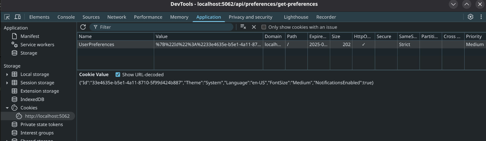

# Cookies in ASP.NET Core Web API

## Overview of Cookies

* Cookies are small pieces of data that a server sends to a client (typically a web browser) to store on the client’s device.
* The client includes these cookies in subsequent HTTP requests to the same server, allowing the server to retrieve or update the stored data.
* Cookies are usually stored in the client file system and can be accessed even after the browser is closed or the client machine is powered off.
* In the context Web APIs, cookies are often used to persist small amounts of data across requests, such as user preferences, session identifiers, or tracking information.

## Characteristics of Cookies

* **Key-Value Pairs**: Cookies store data as key-value pairs, e.g., `theme=dark`.
* **Domain and Path**: Cookies are scoped to a specific domain and path, ensuring they are only sent to the intended server endpoints.
* **Expiration**: Cookies can have an expiration date (persistent cookies) or exist only for the browser session (session cookies).
* **Size Limit**: Cookies are limited to approximately 4 KB per cookie, with browsers typically supporting 20–50 cookies per domain.
* **HttpOnly**: Cookies can be marked as `HttpOnly` to prevent client-side JavaScript access, enhancing security.
* **Secure**: Cookies can be flagged as `Secure`, ensuring they are only sent over HTTPS.
* **SameSite**: The `SameSite` attribute (`Strict`, `Lax`, or `None`) controls when cookies are sent in cross-site requests, mitigating cross-site request forgery (CSRF) risks.

## Common Use Cases

* **User Preferences**: Storing settings like theme (light/dark mode) or language preferences.
* **Tracking**: Maintaining analytics data, such as a unique visitor ID for tracking user behavior.
* **Session Management**: Storing session identifiers (though often tied to authentication).
* **Personalization**: Saving user-specific data, like recently viewed items in an e-commerce API.

## Advantages

* **Automatic Handling**: Browsers automatically include cookies in requests to the relevant domain, simplifying client-side logic.
* **Server Control**: The server can set, update, or delete cookies as needed.
* **Secure Options**: ASP.NET Core provides built-in support for secure cookie attributes (`HttpOnly`, `Secure`, `SameSite`).

## Considerations

* **Size Constraints**: Limited storage capacity requires careful data management.
* **Privacy**: Cookies may be subject to regulations (e.g., GDPR, CCPA), requiring user consent for non-essential cookies.
* **Cross-Origin Issues**: Cookies are domain-specific, and CORS configurations may be needed for cross-origin APIs.
* **Security Risks**: Without proper configuration (e.g., `HttpOnly`, `Secure`), cookies can be vulnerable to attacks like XSS or CSRF.

## Cookie Demo

* No additional NuGet packages are required, as cookie handling is built into ASP.NET Core.
* Each Browser stores Cookies in different away.
  * For example on Fedora 42 Chrome stores the Cookies in SqlLite database
  * Accessing Cookies on Chrome:
    

```csharp
using System.Text.Json;
using Microsoft.AspNetCore.Mvc;
using WebAPI.Models;

namespace WebAPI.Controllers;

[ApiController]
[Route("api/[controller]")]
public class PreferencesController : ControllerBase
{
  const string COOKIE_NAME = "UserPreferences";

  private readonly ILogger<PreferencesController> _logger;

  public PreferencesController(ILogger<PreferencesController> logger)
  {
    _logger = logger ?? throw new ArgumentNullException(nameof(logger));
  }

  [HttpGet("create-preferences")]
  public IActionResult GetPreferences()
  {
    try
    {
      UserPreference preference = new UserPreference
      {
        Id = Guid.NewGuid(),
        FontSize = "Medium",
        Language = "en-US",
        Theme = "System",
        NotificationsEnabled = true
      };
      // Set cookie options
      var cookieOptions = new CookieOptions
      {
        HttpOnly = true, // Prevent JavaScript access
        Secure = false,   // Set to true to only send over HTTPS (true is recommended)
        SameSite = SameSiteMode.Strict, // Mitigate CSRF
        Expires = DateTimeOffset.UtcNow.AddDays(30) // Persistent for 30 days
      };
      // Serialize preferences to JSON to store in a single cookie
      var preferenceJson = JsonSerializer.Serialize(preference);
      Response.Cookies.Append(COOKIE_NAME, preferenceJson, cookieOptions);
      return Ok("Cookie returned");
    }
    catch (Exception)
    {
      return StatusCode(500, "Error setting preferences");
    }
  }

  [HttpGet("access-preferences")]
  public IActionResult AccessPreferences()
  {
    try
    {
      if (Request.Cookies.ContainsKey(COOKIE_NAME))
      {
        var preference = JsonSerializer.Deserialize<UserPreference>(Request.Cookies[COOKIE_NAME]);
        _logger.LogInformation("Prefereces:{preference}", Request.Cookies[COOKIE_NAME]);
      }
      return Ok($"We accessed the cookie: {Request.Cookies[COOKIE_NAME]}");
    }
    catch (Exception)
    {
      return StatusCode(500, "Error setting preferences");
    }
  }

  [HttpDelete("clear-preferences")]
  public IActionResult ClearPreferences()
  {
    try
    {
      Response.Cookies.Delete(COOKIE_NAME);
      return Ok("Preferences cleared");
    }
    catch (Exception)
    {
      return StatusCode(500, "Error clearing preferences");
    }
  }
}
```
