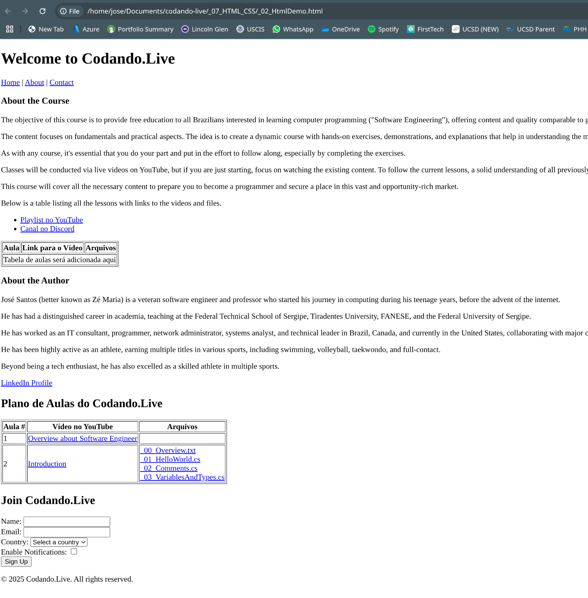
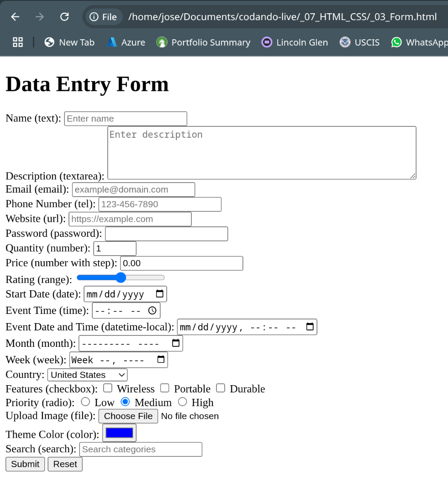

# Introduction to Common HTML Tags

## What is HTML?

HTML (HyperText Markup Language) is the backbone of web development, used to structure content on a webpage. It consists of tags that define elements like headings, paragraphs, links, images, and more.

## HTML Tag?

* An HTML tag is a fundamental component of HTML (HyperText Markup Language) used to structure and define content on a webpage.
* Tags are the building blocks of HTML, marking up content to indicate its role, such as headings, paragraphs, links, or images.
* They create elements that browsers interpret to render a webpage.
* Components
  * `Delimiter`: The angle brackets `<` and `>` enclose the tag name. For example, in `<p>`, the < and > are the delimiters.
  * `Tag Name`: The name inside the delimiters that specifies the type of element (e.g., p for paragraph, h1 for a main heading, img for an image). HTML has a predefined set of tag names, unlike XML, which allows custom tags.
  * `Attributes`: Optional key-value pairs included in the opening tag to provide additional information about the element. Attributes are written as name="value". For example, in `<a href="https://example.com">Click Here<a>`, href is an attribute specifying the link’s destination.
  * `Content`: The text or other elements between the opening and closing tags. For example, in `<p>Hello, world!</p>`, “Hello, world!” is the content.
  * `Closing Tag`: Mirrors the opening tag with a forward slash (/) before the tag name (e.g., `</p>`).

> Some tags are self-closing, meaning they don’t need a separate closing tag (e.g., `<br>`, `<hr>`, ``).

## Common HTML Tags

Below is a list of frequently used HTML tags, their purposes, and key attributes:

* **Document Structure Tags**:
  * `<!DOCTYPE html>`: Declares the document as HTML5.
  * `<html>`: The root element of the page, often with a `lang` attribute (e.g., `lang="en"`).
  * `<head>`: Contains metadata, such as the page title and character encoding.
  * `<body>`: Contains the visible content of the webpage.
* **Metadata Tags** (inside `<head>`):
  * `<meta>`: Defines metadata, like character set (`charset="UTF-8"`) or responsive viewport (`name="viewport"`).
  * `<title>`: Sets the title of the webpage, shown in the browser tab.
  * `<link>`: Links external resources, such as CSS stylesheets (e.g., `<link rel="stylesheet" href="styles.css">`).
* **Text Formatting Tags**:
  * `<h1>` to `<h6>`: Headings, with `<h1>` being the largest/most important and `<h6>` the smallest.
  * ``: Embeds an image, with src for the image path and alt for accessibility (e.g., ``).
  * `<p>`: Defines a paragraph.
  * `<strong>`: Indicates important text, typically bold.
  * `<em>`: Indicates emphasized text, typically italic.
  * `<br>`: Inserts a line break (self-closing tag).
  * `<hr>`: Creates a horizontal rule (line) to separate content.
* **Links and Media Tags**:
  * `<a>`: Creates a hyperlink, using the `href` attribute for the URL.
  * ``: Embeds an image, with `src` for the image path and `alt` for accessibility.
  * `<audio>`: Embeds audio, with `src` and attributes like `controls` for playback.
  * `<video>`: Embeds video, with `src`, `controls`, and optional `width`/`height`.
* **List Tags**:
  * `<ul>`: Creates an unordered (bulleted) list.
  * `<ol>`: Creates an ordered (numbered) list.
  * `<li>`: Defines a list item within `<ul>` or `<ol>`.
* **Structural and Semantic Tags**:
  * `<div>`: A block-level container for grouping content.
  * `<span>`: An inline container for styling or scripting small portions of content.
  * `<header>`: Represents introductory content or navigation.
  * `<nav>`: Defines a navigation section, often containing links (e.g., `<nav><a href="#home">Home</a></nav>`).
  * `<footer>`: Contains footer content, like copyright or contact info.
  * `<section>`: Defines a standalone section of content.
  * `<article>`: Represents independent, self-contained content.
* **Table Tags**:
  * `<table>`: Defines a table.
  * `<tr>`: Defines a table row.
  * `<th>`: Defines a table header cell.
  * `<td>`: Defines a table data cell.
* **Form Tags**:
  * `<form>`: Creates a form for user input, with attributes like action (URL to send data) and method (e.g., get or post).
  * `<input>`: Creates an input field, with types like text, email, submit, range, radio, checkbox, etc.
  * `<label>`: Labels an input for accessibility, using for to match an input’s id (e.g., `<label for="name">Name:</label>`).
  * `<button>`: Creates a clickable button, often with type="submit" or type="button".
  * `<select>`: Creates a dropdown list, often with a name attribute for form submission (e.g., `<select name="choice">`).
  * `<option>`: Defines an option within a `<select>` dropdown, with value for the data sent and optional selected attribute (e.g., `<option value="1">Option 1</option>`).
  * `<textarea>`: Creates a multi-line text input, with attributes like rows and cols for size (e.g., `<textarea rows="4" cols="50">`).
  *

* Comments

  ```html
  <!-- This is a comment -->

  <!-- 
    This is a multi-line comment
  -->
  ```

  >Warning: Comments are visible in the page source, so avoid including sensitive information.

## A Webpage Using Common HTML Tags

Below is a sample HTML webpage that incorporates most of the tags listed above, creating a simple blog post layout with text, media, lists, a table, and a form.

```html
<!DOCTYPE html>
<html lang="en">

<head>
  <meta charset="UTF-8">
  <meta name="viewport" content="width=device-width, initial-scale=1.0">
  <title>Codando.Live Training Course</title>
</head>

<body>
  <header>
    <h1>Welcome to Codando.Live</h1>
    <nav>
      <a href="#home">Home</a> |
      <a href="#about">About</a> |
      <a href="#contact">Contact</a>
    </nav>
  </header>

  <section>
    <!-- Main article for course description -->
    <article>
      <h1>About the Course</h1>
      <p>The objective of this course is to provide free education to all Brazilians interested in learning
        computer programming ("Software Engineering"), offering content and quality comparable to good university courses.</p>
      <p>The content focuses on fundamentals and practical aspects. The idea is to create a dynamic course with hands-on exercises,
        demonstrations, and explanations that help in understanding the material and clarifying the WHY behind concepts.</p>
      <p>As with any course, it's essential that you do your part and put in the effort to follow along, especially by completing the
        exercises.</p>
      <p>Classes will be conducted via live videos on YouTube, but if you are just starting, focus on watching the
        existing content. To follow the current lessons, a solid understanding of all previously covered material is necessary.
        So, don't rush, but stay dedicated and maintain continuous effort. Becoming a junior programmer requires several thousand hours
        of dedication.</p>
      <p>This course will cover all the necessary content to prepare you to become a programmer and secure a place in this
        vast and opportunity-rich market.</p>
      <p>Below is a table listing all the lessons with links to the videos and files.</p>

      <!-- Links to course resources -->
      <ul>
        <li><a href="https://www.youtube.com/playlist?list=PLBQmBWUPdMJSCssCE1uEkqIA6f2o_zYWZ">Playlist no YouTube</a>
        </li>
        <li><a href="https://discord.gg/QUxmPTZeNz">Canal no Discord</a></li>
      </ul>

      <!-- Placeholder for table of lessons -->
      <table border="1">
        <tr>
          <th>Aula</th>
          <th>Link para o Vídeo</th>
          <th>Arquivos</th>
        </tr>
        <tr>
          <td colspan="3">Tabela de aulas será adicionada aqui</td>
        </tr>
      </table>
    </article>
  </section>

  <section>
    <!-- Main article for author bio -->
    <article>
      <h1>About the Author</h1>
      <p>José Santos (better known as Zé Maria) is a veteran software engineer and professor who started his journey 
        in computing during his teenage years, before the advent of the internet.</p>
      <p>He has had a distinguished career in academia, teaching at the Federal Technical School of Sergipe, 
        Tiradentes University, FANESE, and the Federal University of Sergipe.</p>
      <p>He has worked as an IT consultant, programmer, network administrator, systems analyst, and technical 
        leader in Brazil, Canada, and currently in the United States, collaborating with major companies, 
        most recently at Microsoft and now at Intuit.</p>
      <p>He has been highly active as an athlete, earning multiple titles in various sports, including swimming, 
        volleyball, taekwondo, and full-contact.</p>
      <p>Beyond being a tech enthusiast, he has also excelled as a skilled athlete in multiple sports.</p>
      <!-- Link to LinkedIn profile -->
      <p><a href="https://www.linkedin.com/in/jose-rodrigues-santos/">LinkedIn Profile</a></p>
    </article>
  </section>

  <section>
    <h1>Plano de Aulas do Codando.Live</h1>
    <table border="1">
      <tr>
        <th>Aula #</th>
        <th>Vídeo no YouTube</th>
        <th>Arquivos</th>
      </tr>
      <tr>
        <td>1</td>
        <td><a href="https://youtube.com/live/YEfi_kZcaeU">Overview about Software Engineer</a></td>
        <td></td>
      </tr>
      <tr>
        <td>2</td>
        <td><a href="https://youtube.com/live/41j7Gd-EX0c">Introduction</a></td>
        <td>
          <a
            href="https://github.com/airamez/codando-live/blob/main/_01_CSharp/_01_Intro/_00_Overview.txt">_00_Overview.txt</a><br>
          <a
            href="https://github.com/airamez/codando-live/blob/main/_01_CSharp/_01_Intro/_01_HelloWorld.cs">_01_HelloWorld.cs</a><br>
          <a
            href="https://github.com/airamez/codando-live/blob/main/_01_CSharp/_01_Intro/_02_Comments.cs">_02_Comments.cs</a><br>
          <a
            href="https://github.com/airamez/codando-live/blob/main/_01_CSharp/_01_Intro/_03_VariablesAndTypes.cs">_03_VariablesAndTypes.cs</a>
        </td>
      </tr>
    </table>
  </section>

  <section>
    <h2>Join Codando.Live</h2>
    <form action="/submit" method="post">
      <label for="name">Name:</label>
      <input type="text" id="name" name="name" required>
      <br>
      <label for="email">Email:</label>
      <input type="email" id="email" name="email" required>
      <br>
      <label for="country">Country:</label>
      <select id="country" name="country" required>
        <option value="">Select a country</option>
        <option value="brazil">Brazil</option>
        <option value="canada">Canada</option>
        <option value="usa">USA</option>
      </select>
      <br>
      <label for="notifications">Enable Notifications:</label>
      <input type="checkbox" id="notifications" name="notifications">
      <br>
      <button type="submit">Sign Up</button>
    </form>
  </section>

  <footer>
    <p>© 2025 Codando.Live. All rights reserved.</p>
  </footer>
</body>

</html>
```



>Note: Every brower allow the visualition of the HTML source content.

## Document Object Model (DOM)

The **DOM (Document Object Model)** is an interface that represents the structure of an HTML document as a tree, allowing JavaScript to dynamically manipulate content.

* Key Concepts:
  * The DOM represents the document as a tree of nodes.
  * JavaScript interacts with the DOM to access and modify page content dynamically.
  * Each HTML element becomes a **node** in the tree.

* Example Structure

```plaintext
Document
├── html
    ├── head
    │   ├── title
    ├── body
        ├── header
        ├── section
        ├── footer
```

>Note: Every browser has a `Dev Tools` that allow exploration of the DOM.

## Form

HTML forms allow users to input data, which can be processed by web applications. They are essential for interactions like login pages, contact forms, and surveys.

* Basic Structure
  A form is created using the `<form>` element, which contains input fields.
* Attributes
  * `action` – Defines where the form data is sent (Controller path).
  * `method` – Specifies the HTTP method (GET or POST).
  * `name` – Identifies the form.

```html
<form action="/submit" method="post" name="data-entry-form">
    <label for="name">Name:</label>
    <input type="text" id="name" name="name">
    <button type="submit">Submit</button>
</form>
```

* Example

```html
<!DOCTYPE html>
<html lang="en">

<head>
  <meta charset="UTF-8">
  <meta name="viewport" content="width=device-width, initial-scale=1.0">
  <title>Data Entry Form Example</title>
</head>

<body>
  <h1>Data Entry Form</h1>
  <form action="" method="POST" name="data-entry-form">
    <!-- Hidden input -->
    <input type="hidden" id="userId" name="userId" value="12345">

    <!-- Text-based inputs -->
    <label for="name">Name (text):</label>
    <input type="text" id="name" name="name" placeholder="Enter name" required><br>

    <label for="description">Description (textarea):</label>
    <textarea id="description" name="description" rows="4" cols="50" placeholder="Enter description"></textarea><br>

    <label for="email">Email (email):</label>
    <input type="email" id="email" name="email" placeholder="example@domain.com"><br>

    <label for="phone">Phone Number (tel):</label>
    <input type="tel" id="phone" name="phone" placeholder="123-456-7890" pattern="[0-9]{3}-[0-9]{3}-[0-9]{4}"><br>

    <label for="website">Website (url):</label>
    <input type="url" id="website" name="website" placeholder="https://example.com"><br>

    <label for="password">Password (password):</label>
    <input type="password" id="password" name="password"><br>

    <!-- Numeric inputs -->
    <label for="quantity">Quantity (number):</label>
    <input type="number" id="quantity" name="quantity" min="1" max="100" value="1"><br>

    <label for="price">Price (number with step):</label>
    <input type="number" id="price" name="price" step="0.01" min="0" value="0.00"><br>

    <label for="rating">Rating (range):</label>
    <input type="range" id="rating" name="rating" min="0" max="10" value="5"><br>

    <!-- Date and time inputs -->
    <label for="startDate">Start Date (date):</label>
    <input type="date" id="startDate" name="startDate"><br>

    <label for="eventTime">Event Time (time):</label>
    <input type="time" id="eventTime" name="eventTime"><br>

    <label for="eventDateTime">Event Date and Time (datetime-local):</label>
    <input type="datetime-local" id="eventDateTime" name="eventDateTime"><br>

    <label for="month">Month (month):</label>
    <input type="month" id="month" name="month"><br>

    <label for="week">Week (week):</label>
    <input type="week" id="week" name="week"><br>

    <!-- Selection inputs -->
    <label for="country">Country:</label>
    <select id="country" name="country">
      <option value="us">United States</option>
      <option value="ca">Canada</option>
      <option value="br">Brazil</option>
      <option value="uk">United Kingdom</option>
    </select><br>

    <label>Features (checkbox):</label>
    <input type="checkbox" id="feature1" name="features" value="wireless">
    <label for="feature1">Wireless</label>
    <input type="checkbox" id="feature2" name="features" value="portable">
    <label for="feature2">Portable</label>
    <input type="checkbox" id="feature3" name="features" value="durable">
    <label for="feature3">Durable</label><br>

    <label>Priority (radio):</label>
    <input type="radio" id="low" name="priority" value="low">
    <label for="low">Low</label>
    <input type="radio" id="medium" name="priority" value="medium" checked>
    <label for="medium">Medium</label>
    <input type="radio" id="high" name="priority" value="high">
    <label for="high">High</label><br>

    <!-- File input -->
    <label for="image">Upload Image (file):</label>
    <input type="file" id="image" name="image" accept="image/*"><br>

    <!-- Color input -->
    <label for="themeColor">Theme Color (color):</label>
    <input type="color" id="themeColor" name="themeColor" value="#0000ff"><br>

    <!-- Search input -->
    <label for="search">Search (search):</label>
    <input type="search" id="search" name="search" placeholder="Search categories"><br>

    <!-- Buttons -->
    <button type="submit">Submit</button>
    <button type="reset">Reset</button>
  </form>
</body>

</html>
```


