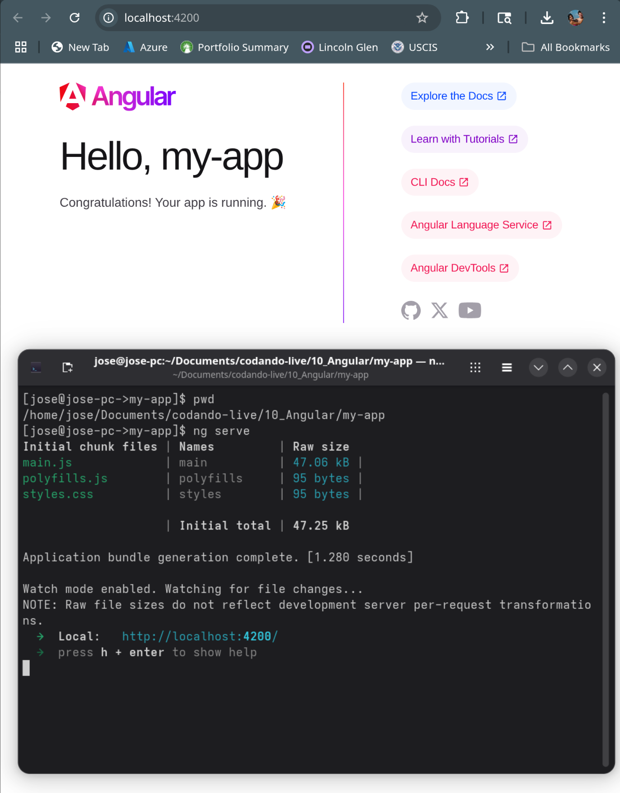

# Angular

* Angular is a robust, open-source web application framework developed by Google, designed for building dynamic, scalable, and maintainable single-page applications (SPAs).
* Built on TypeScript, it offers a structured, component-based architecture that promotes modularity, reusability, and testability.
* Angular 20, released in May 2025, brings cutting-edge features to enhance performance, developer experience, and modern web development capabilities, making it ideal for enterprise-grade applications.

> Note: Angular (version 2 and later) is a complete rewrite of AngularJS (version 1.x), transitioning from a JavaScript-based framework to a TypeScript-based, component-driven platform for better performance and scalability.

## Key Features

* **Component-Based Architecture**: Build encapsulated, reusable UI components to create complex, modular interfaces with ease.
* **TypeScript Integration**: Harnesses TypeScript’s type safety and tooling for better code maintainability and developer productivity.
* **Two-Way Data Binding**: Automatically synchronizes data between the model and view, simplifying UI updates.
* **Dependency Injection**: A powerful DI system for managing services, promoting modularity and easier testing.
* **Angular CLI**: A command-line interface that streamlines project setup, component generation, testing, and deployment.
* **Reactive Programming**: Supports reactive state management (e.g., via RxJS or Signals) for efficient, event-driven applications.
* **Routing and Navigation**: Built-in router for creating SPAs with client-side navigation and lazy loading for performance.
* **Forms Handling**: Robust support for template-driven and reactive forms with validation and dynamic controls.
* **Testing Support**: Integrated tools like Jasmine and Karma for unit and end-to-end testing to ensure code quality.
* **Cross-Platform Development**: Enables web, mobile (via [Ionic](https://ionicframework.com/)), and desktop (via [Electron](https://www.electronjs.org/)) applications from a single codebase.

## Why Use Angular?

* **Enterprise Scalability**: Angular’s structured framework and tooling make it ideal for large, complex applications.
* **Performance Optimizations**: Zoneless change detection, improved SSR, and tree-shaking ensure fast, efficient apps.
* **Developer Productivity**: The Angular CLI, standalone components, and modern APIs reduce development time and complexity.
* **Cross-Platform**: Supports web, mobile (via Ionic), and desktop (via Electron) development.
* **Active Community**: Backed by Google with a thriving community, regular updates, and extensive documentation.

## Resources

* **Official Angular Website**: Explore Angular’s features, tutorials, and community resources.
  * (<https://angular.dev>)
* **Official Documentation**: Detailed guides, API references, and best practices.
  * (<https://angular.dev/docs>)
* **Angular Blog**: Latest news, release notes, and updates on Angular.
  * (<https://blog.angular.io>)
* **Oficial Tutorial**: You can learn Angular interactively with this tutorial from Angular team:
  * (<https://angular.dev/tutorials/learn-angular>)
  * (<https://angular.dev/tutorials>)

## Getting Started

* Install the Angular and [CLI](https://angular.dev/tools/cli) globally
  * The Angular CLI is a command-line interface tool which allows you to scaffold, develop, test, deploy, and maintain Angular applications directly from a command shell.
  * It provides the ng (short for a*ng*ular) command and tools for scaffolding, building, and managing Angular projects.

  ```bash
  sudo npm install -g @angular/cli@20
  ```

* Create a new project:

  ```bash
  ng new my-app
  ```

* Run the development server:

  ```bash
  cd my-app
  ng serve
  ```

>Class Note: Do a demo creating a new app :)



## File Structure

| **Location**       | **File/Directory**  | **Description**                                                                 |
|--------------------|---------------------|---------------------------------------------------------------------------------|
| `/my-app/`         | `angular.json`      | Workspace configuration file defining project settings, build, and test options.|
| `/my-app/`         | `package.json`      | Defines project metadata, dependencies, and scripts for npm.                    |
| `/my-app/`         | `package-lock.json` | Locks exact versions of dependencies for consistent installs.                   |
| `/my-app/`         | `tsconfig.json`     | Root TypeScript configuration for the workspace, including compiler options.    |
| `/my-app/`         | `README.md`         | Introductory documentation with basic instructions for the project.             |
| `/my-app/`         | `.gitignore`        | Specifies files and directories Git should ignore.                              |
| `/my-app/`         | `.editorconfig`     | Standardizes code formatting across editors for consistent coding styl.         |
| `/my-app/`         | `node_modules/`     | Contains all npm dependencies installed for the project.                        |
| `/my-app/src/`     | `src/`              | Root directory for application source code, assets, and configurations.         |
| `/my-app/src/`     | `index.html`        | Main HTML file served by the app, with `<app-root>` as the root component selector. |
| `/my-app/src/`     | `main.ts`           | Entry point for the application, bootstrapping the standalone `AppComponent`.   |
| `/my-app/src/`     | `styles.css`        | Global styles applied across the entire application.                            |
| `/my-app/src/app/` | `app/`              | Contains the main application logic, including components and services          |
| `/my-app/src/app/` | `app.ts`            | Root component (standalone by default) defining the app's entry point.          |
| `/my-app/src/app/` | `app.html`          | Template for the root component, defining its HTML structure.                   |
| `/my-app/src/app/` | `app.css`           | Styles for the root component (CSS by default, based on CLI prompt).            |
| `/my-app/src/app/` | `app.spec.ts`       | Unit test file for the root component.                                          |
| `/my-app/src/app/` | `app.routes.ts`     | Defines application routes (included if routing is enabled during `ng new`).    |

## Components

* A [**component**](https://angular.dev/api/core/Component) is a fundamental building block in Angular applications.
* Components are modular, reusable, and encapsulate their functionality, making it easier to build and maintain complex applications.
* It represents a reusable piece of the user interface (UI) that combines:
  * **HTML Template**: Defines the structure and layout of the UI.
  * **TypeScript Class**: Contains the logic and data for the component.
  * **CSS Styles**: Specifies the component's appearance.
  * **Metadata**: Configures the component using Angular decorators like `@Component`.

### Key Characteristics of Components

* **Encapsulation**: Each component manages its own template, styles, and logic, isolated from others.
* **Reusability**: Components can be reused across different parts of the app.
* **Hierarchy**: Components form a tree-like structure, with parent and child components communicating through inputs and outputs.
* **Data Binding**: Connects the component’s data to the template for dynamic rendering.

### Creating a Component

Let’s create a simple component called `hello-world` to display a welcome message in your Angular app.

* Step 1: Generate a Component
  * Use the Angular CLI to create a new component.
  * Run the following command in your project’s root directory:

  ```bash
  ng generate component hello-world
  ```

  * This command:
  * Creates a `hello-world` folder under `src/app/hello-world`.
  * Generates four files:
    * `hello-world.css`: The component’s styles.
    * `hello-world.html`: The HTML template.
    * `hello-world.spec.ts`: The unit test file.
    * `hello-world.ts`: The TypeScript class with component logic.
  * Updates the `app.module.ts` to declare the new component.

* Step 2: Component Structure

  ```typescript
  import { Component } from '@angular/core';

  @Component({
    selector: 'hello-world',
    imports: [],
    templateUrl: './hello-world.html',
    styleUrl: './hello-world.css'
  })
  export class HelloWorld {

  }
  ```

  * **@Component Decorator**: Configures the component with:
    * `selector`: The custom HTML tag (`<hello-world>`) used to include the component in templates.
    * `imports`: Imported components.
    * `templateUrl`: Path to the HTML template.
    * `styleUrls`: Array of paths to CSS files.
  * **Class**: Defines the component’s properties and methods.

* Step 3: Customize the Component
  * Update the Template (`hello-world.html`):

  ```html
  <h2>Welcome to Our Angular App!</h2>
  <p>{{ message }}</p>
  ```

  * Update the Component Class (`hello-world.ts`):

  ```typescript
  import { Component } from '@angular/core';

  @Component({
    selector: 'hello-world',
    imports: [],
    templateUrl: './hello-world.html',
    styleUrl: './hello-world.css'
  })
  export class HelloWorld {
    message: string = 'Hello Angular World!';
  }
  ```

  * The `message` property is bound to the template using Angular’s interpolation (`{{ message }}`).

* Style the Component (`hello-world.css`):

  ```css
  h2 {
    color: #007bff;
    text-align: center;
  }
  p {
    font-size: 1.2em;
    color: #333;
  }
  ```

* Step 4: Add the Component to Your App
  * Add the the component to the App `imports`

  ```typescript
  import { Component } from '@angular/core';
  import { RouterOutlet } from '@angular/router';
  import { HelloWorld } from './hello-world/hello-world';

  @Component({
    selector: 'app-root',
    imports: [RouterOutlet, HelloWorld],
    templateUrl: './app.html',
    styleUrl: './app.css'
  })
  export class App {
    protected title = 'my-app';
  }
  ```

  * Add the component `selector` to the App HTML `app.html` template:

  ```html
  ...
  <hello-world></hello-world>
  ...
  ```

* Step 5: Run the Application
  * Run the development server:

  ```bash
  ng serve
  ```

  * Open your browser at `http://localhost:4200`

## Component Data Binding

* [Data binding](https://v17.angular.io/guide/binding-syntax) in Angular allows seamless interaction between a component's code and its HTML template.
* It enables dynamic updates to the UI when data changes in the component and vice versa.

### Key Binding Concepts

* **Interpolation (`{{ }}`)**: Displays component data in the template as text.
* **Property Binding (`[property]="value"`)**: Binds a component variable to an HTML element's property.
* **Event Binding (`(event)="handler()"`)**: Listens for user actions (e.g., clicks) and triggers component methods.
* **Two-Way Binding (`[(ngModel)]="value"`)**: Combines property and event binding for bidirectional data flow, typically used with form inputs.

### Binding from Component to HTML

#### 1. Interpolation

Interpolation uses double curly braces `{{ }}` to display component variable values in the template.

```html
<!-- Template (app.component.html) -->
<h1>{{ title }}</h1>
```

```typescript
// Component (app.component.ts)
import { Component } from '@angular/core';

@Component({
  selector: 'app-root',
  templateUrl: './app.component.html'
})
export class AppComponent {
  title = 'Welcome to Angular!';
}
```

* Explanation
  * Renders "Welcome to Angular!" in the `<h1>` tag.
  * When `title` changes, the UI updates automatically.

#### 2. Property Binding

Property binding sets an HTML element's property to a component variable using square brackets `[ ]`.

```html
<!-- Template (component.html) -->
<button [disabled]="isDisabled">Click Me</button>
```

```typescript
// Component (component.ts)
import { Component } from '@angular/core';

@Component({
  selector: 'app-root',
  templateUrl: './app.component.html'
})
export class AppComponent {
  isDisabled = true;
}
```

* Explanation
  * The `disabled` property of the button is bound to `isDisabled`. If `isDisabled` is `true`, the button is disabled.
  * The `src` attribute of the `` tag is bound to `imageUrl`, dynamically setting the image source.

#### 3. Event Binding

Event binding listens for DOM events (e.g., `click`, `input`) and calls a component method using parentheses `( )`.

```html
<!-- Template (component.html) -->
<p>Counter: {{ counter }}</p>
<button (click)="increment()">Increment</button>
```

```typescript
// Component (component.ts)
import { Component } from '@angular/core';

@Component({
  selector: 'app-root',
  templateUrl: './app.component.html'
})
export class AppComponent {
  counter = 0;

  increment() {
    this.counter++;
  }
}
```

* Explanation
  * Clicking the button triggers the `increment()` method, updating `counter`, which is reflected in the UI via interpolation.

### 4. Two-Way Binding

* Two-way binding syncs data between the component and template using `[(ngModel)]`.
* Requires the `FormsModule` to be imported in the module.

```html
<!-- Template (app.component.html) -->
<input [(ngModel)]="userName" placeholder="Enter your name">
<p>Hello, {{ userName }}!</p>
```

```typescript
// Module (app.module.ts)
import { NgModule } from '@angular/core';
import { FormsModule } from '@angular/forms';
import { AppComponent } from './app.component';

@NgModule({
  declarations: [AppComponent],
  imports: [FormsModule],
  bootstrap: [AppComponent]
})
export class AppModule { }
```

>Note: Add the FormsModule to the `imports

```typescript
// Component (app.component.ts)
import { Component } from '@angular/core';

@Component({
  selector: 'app-root',
  templateUrl: './app.component.html'
})
export class AppComponent {
  userName = '';
}
```

* Explanation
  * As the user types in the input, `name` updates in the component, and the updated value is displayed in the `<p>` tag.

### Summary

* **Interpolation**: Display component data in the template (`{{ variable }}`).
* **Property Binding**: Bind component variables to element properties (`[property]="variable"`).
* **Event Binding**: Handle user events to trigger component methods (`(event)="method()"`).
* **Two-Way Binding**: Sync data bidirectionally with `[(ngModel)]` (requires `FormsModule`).

>Note: These binding techniques allow you to create dynamic, interactive Angular applications by connecting component logic to the UI.

### Binding Demo

* Demo 1: All binding types
  * [_10_Angular/my-app/src/app/binding-demo/binding-demo.css](../_10_Angular/my-app/src/app/binding-demo/binding-demo.css)
  * [_10_Angular/my-app/src/app/binding-demo/binding-demo.html](../_10_Angular/my-app/src/app/binding-demo/binding-demo.html)
  * [_10_Angular/my-app/src/app/binding-demo/binding-demo.ts](../_10_Angular/my-app/src/app/binding-demo/binding-demo.ts)

* Demo 2: Form demo
  * [_10_Angular/my-app/src/app/data-form-demo/data-form-demo.css](../_10_Angular/my-app/src/app/data-form-demo/data-form-demo.css)
  * [_10_Angular/my-app/src/app/data-form-demo/data-form-demo.html](../_10_Angular/my-app/src/app/data-form-demo/data-form-demo.html)
  * [_10_Angular/my-app/src/app/data-form-demo/data-form-demo.ts](../_10_Angular/my-app/src/app/data-form-demo/data-form-demo.ts)

## Angular Structural Directives

* Structural directives in Angular are powerful tools for dynamically modifying the DOM by adding, removing, or repeating elements based on data or conditions.
* Built into Angular’s template syntax, they use an asterisk (`*`) to indicate structural changes, such as conditionally rendering elements or iterating over collections.
* In Angular 20 (released May 2025), structural directives like `*ngIf` and `*ngFor` remain core features, with new built-in control flow syntax (`@if`, `@for`) introduced as modern alternatives.

* Key Concepts
  * **Structural Directives**: Directives that alter the DOM structure by adding, removing, or repeating elements.
    * Prefixed with `*` (e.g., `*ngIf`, `*ngFor`), which Angular expands into `<ng-template>` internally.
  * **Dynamic HTML**: Structural directives enable dynamic UI updates by binding to component data, making apps interactive and responsive.
  * **CommonModule**: Provides `*ngIf` and `*ngFor` for standalone components; not needed for `@if` and `@for`.
  * **New Control Flow**: Angular 20’s `@if` and `@for` offer a concise, built-in alternative to directives, with improved performance and readability.

* Resources
  * **Official Documentation**:
    * `*ngIf`: [https://angular.dev/api/common/NgIf](https://angular.dev/api/common/NgIf)
    * `*ngFor`: [https://angular.dev/api/common/NgFor](https://angular.dev/api/common/NgFor)
    * Control Flow (`@if`, `@for`): [https://angular.dev/guide/templates/control-flow](https://angular.dev/guide/templates/control-flow)
  * **Angular Tutorials**: Interactive guides for learning directives and control flow.
    * [https://angular.dev/tutorials](https://angular.dev/tutorials)

### `*ngIf` Directive

* The `*ngIf` directive conditionally adds or removes an element and its children from the DOM based on a boolean expression.
* Ideal for showing/hiding content dynamically, such as user authentication states or toggling UI elements.

* Syntax

  ```html
  <div *ngIf="condition">Content to show if condition is true</div>
  ```

  * `condition`: A boolean expression from the component.
  * If `true`, the element is rendered; if `false`, it’s removed from the DOM.

* Example: Component to show a login status message.

  ```typescript
  import { Component } from '@angular/core';
  import { CommonModule } from '@angular/common';

  @Component({
    selector: 'app-login-status',
    standalone: true,
    imports: [CommonModule],
    templateUrl: './login-status.html',
    styleUrl: './login-status.css'
  })
  export class LoginStatusComponent {
    isLoggedIn = false;

    toggleLogin() {
      this.isLoggedIn = !this.isLoggedIn;
    }
  }
  ```

  ```html
  <div>
    <button (click)="toggleLogin()">{{ isLoggedIn ? 'Log Out' : 'Log In' }}</button>
    <p *ngIf="isLoggedIn">Welcome, you are logged in!</p>
  </div>
  ```

  ```css
  p {
    color: green;
    font-weight: bold;
  }
  button {
    padding: 8px 16px;
    margin-bottom: 10px;
  }
  ```

  * **Explanation**:
    * The `<p>` is rendered only when `isLoggedIn` is `true`.
    * Clicking the button toggles `isLoggedIn`, dynamically updating the DOM.
    * `*ngIf` removes the element entirely, unlike CSS `display: none`.

### `*ngIf` with `else`

Use `else` to display alternative content when the condition is `false`.

```html
<div>
  <button (click)="toggleLogin()">{{ isLoggedIn ? 'Log Out' : 'Log In' }}</button>
  <p *ngIf="isLoggedIn; else notLoggedIn">Welcome, you are logged in!</p>
  <ng-template #notLoggedIn>
    <p>Please log in to continue.</p>
  </ng-template>
</div>
```

* **Explanation**:
  * Shows the welcome message if `isLoggedIn` is `true`; otherwise, renders the `<ng-template>` content.

### `*ngFor` Directive

* The `*ngFor` directive iterates over a collection (e.g., an array) to render a template for each item.
* Perfect for displaying lists, tables, or any repeated UI elements.

* Syntax

```html
<div *ngFor="let item of items">{{ item }}</div>
```

* `items`: The collection to iterate over.
* `item`: A local variable for each item in the iteration.

* Example: Task List. Create a component to display and add tasks.

```html
<div>
  <input [(ngModel)]="task" placeholder="Add a new task">
  <button (click)="addTask()">Add</button>
  <p *ngIf="tasks.length === 0">No tasks available.</p>
  <ul *ngIf="tasks.length > 0">
    <li *ngFor="let task of tasks; let i = index;">
      {{ i + 1 }}. {{ task }}
    </li>
  </ul>
</div>
```

```typescript
import { Component } from '@angular/core';
import { FormsModule } from '@angular/forms';
import { CommonModule } from '@angular/common';

@Component({
  selector: 'task-list',
  imports: [FormsModule, CommonModule],
  templateUrl: './task-list.html',
  styleUrl: './task-list.css'
})
export class TaskList {
  task = "";
  tasks: string[] = [];

  addTask() {
    if (this.task.length > 0) {
      this.tasks.push(this.task);
    }
    this.task = "";
  }
}
```

```css
ul {
  list-style-type: none;
  padding: 0;
}
li {
  padding: 8px;
  border-bottom: 1px solid #ddd;
}
input {
  padding: 8px;
  margin-bottom: 10px;
  width: 200px;
  border: 1px solid #ccc;
  border-radius: 4px;
}
p {
  color: #888;
  text-align: left;
}
button {
  padding: 8px 16px;
  margin-left: 10px;
  background-color: #007bff;
  color: white;
  border: none;
  border-radius: 4px;
  cursor: pointer;
}
button:hover {
  background-color: #0056b3;
}
```

* **Explanation**:
  * `*ngFor` renders an `<li>` for each task in the `tasks` array.
  * `let i = index` provides a numbered list.
  * `*ngIf` shows a message when the list is empty.

* Demo: Task List
  * [_10_Angular/my-app/src/app/task-list/task-list.css](../_10_Angular/my-app/src/app/task-list/task-list.css)
  * [_10_Angular/my-app/src/app/task-list/task-list.html](../_10_Angular/my-app/src/app/task-list/task-list.html)
  * [_10_Angular/my-app/src/app/task-list/task-list.ts](../_10_Angular/my-app/src/app/task-list/task-list.ts)

### Modern Control Flow: `@if` and `@for`

* Angular 17 introduces [`@if`](https://blog.angular-university.io/angular-if/) and [`@for`](https://blog.angular-university.io/angular-for/) as built-in control flow syntax, offering a concise alternative to `*ngIf` and `*ngFor`.
* No `CommonModule` import is needed, and they integrate directly into templates.

#### `@if`

* Conditionally renders content without `<ng-template>`.

  ```html
  @if (condition) {
    <div>Content to show if condition is true.</div>
  } @else {
    <div>Content to show if condition is false.</div>
  }
  ```

* Example: Login Status with `@if`

  ```typescript
  import { Component } from '@angular/core';

  @Component({
    selector: 'app-login-status-modern',
    standalone: true,
    templateUrl: './login-status-modern.html',
    styleUrl: './login-status-modern.css'
  })
  export class LoginStatusModernComponent {
    isLoggedIn = false;

    toggleLogin() {
      this.isLoggedIn = !this.isLoggedIn;
    }
  }
  ```

  ```html
  <div>
    <button (click)="toggleLogin()">{{ isLoggedIn ? 'Log Out' : 'Log In' }}</button>
    @if (isLoggedIn) {
      <p>Welcome, you are logged in!</p>
    } @else {
      <p>Please log in to continue.</p>
    }
  </div>
  ```

  ```css
  p {
    color: green;
    font-weight: bold;
  }
  button {
    padding: 8px 16px;
    margin-bottom: 10px;
  }
  ```

* **Explanation**:
  * `@if` is more concise than `*ngIf` and doesn’t require `CommonModule`.
  * Achieves the same conditional rendering.

#### `@for`

* Iterates over collections with a mandatory `track` expression for performance.

  ```html
  @for (item of items; track item) {
    <div>{{ item }}</div>
  } @empty {
    <div>No items available.</div>
  }
  ```

  * Example: Task List with `@for`

  ```html
  <div>
    <h2>Task Manager Modern</h2>
    <input [(ngModel)]="task" placeholder="Add a new task">
    <button (click)="addTask()">Add</button>
    @for (task of tasks; track task; let i = $index) {
      <li>{{ i + 1 }}. {{ task }}</li>
    } @empty {
      <p>No tasks available.</p>
    }
  </div>
  ```

  ```typescript
  import { Component } from '@angular/core';
  import { FormsModule } from '@angular/forms';

  @Component({
    selector: 'task-list-modern',
    imports: [FormsModule],
    templateUrl: './task-list-modern.html',
    styleUrl: './task-list-modern.css'
  })
  export class TaskListModern {
    task = "";
    tasks: string[] = [];

    addTask() {
      if (this.task.length > 0) {
        this.tasks.push(this.task);
      }
      this.task = "";
    }
  }
  ```

  ```css
  /* src/app/task-list-modern/task-list-modern.css */
  ul {
    list-style-type: none;
    padding: 0;
  }
  li {
    padding: 8px;
    border-bottom: 1px solid #ddd;
  }
  input {
    padding: 8px;
    margin-bottom: 10px;
    width: 200px;
  }
  p {
    color: #888;
    text-align: center;
  }
  ```

  * **Explanation**:
    * `@for` iterates over `tasks`, with `track task` optimizing updates.
    * `@empty` replaces the need for a separate `*ngIf` check.
    * No `CommonModule` import is required.

* Demo: `@if` and `@for` Modern Task List
  * [_10_Angular/dynamic-content-app/src/app/task-list-modern/task-list-modern.css](../_10_Angular/dynamic-content-app/src/app/task-list-modern/task-list-modern.css)
  * [_10_Angular/dynamic-content-app/src/app/task-list-modern/task-list-modern.html](../_10_Angular/dynamic-content-app/src/app/task-list-modern/task-list-modern.html)
  * [_10_Angular/dynamic-content-app/src/app/task-list-modern/task-list-modern.ts](../_10_Angular/dynamic-content-app/src/app/task-list-modern/task-list-modern.ts)

## ng-container

`ng-container` is a logical container in Angular that allows you to group elements or apply structural directives without adding extra DOM elements. It’s a lightweight utility for managing template structure, especially useful when you need to apply directives like `*ngIf` or `*ngFor` but don’t want to wrap content in a `<div>` or other HTML element that affects styling or layout.

* Key Characteristics
  * **No DOM Output**: `ng-container` is a template-only construct and does not render as an HTML element in the DOM.
  * **Use Cases**: Apply structural directives, group elements for conditional rendering, or manage multiple directives without cluttering the DOM.
  * **Common Scenarios**: Combine with `*ngIf`, `*ngFor` to keep templates clean.

* Syntax

  ```html
  <ng-container *ngDirective>
    <!-- Content here -->
  </ng-container>
  ```

* Example: Conditional Grouping with `ng-container`
  * Component to display a user profile conditionally without adding extra DOM elements.

  ```html
  <div class="container">
    <div class="left-panel">
      <h2>User Profile</h2>
      <div>
        <input type="text" [(ngModel)]="inputUsername" placeholder="Enter username">
        <button (click)="checkPremiumStatus()">Login</button>
      </div>
      <ng-container *ngIf="user.name; else noUsername">
        <ng-container *ngIf="user.isPremium; else notPremium">
          <p>Premium Member: {{ user.name }}</p>
          <p>Enjoy exclusive benefits!</p>
        </ng-container>
        <ng-template #notPremium>
          <p>{{ user.name }} is a standard user.</p>
        </ng-template>
      </ng-container>
      <ng-template #noUsername>
        <p>Please enter a username.</p>
      </ng-template>
    </div>
    <div class="right-panel">
      <h3>Premium Users</h3>
      <ul>
        <ng-container *ngFor="let premiumUser of premiumUsers">
          <li>{{ premiumUser }}</li>
        </ng-container>
      </ul>
    </div>
  </div>
  ```

  ```typescript
  import { Component } from '@angular/core';
  import { CommonModule } from '@angular/common';
  import { FormsModule } from '@angular/forms';

  @Component({
    selector: 'user-profile',
    standalone: true,
    imports: [CommonModule, FormsModule],
    templateUrl: './user-profile.html',
    styleUrl: './user-profile.css'
  })
  export class UserProfile {
    user = { name: '', isPremium: false };
    premiumUsers = ['leila', 'jose', 'artur'];
    inputUsername: string = '';

    checkPremiumStatus() {
      this.user.name = this.inputUsername;
      this.user.isPremium = this.premiumUsers.includes(this.inputUsername.toLowerCase());
    }
  }
  ```

  ```css
  .container {
    display: flex;
    gap: 20px;
    background-color: #1e1e1e;
    color: #e0e0e0;
    padding: 16px;
    border-radius: 8px;
  }
  .left-panel, .right-panel {
    flex: 1;
  }
  p {
    margin: 8px 0;
  }
  input {
    padding: 8px;
    margin: 8px 0;
    border: 1px solid #444;
    border-radius: 4px;
    width: 100px;
    background-color: #2a2a2a;
    color: #e0e0e0;
  }
  input:focus {
    outline: none;
    border-color: #1e90ff;
    box-shadow: 0 0 4px rgba(30, 144, 255, 0.5);
  }
  input::placeholder {
    color: #888;
  }
  h3 {
    margin: 8px 0;
  }
  ul {
    list-style: none;
    padding: 0;
  }
  li {
    padding: 4px 0;
    border-bottom: 1px solid #444;
  }
  button {
    padding: 8px 16px;
    margin: 8px 0;
    border: none;
    border-radius: 4px;
    background-color: #1e90ff;
    color: #e0e0e0;
    cursor: pointer;
    font-size: 14px;
    transition: background-color 0.2s ease;
  }

  button:hover {
    background-color: #1c86ee;
  }

  button:focus {
    outline: none;
    box-shadow: 0 0 4px rgba(30, 144, 255, 0.5);
  }
  ```

* Explanation
  * The `<ng-container *ngIf="user.isPremium">` groups two `<p>` elements without adding a wrapper `<div>` to the DOM.
  * If `user.isPremium` is `true`, both premium messages are shown; if `false`, only the standard user message appears.
  * Inspecting the DOM shows no extra elements from `ng-container`, keeping the structure clean.
* Demo
  * [_10_Angular/my-app/src/app/user-profile/user-profile.css](../_10_Angular/src/app/user-profile/user-profile.css)
  * [_10_Angular/src/app/user-profile/user-profile.html](../_10_Angular/src/app/user-profile/user-profile.html)
  * [_10_Angular/src/app/user-profile/user-profile.ts](../_10_Angular/src/app/user-profile/user-profile.ts)

## ViewChild

* [`@ViewChild`](https://angular.dev/api/core/ViewChild) is an Angular decorator that allows a component to access and interact with a child element, directive, or component in its template.
* It’s ideal for dynamic DOM manipulation, calling methods on child components, or accessing directive properties.

* Key Features
  * **Purpose**: Query a single child element, directive, or component.
  * **Selector**: Use a component class, element reference, or template reference variable (e.g., `#myRef`).
  * **Static Option**: `{ static: true }` for queries in `ngOnInit`, `{ static: false }` for dynamic queries in `ngAfterViewInit`.
  * **Use Cases**: Focus inputs, manipulate child component state, interact with third-party libraries, or control DOM properties.

* Syntax

  ```typescript
  @ViewChild(selector, { static: boolean }) propertyName: Type;
  ```

  * **`selector`**: Specifies what to query:
    * A component class (e.g., `ChildComponent`).
    * A string (e.g., `'#myElement'`) for a template reference variable.
    * A directive (e.g., `NgModel`).
  * **`{ static: boolean }`**: Optional configuration:
    * `static: true`: Query resolves before view initialization (`ngOnInit`), for always-present elements.
    * `static: false`: Query resolves after view initialization (`ngAfterViewInit`), for conditional or dynamic elements.
    * Defaults to `false` if omitted.
  * **`propertyName`**: The parent component’s property storing the child reference.
  * **`Type`**: TypeScript type of the child (e.g., `ChildComponent`, `ElementRef`, `NgModel`) for type safety.


* Example

  * Template

    ```html
    <div class="editor-container">
      <h2>Text Editor</h2>
      <textarea #textArea placeholder="Write something..."></textarea>
      <div class="controls">
        <button (click)="focusTextArea()">Focus</button>
        <button (click)="changeTextColor()">Change Color</button>
        <button (click)="resizeTextArea()">Toggle Size</button>
        <button (click)="countWords()">Count Words</button>
      </div>

      @if (wordCount !== null){
      <p>Word Count: {{ wordCount }}</p>
      }
    </div>
    ```

  * Component

    ```typescript
    import { Component, ViewChild, ElementRef, AfterViewInit } from '@angular/core';

    @Component({
      selector: 'app-text-editor',
      standalone: true,
      templateUrl: './text-editor.component.html',
      styleUrls: ['./text-editor.component.css']
    })
    export class TextEditorComponent implements AfterViewInit {
      @ViewChild('textArea', { static: false }) textArea!: ElementRef<HTMLTextAreaElement>;
      wordCount: number | null = null;
      isLarge: boolean = false;
      colors: string[] = ['#000000', '#ff0000', '#00ff00', '#0000ff'];
      colorIndex: number = 0;

      ngAfterViewInit() {
        this.textArea.nativeElement.focus();
      }

      focusTextArea() {
        this.textArea.nativeElement.focus();
      }

      changeTextColor() {
        this.colorIndex = (this.colorIndex + 1) % this.colors.length;
        this.textArea.nativeElement.style.color = this.colors[this.colorIndex];
      }

      resizeTextArea() {
        this.isLarge = !this.isLarge;
        this.textArea.nativeElement.style.height = this.isLarge ? '300px' : '100px';
      }

      countWords() {
        const text = this.textArea.nativeElement.value.trim();
        this.wordCount = text ? text.split(/\s+/).length : 0;
      }
    }
    ```

  * Style

    ```css
    .editor-container {
      padding: 20px;
      max-width: 500px;
      margin: 0 auto;
    }
    textarea {
      width: 100%;
      height: 100px;
      padding: 10px;
      border: 1px solid #ccc;
      border-radius: 4px;
      font-size: 16px;
    }
    .controls {
      margin-top: 10px;
    }
    button {
      padding: 8px 16px;
      margin-right: 10px;
      background-color: #007bff;
      color: white;
      border: none;
      border-radius: 4px;
      cursor: pointer;
    }
    button:hover {
      background-color: #0056b3;
    }
    p {
      margin-top: 10px;
      font-size: 16px;
    }
    ```

## Component Lifecycle

* The [Angular component lifecycle](https://v17.angular.io/guide/lifecycle-hooks) consists of a series of stages that a component goes through from creation to destruction.
* Angular provides **lifecycle hooks**—methods that allow developers to tap into these stages and execute custom logic.
* Understanding the lifecycle is crucial for managing component initialization, updates, and cleanup effectively.

### Key Lifecycle Hooks

* Each lifecycle hook corresponds to a specific phase in a component’s lifecycle.
* Below is a comprehensive list of the primary hooks, their purposes, and common use cases.

1. **`ngOnChanges`**
   - **Purpose**: Called when Angular detects changes to **input properties** of a component or directive (before `ngOnInit` and whenever inputs change).
   - **When**: Invoked before the first rendering and after each change to input-bound properties.
   - **Use Cases**:
     - Respond to changes in `@Input` properties.
     - Perform calculations or updates based on new input values.
   - **Parameters**: Receives a `SimpleChanges` object containing current and previous values of changed inputs.
   - **Example**:
     ```typescript
     ngOnChanges(changes: SimpleChanges) {
       if (changes['inputData']) {
         console.log('Input changed:', changes['inputData'].currentValue);
       }
     }
     ```

2. **`ngOnInit`**
   - **Purpose**: Called **once** after the component’s inputs are set and the component is initialized.
   - **When**: After the first `ngOnChanges` and before the view is rendered.
   - **Use Cases**:
     - Initialize component data, fetch initial data from services, or set up subscriptions.
     - Perform setup that depends on input properties or component state.
   - **Example**:
     ```typescript
     ngOnInit() {
       this.loadData();
     }
     ```

3. **`ngDoCheck`**
   - **Purpose**: Called during every **change detection cycle**, allowing custom change detection logic.
   - **When**: After `ngOnChanges` and `ngOnInit`, and on every change detection run.
   - **Use Cases**:
     - Implement custom change detection for complex objects or non-input properties.
     - Rarely used due to performance implications; prefer Angular’s default change detection or `ngOnChanges`.
   - **Example**:
     ```typescript
     ngDoCheck() {
       if (this.customConditionChanged()) {
         this.updateComponent();
       }
     }
     ```

4. **`ngAfterContentInit`**
   - **Purpose**: Called **once** after Angular finishes projecting external content into the component’s view (via `<ng-content>`).
   - **When**: After `ngDoCheck` and content projection is complete.
   - **Use Cases**:
     - Initialize logic that depends on projected content.
     - Access queried content using `@ContentChild` or `@ContentChildren`.
   - **Example**:
     ```typescript
     ngAfterContentInit() {
       console.log('Projected content initialized');
     }
     ```

5. **`ngAfterContentChecked`**
   - **Purpose**: Called after every change detection cycle for projected content.
   - **When**: After `ngAfterContentInit` and during every change detection run.
   - **Use Cases**:
     - Update state or perform checks on projected content after changes.
   - **Example**:
     ```typescript
     ngAfterContentChecked() {
       this.validateContent();
     }
     ```

6. **`ngAfterViewInit`**
   - **Purpose**: Called **once** after Angular fully initializes the component’s view and all child views.
   - **When**: After `ngAfterContentChecked` and view initialization.
   - **Use Cases**:
     - Access or manipulate DOM elements or child components via `@ViewChild` or `@ViewChildren`.
     - Perform initialization that requires the view to be fully rendered.
   - **Example**:
     ```typescript
     ngAfterViewInit() {
       this.textArea.nativeElement.focus();
     }
     ```

7. **`ngAfterViewChecked`**
   - **Purpose**: Called after every change detection cycle for the component’s view and child views.
   - **When**: After `ngAfterViewInit` and during every change detection run.
   - **Use Cases**:
     - Perform checks or updates after the view and child views are updated.
   - **Example**:
     ```typescript
     ngAfterViewChecked() {
       this.checkViewState();
     }
     ```

8. **`ngOnDestroy`**
   - **Purpose**: Called **once** just before Angular destroys the component or directive.
   - **When**: When the component is removed from the DOM.
   - **Use Cases**:
     - Clean up subscriptions, timers, or event listeners to prevent memory leaks.
     - Perform final logging or state persistence.
   - **Example**:
     ```typescript
     ngOnDestroy() {
       this.subscription.unsubscribe();
     }
     ```

### Lifecycle Sequence

The lifecycle hooks are executed in the following order during a component’s lifecycle:

1. `ngOnChanges` (if inputs change)
2. `ngOnInit`
3. `ngDoCheck`
4. `ngAfterContentInit`
5. `ngAfterContentChecked`
6. `ngAfterViewInit`
7. `ngAfterViewChecked`
8. `ngOnChanges` (if inputs change again), `ngDoCheck`, `ngAfterContentChecked`, `ngAfterViewChecked` (repeated for each change detection cycle)
9. `ngOnDestroy` (when component is destroyed)

### Example: Component with Lifecycle Hooks

* Template

  ```html
  <div class="editor-container">
    <h2>Lifecycle Demo</h2>
    <input [(ngModel)]="inputData" placeholder="Enter title" />
    <textarea #textArea placeholder="Write something..."></textarea>
    @if (wordCount !== null) {
      <p>Word Count: {{ wordCount }}</p>
    }
    @if (charCount !== null) {
      <p>Character Count: {{ charCount }}</p>
    }
  </div>
  ```

* Component

  ```typescript
  import { Component, ViewChild, ElementRef, AfterViewInit, OnChanges, OnInit, OnDestroy, SimpleChanges } from '@angular/core';
  import { FormsModule } from '@angular/forms';

  @Component({
    selector: 'app-lifecycle-demo',
    standalone: true,
    imports: [FormsModule],
    templateUrl: './lifecycle-demo.component.html',
    styleUrls: ['./lifecycle-demo.component.css']
  })
  export class LifecycleDemoComponent implements OnChanges, OnInit, AfterViewInit, OnDestroy {
    @ViewChild('textArea', { static: false }) textArea!: ElementRef<HTMLTextAreaElement>;
    inputData: string = '';
    wordCount: number | null = null;
    charCount: number | null = null;
    private intervalId: any; // Example timer

    ngOnChanges(changes: SimpleChanges) {
      console.log('ngOnChanges: Input changed', changes);
      if (changes['inputData'] && this.textArea) {
        this.textArea.nativeElement.value = this.inputData;
        this.updateCounts();
      }
    }

    ngOnInit() {
      console.log('ngOnInit: Component initialized');
      this.intervalId = setInterval(() => {
        console.log('Component still active');
      }, 5000);
    }

    ngAfterViewInit() {
      console.log('ngAfterViewInit: View initialized');
      this.textArea.nativeElement.focus();
      // Add event listener for textarea changes
      this.textArea.nativeElement.addEventListener('input', () => this.updateCounts());
    }

    ngOnDestroy() {
      console.log('ngOnDestroy: Component destroyed');
      clearInterval(this.intervalId);
      // Remove event listener to prevent memory leaks
      this.textArea.nativeElement.removeEventListener('input', () => this.updateCounts());
    }

    private updateCounts() {
      const text = this.textArea.nativeElement.value.trim();
      this.wordCount = text ? text.split(/\s+/).length : 0;
      this.charCount = this.textArea.nativeElement.value.length;
    }
  }
  ```

* Style

  ```css
  .editor-container {
    padding: 20px;
    max-width: 500px;
    margin: 0 auto;
  }
  input, textarea {
    width: 100%;
    padding: 10px;
    margin-bottom: 10px;
    border: 1px solid #ccc;
    border-radius: 4px;
    font-size: 16px;
  }
  textarea {
    height: 100px;
  }
  p {
    margin-top: 10px;
    font-size: 16px;
  }
  ```

## Best Practices

- **Use `ngOnInit` for Initialization**: Perform setup tasks like data fetching or subscriptions in `ngOnInit` rather than the constructor, as inputs are available here.
- **Clean Up in `ngOnDestroy`**: Always unsubscribe from observables, clear intervals, or remove event listeners to prevent memory leaks.
- **Avoid Heavy Logic in `ngDoCheck`**: This hook runs frequently, so keep it lightweight to avoid performance issues.
- **Use `ngAfterViewInit` for View Access**: Access `@ViewChild` or `@ViewChildren` in `ngAfterViewInit` for dynamic queries to ensure the view is fully initialized.
- **Leverage `ngOnChanges` for Input Changes**: Use this hook to react to input property changes efficiently instead of relying on `ngDoCheck`.
- **Minimize DOM Manipulation**: Prefer Angular’s data-binding and directives over direct DOM manipulation, even when using `@ViewChild`.

## Common Pitfalls

- **Accessing `@ViewChild` Too Early**: If `{ static: false }`, ensure you access `@ViewChild` properties in `ngAfterViewInit`, not `ngOnInit`.
- **Forgetting Cleanup**: Failing to unsubscribe in `ngOnDestroy` can cause memory leaks, especially with long-lived subscriptions.
- **Overusing `ngDoCheck`**: Relying on `ngDoCheck` for change detection can degrade performance; use Angular’s change detection or `ngOnChanges` instead.
- **Misusing `static` in `@ViewChild`**: Use `{ static: true }` only for elements or components that are always present; otherwise, use `{ static: false }`.

## Additional Content

* Component Communication (Input/Output)
* Inner components
* Pipes
* Reactive Forms
* Routing and Navigation
* Services and Dependency Injection
