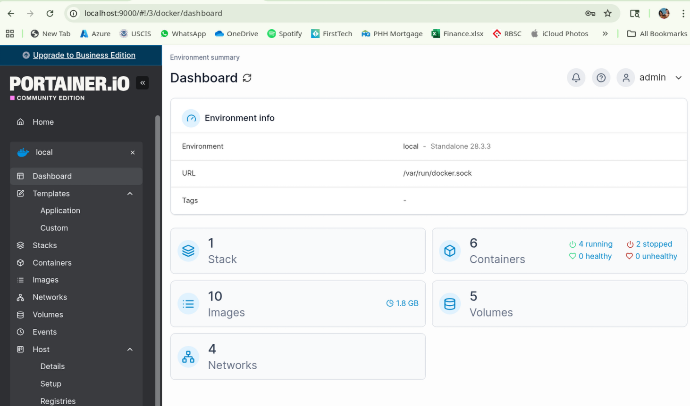

# 🐳 Docker

[Docker](https://www.docker.com) is an open-source platform used to develop, ship, and run applications inside containers.

## Documentation

- Docker Documentation: [https://docs.docker.com](https://docs.docker.com)
- Play with Docker: [https://labs.play-with-docker.com](https://labs.play-with-docker.com)
- DockerHub: [https://hub.docker.com](https://hub.docker.com)


## Key Concepts:
- **Containers**: Lightweight, portable environments to run apps
- **Images**: Snapshots of containers
- **Docker Engine**: Core part of Docker, runs and manages containers

---

## Why Use Docker?

- Consistent environments across development, staging, and production
- Lightweight and fast startup
- Simplified dependency management

---

## Installation

* On Windows/Mac:
  * Download from [Docker Official Site](https://www.docker.com/products/docker-desktop/)
  * Follow the installation wizard

* On Ubuntu Linux:

  ```bash
  # Update your system first
  sudo apt-get update
  # Install Docker package
  sudo apt-get install docker-ce docker-ce-cli containerd.io
  ```

* On Arch Linux

  ```bash
  # Update your system first
  sudo pacman -Syu     
  
  # Install Docker package     
  sudo pacman -S docker
  
  # Install Docker Composer
  sudo pacman -S docker-compose

  # Intall Docker BuildX
  sudo pacman -S docker-buildx

  ```

* Confirm installation

  ```shell
  docker --version
  docker-compose --version

  ```

* Start/Stop Docker

  ```bash
  # Start Docker
  sudo systemctl start docker

  # Stop
  sudo systemctl stop docker.socket
  sudo systemctl stop docker.service
  ```

* Basic Commands

  | Command                     | Description                      |
  | --------------------------- | -------------------------------- |
  | `docker run hello-world`    | Test Docker installation         |
  | `docker ps`                 | List running containers          |
  | `docker images`             | List downloaded images           |
  | `docker build -t appname .` | Build image from Dockerfile      |
  | `docker exec -it <id> bash` | Access running container's shell |

## Dockerfile

* A [**Dockerfile**](https://docs.docker.com/reference/dockerfile/) is a plain text file that defines how to build a Docker image.
* It’s essentially a blueprint containing instructions like which base image to use, what dependencies to install, and how to configure your app.

### Why Use a Dockerfile?

- Ensures consistent environment across machines and teams
- Automates the setup of apps and dependencies
- Makes it easy to share and deploy your app using images

### Multi-Container Setup

* For a full-stack web app, we often split responsibilities across containers for modularity and scalability.
* This is a setup using **three containers(layers)** for full-stack application:

  | Layer      | Tech Stack           | Docker Image Used                                |
  | ---------- | -------------------- | ------------------------------------------------ |
  | Database   | PostgreSQL           | `postgres:latest`                                |
  | Server/API | ASP.NET Core Web API | `mcr.microsoft.com/dotnet/aspnet` + custom build |
  | Frontend   | Angular              | `node:20` for build + `nginx` to serve           |

>Note: We’ll define each container individually and orchestrate them using **Docker Compose** (Details Below).

#### Architecture Diagram

```
┌─────────────────────────────────────────────────────────────────┐
│                        HOST MACHINE                             │
│                                                                 │
│  ┌─────────────────┐    ┌─────────────────┐    ┌──────────────┐ │
│  │   Frontend      │    │      API        │    │  Database    │ │
│  │   Container     │    │   Container     │    │  Container   │ │
│  │                 │    │                 │    │              │ │
│  │  ┌───────────┐  │    │  ┌───────────┐  │    │ ┌──────────┐ │ │
│  │  │   nginx   │  │    │  │ ASP.NET   │  │    │ │PostgreSQL│ │ │
│  │  │  (Alpine) │  │---►│  │ Core API  │  │---►│ │          │ │ │
│  │  │           │  │    │  │   (.NET)  │  │    │ │          │ │ │
│  │  │  Angular  │  │◄---│  │           │  |◄---│ │          │ │ │
│  │  │    App    │  │    │  │           │  │    │ │          │ │ │
│  │  └───────────┘  │    │  └───────────┘  │    │ └──────────┘ │ │
│  │                 │    │                 │    │              │ │
│  │  Port: 80       │    │  Port: 5000     │    │ Port: 5432   │ │
│  │  Name:          │    │  Name:          │    │ Name:        │ │
│  │  todo-frontend  │    │  todo-api       │    │ todo-postgres│ │
│  └─────────────────┘    └─────────────────┘    └──────────────┘ │
│           │                       │                       │     │
│           │                       │                       │     │
│  ┌────────▼────────┐    ┌─────────▼────────┐    ┌─────────▼───┐ │
│  │ localhost:80    │    │ localhost:5000   │    │ Internal    │ │
│  │ (External)      │    │ (External)       │    │ Network     │ │
│  └─────────────────┘    └──────────────────┘    │ Only        │ │
│                                                 └─────────────┘ │
└─────────────────────────────────────────────────────────────────┘

                    ┌─────────────────┐
                    │     Browser     │
                    │  (User Access)  │
                    └─────────────────┘
                             │
                             │ HTTP Requests
                             ▼
                    ┌─────────────────┐
                    │ localhost:80    │
                    │  (Frontend)     │
                    └─────────────────┘
```

#### Frontend Container (todo-frontend)
- **Base Image**: nginx:alpine
- **Build Process**: Multi-stage (Node.js build → nginx serve)
- **Port Mapping**: 80:80
- **Purpose**: Serves Angular application via nginx
- **Dependencies**: Depends on API container

#### API Container (todo-api)
- **Base Image**: mcr.microsoft.com/dotnet/aspnet
- **Framework**: ASP.NET Core (.NET 9.0)
- **Port Mapping**: 5000:5000
- **Purpose**: REST API for todo operations
- **Dependencies**: Depends on PostgreSQL container

#### Database Container (todo-postgres)
- **Base Image**: postgres:latest
- **Port Mapping**: 5432:5432
- **Database Name**: todo_db
- **Credentials**: user/password
- **Purpose**: Data persistence for todo items

#### Dockerfiles

Dockerfiles use a **multi-stage build** approach to optimize image size and security. This technique separates the build environment (with development tools) from the runtime environment (minimal production image).

**Key Benefits of Multi-Stage Builds:**
- **Smaller final images**: Build tools and dependencies are not included in the final image
- **Better security**: Fewer components in production = smaller attack surface
- **Faster deployments**: Smaller images transfer and start faster
- **Clean separation**: Build artifacts vs runtime requirements

**Multi-Stage Build Process:**
1. **Build Stage**: Uses full SDK/development image with all build tools
2. **Runtime Stage**: Uses minimal runtime image and copies only compiled artifacts
3. **Final Image**: Contains only what's needed to run the application

---

* Database - PostgreSQL (No Dockerfile needed)
  * Use the official image directly in Docker Compose.
* Backend - ASP.NET Core Web API: `Dockerfile.api`

  ```dockerfile
  FROM mcr.microsoft.com/dotnet/sdk:8.0 AS build
  WORKDIR /src
  COPY . .
  RUN dotnet publish "WebApi.csproj" -c Release -o /app/publish

  FROM mcr.microsoft.com/dotnet/aspnet:8.0 AS runtime
  WORKDIR /app
  COPY --from=build /app/publish .
  EXPOSE 5000
  ENV ASPNETCORE_URLS=http://+:5000
  ENTRYPOINT ["dotnet", "WebApi.dll"]
  ```

  **Detailed Breakdown:**

  **Stage 1: Build Stage**
  ```dockerfile
  FROM mcr.microsoft.com/dotnet/sdk:8.0 AS build
  ```
  - Uses Microsoft's official .NET SDK image (contains compiler, build tools)
  - Names this stage "build" for reference in later stages
  - SDK image is ~700MB but contains everything needed to compile .NET applications

  ```dockerfile
  WORKDIR /src
  ```
  - Sets working directory inside container to `/src`
  - All subsequent commands will run from this directory

  ```dockerfile
  COPY . .
  ```
  - Copies all files from build context (current directory) to `/src` in container
  - Includes source code, project files, dependencies

  ```dockerfile
  RUN dotnet publish "WebApi.csproj" -c Release -o /app/publish
  ```
  - Compiles the application in Release mode (optimized for production)
  - Outputs compiled binaries to `/app/publish` directory
  - Creates self-contained deployment package

  **Stage 2: Runtime Stage**
  ```dockerfile
  FROM mcr.microsoft.com/dotnet/aspnet:8.0 AS runtime
  ```
  - Starts fresh with ASP.NET Core runtime image (~200MB)
  - Contains only runtime components, no build tools
  - Much smaller and more secure than SDK image

  ```dockerfile
  WORKDIR /app
  ```
  - Sets working directory to `/app` in the runtime container

  ```dockerfile
  COPY --from=build /app/publish .
  ```
  - Copies compiled application from build stage to runtime stage
  - Only the necessary compiled files, not source code or build tools

  ```dockerfile
  EXPOSE 5000
  ```
  - Documents that the application listens on port 5000
  - Doesn't actually publish the port (done in docker-compose.yml)

  ```dockerfile
  ENV ASPNETCORE_URLS=http://+:5000
  ```
  - Sets environment variable to configure ASP.NET Core to listen on all interfaces
  - `+` means bind to all available IP addresses on port 5000

  ```dockerfile
  ENTRYPOINT ["dotnet", "WebApi.dll"]
  ```
  - Defines the command that runs when container starts
  - Executes the compiled .NET application

* Frontend - Angular App: `Dockerfile.frontend`

  ```dockerfile
  FROM node:latest AS build
  WORKDIR /app
  COPY package.json package-lock.json ./
  RUN npm install
  COPY . .
  RUN npm run build

  FROM nginx:alpine
  COPY --from=build /app/dist/frontend/browser /usr/share/nginx/html
  EXPOSE 80
  CMD ["nginx", "-g", "daemon off;"]
  ```

  **Detailed Breakdown:**

  **Stage 1: Build Stage**
  ```dockerfile
  FROM node:latest AS build
  ```
  - Uses official Node.js image (contains npm, node, build tools)
  - Names this stage "build" for reference in the runtime stage
  - Node.js image is ~400MB but includes everything needed to build Angular apps

  ```dockerfile
  WORKDIR /app
  ```
  - Sets working directory inside container to `/app`
  - All subsequent commands will execute from this directory

  ```dockerfile
  COPY package.json package-lock.json ./
  ```
  - Copies only dependency files first (optimization technique)
  - Allows Docker to cache npm install step if dependencies haven't changed
  - Faster rebuilds when only source code changes

  ```dockerfile
  RUN npm install
  ```
  - Downloads and installs all Node.js dependencies
  - Creates `node_modules` folder with all required packages
  - This step is cached unless package files change

  ```dockerfile
  COPY . .
  ```
  - Copies all remaining source code files to the container
  - Includes TypeScript files, components, assets, configuration

  ```dockerfile
  RUN npm run build
  ```
  - Executes Angular build process (typically `ng build`)
  - Compiles TypeScript to JavaScript, optimizes assets
  - Creates production-ready static files in `dist/` folder

  **Stage 2: Runtime Stage**
  ```dockerfile
  FROM nginx:alpine
  ```
  - Starts fresh with lightweight nginx web server (~15MB)
  - Alpine Linux base for minimal size and security
  - Perfect for serving static files (HTML, CSS, JS)

  ```dockerfile
  COPY --from=build /app/dist/frontend/browser /usr/share/nginx/html
  ```
  - Copies built Angular application from build stage
  - Places files in nginx's default web root directory
  - Only static files, no source code or build tools

  ```dockerfile
  EXPOSE 80
  ```
  - Documents that nginx serves on port 80 (standard HTTP port)
  - Doesn't actually publish the port (done in docker-compose.yml)

  ```dockerfile
  CMD ["nginx", "-g", "daemon off;"]
  ```
  - Starts nginx web server when container runs
  - `-g "daemon off;"` keeps nginx running in foreground (required for containers)
  - Serves the Angular application to web browsers

>Note: The name convention for docker files is to start with `Dockerfile.`

#### Build and Deployment

```
Command: sudo docker-compose up --build
```

Build Order:
1. PostgreSQL container starts first
2. API container builds and starts (waits for PostgreSQL)
3. Frontend container builds and starts (waits for API)

## Docker Compose Overview

[Docker Compose](https://docs.docker.com/compose/) is a powerful orchestration tool that simplifies multi-container application management through a single YAML configuration file.

**Key Benefits:**
- **Single Configuration**: Define entire application stack in one `docker-compose.yml` file
- **Service Orchestration**: Manage dependencies between containers automatically  
- **Environment Consistency**: Works across development, staging, and production
- **Simple Commands**: Control entire application lifecycle with basic commands
- **Network Management**: Automatic service discovery and communication
- **Volume Management**: Persistent data storage across container restarts

**Core Capabilities:**
- Start, stop, and rebuild services
- View real-time logs from all services
- Scale services up or down
- Run one-off commands on specific services
- Health checks and dependency management

#### Docker Compose Configuration

**File Structure: `docker-compose.yml`**

The compose file defines three main sections:
1. **Services**: Individual containers and their configurations
2. **Networks**: Communication channels between containers  
3. **Volumes**: Persistent storage for data

**Complete Configuration Example:**

```yaml
services:
  # Database Service
  postgres:
    container_name: todo-postgres
    image: postgres:latest
    environment:
      POSTGRES_USER: user
      POSTGRES_PASSWORD: password
      POSTGRES_DB: todo_db
    ports:
      - "5432:5432"
    volumes:
      - postgres_data:/var/lib/postgresql/data
    restart: unless-stopped
    healthcheck:
      test: ["CMD-SHELL", "pg_isready -U user -d todo_db"]
      interval: 30s
      timeout: 10s
      retries: 3

  # Backend API Service
  api:
    container_name: todo-api
    build:
      context: ./api
      dockerfile: Dockerfile.api
    ports:
      - "5000:5000"
    environment:
      - ASPNETCORE_URLS=http://+:5000
      - ConnectionStrings__DefaultConnection=Host=postgres;Database=todo_db;Username=user;Password=password
    depends_on:
      postgres:
        condition: service_healthy
    restart: unless-stopped
    healthcheck:
      test: ["CMD", "curl", "-f", "http://localhost:5000/health"]
      interval: 30s
      timeout: 10s
      retries: 3

  # Frontend Service
  frontend:
    container_name: todo-frontend
    build:
      context: ./frontend
      dockerfile: Dockerfile.frontend
    ports:
      - "80:80"
    environment:
      - API_URL=http://localhost:5000
    depends_on:
      api:
        condition: service_healthy
    restart: unless-stopped

# Named volumes for data persistence
volumes:
  postgres_data:
    driver: local

# Custom network (optional - Docker creates default network)
networks:
  todo-network:
    driver: bridge
```

#### Key Configuration Options

| Option | Purpose | Example |
|--------|---------|---------|
| `container_name` | Custom container identifier | `todo-postgres` |
| `image` | Pre-built image to use | `postgres:latest` |
| `build` | Build from Dockerfile | `context: ./api` |
| `ports` | Port mapping (host:container) | `"80:80"` |
| `environment` | Environment variables | `POSTGRES_USER: user` |
| `volumes` | Data persistence | `postgres_data:/var/lib/postgresql/data` |
| `depends_on` | Service startup order | `condition: service_healthy` |
| `restart` | Restart policy | `unless-stopped` |
| `healthcheck` | Container health monitoring | `pg_isready` command |

## Docker Commands Reference

### Prerequisites

Before running the application, ensure Docker is installed and running:

| Command | Description |
|---------|-------------|
| `sudo systemctl start docker` | Start Docker service (Linux) |
| `sudo systemctl status docker` | Check Docker service status |
| `docker --version` | Verify Docker installation |
| `docker-compose --version` | Verify Docker Compose installation |

### Application Lifecycle Commands

| Command | Description | Use Case |
|---------|-------------|----------|
| `sudo docker-compose up --build` | Build and start all services | Initial deployment or major changes |
| `sudo docker-compose up` | Start existing containers | Regular startup after containers exist |
| `sudo docker-compose up -d` | Start containers in background (detached) | Production deployment |
| `sudo docker-compose down` | Stop and remove all containers | Clean shutdown |
| `sudo docker-compose stop` | Stop containers without removing them | Temporary pause |
| `sudo docker-compose start` | Start stopped containers | Resume after stop |
| `sudo docker-compose restart` | Restart all services | Quick restart |

### Development Workflow Commands

| Scenario | Command | Description |
|----------|---------|-------------|
| **Frontend Code Changes** | `sudo docker-compose up --build frontend` | Rebuild only frontend container |
| **Backend Code Changes** | `sudo docker-compose up --build api` | Rebuild only API container |
| **Database Changes** | `sudo docker-compose down && sudo docker-compose up --build` | Full rebuild (recreates database) |
| **Configuration Changes** | `sudo docker-compose down && sudo docker-compose up --build` | Apply docker-compose.yml changes |

### Container Management Commands

| Command | Description |
|---------|-------------|
| `sudo docker ps` | List running containers |
| `sudo docker ps -a` | List all containers (including stopped) |
| `sudo docker logs todo-frontend` | View frontend container logs |
| `sudo docker logs todo-api` | View API container logs |
| `sudo docker logs todo-postgres` | View database container logs |
| `sudo docker exec -it todo-api bash` | Access API container shell |
| `sudo docker exec -it todo-postgres psql -U user -d todo_db` | Access database directly |

### Cleanup Commands

| Command | Description | Use Case |
|---------|-------------|----------|
| `sudo docker-compose down --volumes` | Remove containers and volumes | Complete cleanup including data |
| `sudo docker system prune` | Remove unused containers, networks, images | Free up disk space |
| `sudo docker image prune` | Remove unused images | Clean up old builds |
| `sudo docker volume prune` | Remove unused volumes | Clean up orphaned data |

### Quick Start Guide

1. **Start Docker service:**
   ```bash
   sudo systemctl start docker
   ```

2. **Navigate to project directory:**
   ```bash
   cd /path/to/todo-app
   ```

3. **Build and run the application:**
   ```bash
   sudo docker-compose up --build
   ```

4. **Access the application:**
   - Frontend: http://localhost
   - API: http://localhost:5000
   - Database: localhost:5432

5. **Stop the application:**
   ```bash
   sudo docker-compose down
   ```

### Troubleshooting Commands

| Issue | Command | Solution |
|-------|---------|----------|
| **Containers won't start** | `sudo docker-compose logs` | Check logs for errors |
| **Port conflicts** | `sudo docker-compose down && sudo docker-compose up` | Restart to release ports |
| **Database connection issues** | `sudo docker-compose restart postgres` | Restart database container |
| **Frontend not updating** | `sudo docker-compose up --build frontend` | Rebuild frontend with changes |
| **API errors** | `sudo docker logs todo-api --tail 50` | Check recent API logs |

---

## Container Resource Management

Docker provides extensive control over container resources including CPU, memory, storage, and other system resources. Proper resource management ensures optimal performance, prevents resource starvation, and maintains system stability.

### Memory Management

**Docker Run Commands:**
```bash
# Set memory limit to 512MB
docker run -m 512m nginx

# Set memory limit with swap (memory + swap = 1GB total)
docker run -m 512m --memory-swap 1g nginx

# Disable swap usage
docker run -m 512m --memory-swap 512m nginx

# Set memory reservation (soft limit)
docker run --memory-reservation 256m nginx

# Out-of-memory kill disable (use with caution)
docker run -m 512m --oom-kill-disable nginx
```

**Docker Compose Configuration:**
```yaml
services:
  api:
    image: my-api
    deploy:
      resources:
        limits:
          memory: 512M        # Hard memory limit
        reservations:
          memory: 256M        # Memory reservation (soft limit)
    mem_limit: 512m          # Alternative syntax
    mem_reservation: 256m    # Alternative syntax
    memswap_limit: 1g        # Memory + swap limit
```

### CPU Management

**Docker Run Commands:**
```bash
# Limit to 1.5 CPUs
docker run --cpus="1.5" nginx

# Set CPU shares (relative weight)
docker run --cpu-shares=512 nginx

# Pin to specific CPU cores
docker run --cpuset-cpus="0,1" nginx

# Set CPU quota and period
docker run --cpu-quota=50000 --cpu-period=100000 nginx
```

**Docker Compose Configuration:**
```yaml
services:
  api:
    image: my-api
    deploy:
      resources:
        limits:
          cpus: '1.5'         # Limit to 1.5 CPUs
        reservations:
          cpus: '0.5'         # Reserve 0.5 CPUs
    cpus: 1.5                # Alternative syntax
    cpu_shares: 512          # CPU shares (relative weight)
    cpuset: "0,1"            # Pin to specific CPU cores
```

### Storage and I/O Management

**Docker Run Commands:**
```bash
# Set block I/O weight (10-1000)
docker run --blkio-weight 500 nginx

# Limit read/write IOPS
docker run --device-read-iops /dev/sda:1000 nginx
docker run --device-write-iops /dev/sda:1000 nginx

# Limit read/write bandwidth
docker run --device-read-bps /dev/sda:10mb nginx
docker run --device-write-bps /dev/sda:10mb nginx

# Set storage driver options
docker run --storage-opt size=10G nginx
```

**Docker Compose Configuration:**
```yaml
services:
  database:
    image: postgres
    deploy:
      resources:
        limits:
          memory: 1G
          cpus: '2'
    blkio_config:
      weight: 500
      device_read_bps:
        - path: /dev/sda
          rate: 10mb
      device_write_bps:
        - path: /dev/sda
          rate: 5mb
```

### Network Resource Limits

**Docker Run Commands:**
```bash
# Set network bandwidth limit (requires tc tool)
docker run --network my-network nginx

# Limit network I/O (using cgroups)
docker run --cgroup-parent=/sys/fs/cgroup/net_cls nginx
```

### Process and File Descriptor Limits

**Docker Run Commands:**
```bash
# Set maximum number of processes
docker run --pids-limit 100 nginx

# Set file descriptor limits
docker run --ulimit nofile=1024:2048 nginx

# Set core dump size limit
docker run --ulimit core=0 nginx

# Set maximum file size
docker run --ulimit fsize=100000000 nginx
```

**Docker Compose Configuration:**
```yaml
services:
  api:
    image: my-api
    pids_limit: 100
    ulimits:
      nofile:
        soft: 1024
        hard: 2048
      core:
        soft: 0
        hard: 0
```

### Complete Resource Configuration Example

**Comprehensive Docker Compose Example:**
```yaml
services:
  # High-performance API service
  api:
    container_name: todo-api
    build:
      context: ./api
      dockerfile: Dockerfile.api
    ports:
      - "5000:5000"
    deploy:
      resources:
        limits:
          cpus: '2.0'         # Maximum 2 CPUs
          memory: 1G          # Maximum 1GB RAM
        reservations:
          cpus: '0.5'         # Reserve 0.5 CPU
          memory: 512M        # Reserve 512MB RAM
    # Alternative resource syntax
    cpus: 2.0
    mem_limit: 1g
    mem_reservation: 512m
    memswap_limit: 2g
    # Process and file limits
    pids_limit: 200
    ulimits:
      nofile:
        soft: 2048
        hard: 4096
      nproc: 1000
    # I/O configuration
    blkio_config:
      weight: 600
    # CPU pinning for performance
    cpuset: "0,1"
    restart: unless-stopped

  # Memory-intensive database
  postgres:
    container_name: todo-postgres
    image: postgres:latest
    environment:
      POSTGRES_USER: user
      POSTGRES_PASSWORD: password
      POSTGRES_DB: todo_db
    ports:
      - "5432:5432"
    deploy:
      resources:
        limits:
          cpus: '1.5'
          memory: 2G
        reservations:
          cpus: '0.25'
          memory: 512M
    # Storage optimization
    volumes:
      - postgres_data:/var/lib/postgresql/data
    # Database-specific limits
    ulimits:
      nofile:
        soft: 4096
        hard: 8192
    restart: unless-stopped

  # Lightweight frontend
  frontend:
    container_name: todo-frontend
    build:
      context: ./frontend
      dockerfile: Dockerfile.frontend
    ports:
      - "80:80"
    deploy:
      resources:
        limits:
          cpus: '0.5'
          memory: 256M
        reservations:
          cpus: '0.1'
          memory: 64M
    restart: unless-stopped

volumes:
  postgres_data:
    driver: local
```

### Resource Monitoring Commands

**Monitor Container Resources:**
```bash
# Real-time resource usage
docker stats

# Specific container stats
docker stats todo-api

# Container resource usage history
docker exec todo-api cat /sys/fs/cgroup/memory/memory.usage_in_bytes

# Check container limits
docker inspect todo-api | grep -i memory
docker inspect todo-api | grep -i cpu
```

### Warning

When resource parameters are not definedin Docker, the containers run with Docker's default behavior, which can lead to some important implications.

#### Default Docker Resource Behavior

* Memory (RAM)
  * Default: No memory limit - containers can use all available system memory
  * Risk: A single container can consume all system RAM, causing:
    * System instability
    * Other containers to be killed (OOM - Out of Memory)
    * Host system to become unresponsive
* CPU
  * Default: No CPU limit - containers can use all available CPU cores
  * Behavior: CPU time is shared among all running processes using the Linux scheduler
  * Risk: CPU-intensive containers can monopolize system resources
* Storage I/O
  * Default: No I/O limits - containers have unrestricted disk access
  * Risk: Heavy disk operations can impact other containers and the host system
* Process Limits
  * Default: Inherits from the host system's limits
  * Typical values: Usually around 1024-4096 processes per container

### Resource Management Best Practices

| Practice | Recommendation | Reason |
|----------|----------------|---------|
| **Memory Limits** | Always set memory limits | Prevents OOM kills and system instability |
| **CPU Limits** | Set CPU limits for production | Ensures fair resource sharing |
| **Reservations** | Use reservations for critical services | Guarantees minimum resources |
| **Monitoring** | Monitor resource usage regularly | Identify bottlenecks and optimize |
| **Testing** | Test resource limits in staging | Validate performance under constraints |
| **Gradual Scaling** | Start conservative, scale up | Avoid over-provisioning |

### Common Resource Scenarios

**Development Environment:**
```yaml
# Lightweight development setup
services:
  api:
    deploy:
      resources:
        limits:
          cpus: '0.5'
          memory: 256M
```

**Production Environment:**
```yaml
# Production-ready configuration
services:
  api:
    deploy:
      resources:
        limits:
          cpus: '4.0'
          memory: 2G
        reservations:
          cpus: '1.0'
          memory: 512M
      replicas: 3
```

**Resource-Constrained Environment:**
```yaml
# Minimal resource usage
services:
  api:
    deploy:
      resources:
        limits:
          cpus: '0.25'
          memory: 128M
```

## Administration Tools

There are several tools available for Docker and Docker Compose administration. The most popular ones are:

* [Docker Desktop](https://www.docker.com/products/docker-desktop)
* [Docker Hub](https://hub.docker.com/)
* [Portainer](https://portainer.io/)

## Docker Desktop

* On Arch Linux it is necessary to uninstall Docker Composer

* Commands replacing the Docker Composer commands

  ```shell
  docker compose up -d  # Builds and starts services from your compose file
  docker compose down   # Stops and removes
  docker compose logs   # View logs
  ```

## Portainer

[Portainer](https://portainer.io/) is a lightweight management UI for Docker and Docker Compose.

### Installation

```bash
# Install via Docker (easiest method)
sudo docker run -d -p 9000:9000 --name portainer \
  --restart=always \
  -v /var/run/docker.sock:/var/run/docker.sock \
  -v portainer_data:/data \
  portainer/portainer-ce

# Access at: http://localhost:9000

```

### Accessing Portainer

Open your browser and navigate to `https://localhost:9000`.
Accept the self-signed certificate warning.
The default credentials are:
* Username: `admin`
* Password: `P@ssw0rd`

