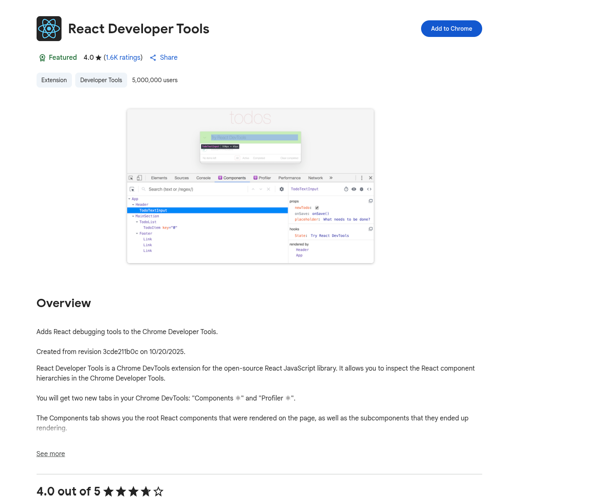

# React Development Tools

React Developer Tools is an essential browser extension for debugging and optimizing React applications. It adds React-specific debugging capabilities to your browser's developer tools, allowing you to inspect the React component tree, view and edit props/state, and identify performance issues.

**Documentation:**

* [React Developer Tools - Official Guide](https://react.dev/learn/react-developer-tools) - Complete guide to using React DevTools
* [GitHub Repository](https://github.com/facebook/react/tree/main/packages/react-devtools) - Source code and detailed documentation

---

##### Installation

**Browser Extension** (Recommended):

The easiest way to debug React applications is to install the React Developer Tools browser extension:

* **Chrome**: [Chrome Web Store](https://chrome.google.com/webstore/detail/react-developer-tools/fmkadmapgofadopljbjfkapdkoienihi)
* **Firefox**: [Firefox Add-ons](https://addons.mozilla.org/en-US/firefox/addon/react-devtools/)
* **Edge**: [Edge Add-ons](https://microsoftedge.microsoft.com/addons/detail/react-developer-tools/gpphkfbcpidddadnkolkpfckpihlkkil)

**Standalone Application**:

For React Native, Safari, or other environments, you can use the standalone version:

```bash
npm install -g react-devtools
# Then run
react-devtools
```

**Console Warning:**

When you open a React application without the extension installed, you'll see this warning in the browser console:


**Chrome Extension Install:**



---

##### Using React DevTools

After installing the extension, open your React app and press F12 to open browser DevTools. You'll see two new tabs:

* **⚛️ Components** - Inspect component tree, props, state, and hooks
* **⚛️ Profiler** - Analyze rendering performance

---

##### Components Tab

**Inspecting Components:**

* Browse the component tree hierarchy
* Search for components by name
* Click any component to view its details in the right panel:
  * **Props** - All props passed to the component
  * **State** - Current state values
  * **Hooks** - All hooks (useState, useEffect, useContext, etc.)
  * **Source** - Jump to component source code

**Editing for Testing:**

You can directly edit props and state values to test components:

1. Select a component in the tree
2. In the right panel, click on any state or prop value
3. Edit the value and press Enter
4. The component re-renders with the new value

This is useful for testing edge cases without modifying code.

**Other Features:**

* Hover over components to highlight them on the page
* Use the element picker icon to select components by clicking on the page
* Selected component is available in console as `$r` (access `$r.props`, `$r.state`)

---

##### Profiler Tab

**Analyzing Performance:**

1. Click the **Record** button
2. Interact with your app (click, type, navigate)
3. Click **Stop**
4. View results in three modes:

**Flamegraph View:**
* Horizontal bars show render times
* Wider bars = slower components
* Colors: Yellow/Red = slow, Blue/Green = fast

**Ranked View:**
* Components sorted by render time (slowest first)
* Shows render count and identifies unnecessary re-renders

**Component Chart:**
* Timeline of when components rendered
* Shows rendering patterns and cascading updates

**Performance Tips:**

For slow or frequently re-rendering components, try:
* Wrap expensive calculations in `useMemo`
* Wrap callback functions in `useCallback`
* Wrap child components in `React.memo`
* Move state closer to where it's used

---
